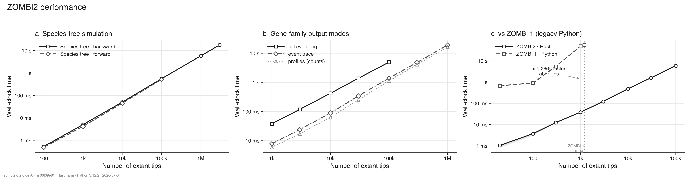

# ZOMBI2

**A phylogenetic simulator of species trees and gene families.**

ZOMBI2 simulates evolution in two steps: build a **species tree**, then evolve
**gene families** along it under duplication, transfer, loss, and origination (DTL).
It also evolves **phenotypic traits** along a phylogeny. It is a ground-up redesign of
[ZOMBI](https://github.com/AADavin/Zombi), with a fast Rust engine, a simple
command-line interface, and a composable Python library.

Use it to generate benchmark datasets for phylogenetic methods — gene trees,
reconciliations, and copy-number profiles — with fully reproducible, seeded runs.

---

## Installation

ZOMBI2 needs Python ≥ 3.10.

```bash
git clone https://github.com/AADavin/zombi2.git
cd zombi2
pip install -e . maturin
cd rust && maturin build --release -i python3 && pip install --force-reinstall target/wheels/*.whl
```

This installs the `zombi2` command and the compiled gene-family engine.

---

## Command line

### 1. Simulate a species tree

```bash
zombi2 species --birth 1 --death 0.3 --tips 50 --age 5 --seed 1 -o out/
```

### 2. Evolve gene families along it

```bash
zombi2 genomes --tree out/species_tree.nwk \
    --dup 0.2 --trans 0.1 --loss 0.25 --orig 0.5 --seed 42 -o out/
```

### 3. Evolve a phenotypic trait along it

```bash
zombi2 trait --tree out/species_tree.nwk --model ou --alpha 2 --theta 5 --seed 1 -o out/
```

### 4. Rescale gene trees to substitutions/site

```bash
zombi2 genomes  --tree out/species_tree.nwk --dup 0.2 --loss 0.25 --orig 0.5 \
    --output trace profiles --seed 42 -o out/
zombi2 sequence --genomes out/ --branch-speed 0.4 --family-speed 0.5 --seed 7 -o out/
```

### 5. Couple gene families to a trait

`zombi2 coevolve-genetrait` evolves gene families whose loss/gain **depends on a trait**, so the
profile carries a known, trait-linked signal (e.g. dating the tree from the Great Oxidation
Event). See [trait-linked gene families](docs/guide/trait-linked-genomes.md).

```bash
zombi2 coevolve-genetrait --tree out/species_tree.nwk --trait-model mk --states 2 \
    --trait-center --panel 40 --responsive 0.3 --effect-loss 3 --seed 1 -o out/
```

Run `zombi2 <command> -h` or see [`docs/cli.md`](docs/cli.md).

---

## Performance

The core models run on a native Rust engine and scale to millions of tips on a laptop.
A backward species tree of 1M tips builds in ~6 s (3M in ~18 s). Gene families over a
100k-tip tree take ~5 s as a full event log, but only ~1.4 s as a compact **event trace**
(gene trees still reconstructable) and ~1.1 s as counts-only **profiles** — the trace and
profile paths both scale to 1M tips at close to the same cost (~19 s / ~16 s, ~5 GB / ~3 GB),
where the full event log tops out near 100k. On the identical task, ZOMBI2 runs gene-family
simulations **over 1000× faster than ZOMBI 1** (48 s → 38 ms at 1,000 tips; the legacy tool
stalls past ~1,200 tips).



---

## Models

ZOMBI2 ships a broad range of models, all reachable from the Python API.

**Species-tree models**

- Backward (reconstructed) and forward (complete) birth–death
- Episodic / skyline rate shifts
- Fossilized birth–death and incomplete sampling
- Ghost lineages added on top of a phylogeny

**Genome models**

- Uniform DTL rates (default, Rust engine)
- Family-sampled rates — each family draws its own DTL from distributions (ZOMBI-1 style)
- Genome-wise rates
- Ordered chromosomes with inversions and transpositions
- Nucleotide-resolution genomes, where genes emerge as *atoms* from structural events
- Gene-family coupling (a Potts model of non-independence)
- Trait-linked gene families — loss/gain conditioned on a phenotypic trait (`coevolve-genetrait`)

**Trait models**

- Brownian motion, Ornstein–Uhlenbeck, and early burst (continuous traits)
- Mk and threshold models (discrete traits)
- DEC biogeography (geographic ranges)

**Sequence evolution**

- A gene × lineage relaxed clock that rescales gene trees from time into substitutions/site
  (lognormal or discrete-bin GTDB lineage rates × per-family speed)

---

## Python library

The same two steps from Python, where models are first-class objects you can compose:

```python
import zombi2 as z

# 1. species tree (backward). Yule(birth) == BirthDeath(birth, death=0).
tree = z.simulate_species_tree(z.BirthDeath(birth=1.0, death=0.3),
                               n_tips=20, age=5.0, seed=1)

# 2. gene families along it
genomes = z.simulate_genomes(tree, duplication=0.2, transfer=0.1, loss=0.25,
                             origination=0.5, initial_size=40, seed=42)

print(tree.to_newick())
print(genomes.profiles.matrix)          # families × species copy numbers
genomes.write("out/")                   # trees, event tables, transfers, profiles
```

---

## Documentation

Full guides and API reference live in `docs/` (build with
`pip install -e ".[docs]" && mkdocs serve`). Start with
[`docs/quickstart.md`](docs/quickstart.md) and the
[command-line reference](docs/cli.md).

## Development

```bash
pip install -e ".[dev]"   # adds pytest and scipy
pytest
```
