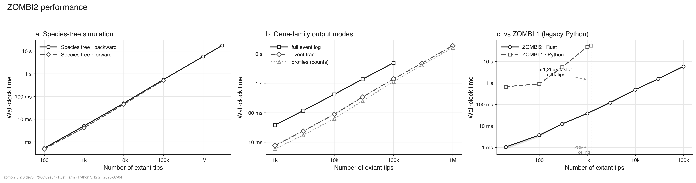

<h1>
  &nbsp;ZOMBI2
</h1>

[](https://github.com/AADavin/zombi2/actions/workflows/ci.yml)
[](https://pypi.org/project/zombi2/)
[](https://aadavin.github.io/zombi2/docs/)
[](LICENSE)


**A simulator suite for genome evolution.**

ZOMBI2 simulates how genomes evolve along a phylogeny across **four levels** — **species
trees**, the **genomes** (gene families) that evolve along them, phenotypic **traits**, and
molecular **sequences** — plus their **coevolution**, as one composable, seeded, fully
reproducible suite. Use it to generate benchmark datasets with known ground truth for
phylogenetic and comparative methods.

---

## Install

```bash
pip install zombi2
```

Prebuilt wheels are published for Linux, macOS, and Windows (CPython 3.10+), including the
native engine — no toolchain required. Building from source is covered in the
[installation guide](docs/installation.md).

---

## Quickstart

Each level is its own subcommand — run whichever you need. Here a dated species tree, then
gene families evolving along it under duplication, transfer, loss, and origination:

```bash
zombi2 species --birth 1 --death 0.3 --tips 50 --age 5 --seed 1  -o run/
zombi2 genomes --tree run/species_tree.nwk \
    --dup 0.2 --trans 0.1 --loss 0.25 --orig 0.5 --seed 42       -o run/
```

`zombi2 <command> -h` documents each of `species`, `genomes`, `trait`, `sequence`, and
`coevolve`; see the [quickstart](docs/quickstart.md) and [CLI reference](docs/cli.md).

From Python, every model is a first-class object you can compose:

```python
import zombi2 as z

tree = z.simulate_species_tree(z.BirthDeath(birth=1.0, death=0.3), n_tips=20, age=5.0, seed=1)
genomes = z.simulate_genomes(tree, duplication=0.2, transfer=0.1, loss=0.25,
                             origination=0.5, initial_families=40, seed=42)

genomes.write("run/")           # gene trees, event tables, transfers, copy-number profiles
```

---

## Levels

ZOMBI2 is organized around **four levels of evolution**. Each conditions on the ones above it,
and you run whichever you need — a species tree, then genomes and/or traits along it, then
sequences along the resulting gene trees — composed into one seeded, reproducible run.

<p align="center">
  <picture>
    <source media="(prefers-color-scheme: dark)" srcset="docs/img/four_levels_dark.svg">
    
  </picture>
</p>

A broad library, grouped by the level it acts on. Each links to its guide.

- **[Species trees](docs/guide/species-trees.md)** — birth–death (backward and forward),
  episodic/skyline shifts, fossilized birth–death, incomplete sampling, diversity-dependent
  and per-lineage (ClaDS) diversification, mass extinctions, and ghost lineages
  ([full list](docs/species_tree_models.md)).
- **[Genomes](docs/guide/genomes.md)** — gene families under duplication, transfer, loss,
  and origination (DTL) with shared / family-sampled / genome-wise / per-branch rates and a full
  [transfer model](docs/guide/transfers.md); plus genome **structure** —
  [ordered chromosomes](docs/guide/ordered-genomes.md) with rearrangements and
  [nucleotide-resolution genomes](docs/guide/nucleotide-genomes.md) where genes emerge as blocks.
- **[Traits](docs/guide/traits.md)** — Brownian motion, Ornstein–Uhlenbeck, and early burst
  (continuous); Mk and threshold (discrete); DEC biogeography.
- **[Sequences](docs/guide/sequences.md)** — substitution models
  (JC/K80/HKY/GTR + Gamma, and empirical amino-acid models) along the gene trees, with a family
  of [relaxed molecular clocks](docs/guide/rate-variation.md) (strict, uncorrelated
  lognormal/gamma, autocorrelated, Cox–Ingersoll–Ross) rescaling time into substitutions.

---

## Combining levels

**Coevolution** couples any two levels so they drive each other with
`coevolve --couple driver:target`: state-dependent diversification (SSE), cladogenetic change,
key innovations, and trait-linked gene families. See the
[coevolution models](docs/models/coevolution.md) guide.

---

## Performance

The built-in models run on a native **Rust** engine and scale to millions of tips on a
laptop: a backward species tree of 1M tips builds in ~6 s, and gene families over a 100k-tip
tree simulate in ~1 s as copy-number profiles. On one shared 1,000-tip species tree, ZOMBI2
runs the gene-family simulation **≈580× faster than ZOMBI 1** (41 s → 71 ms). Details in the
[Rust engine guide](docs/guide/rust-engine.md).



---

## Documentation

Guides, a command-line reference, and the full API live in [`docs/`](docs/) (build locally
with `pip install -e ".[docs]" && mkdocs serve`); a book-style [manual](manual/) is built with
Pandoc. Start with the [quickstart](docs/quickstart.md).

## Citation

If you use ZOMBI2, please cite it via [`CITATION.cff`](CITATION.cff) (GitHub's *Cite this
repository* button). A dedicated ZOMBI2 paper is in preparation; until then, cite the original
[ZOMBI](https://github.com/AADavin/Zombi).

## License

ZOMBI2 is released under the [MIT License](LICENSE).
