<h1>
  ZOMBI2&nbsp;
</h1>

**[🌐 Website](https://aadavin.github.io/zombi2/)** · [Documentation](https://aadavin.github.io/zombi2/docs/) · [Manual (pdf)](https://github.com/AADavin/zombi2/releases/latest/download/zombi2-manual.pdf)

[](https://github.com/AADavin/zombi2/actions/workflows/ci.yml)
[](https://pypi.org/project/zombi2/)
[](https://aadavin.github.io/zombi2/docs/)
[](LICENSE)


**Simulating the evolution of species, genomes, sequences and traits.**

ZOMBI2 simulates evolution at **four levels** — the **species** tree of lineages, the
**genomes** that evolve along it, the **sequences** inside each gene, and the **traits** a
lineage carries. Each level runs on its own, conditioned on another, or jointly with it, and
every run records the true history behind the dataset. Use it to generate benchmark datasets
with known ground truth for phylogenetic and comparative methods.

> **Rebuild in progress.** ZOMBI2 is being rebuilt as a clean core grown from a single
> specification, one level at a time. Everything documented below is built and tested; the
> older code it is being grown out of is quarantined in [`legacy/`](legacy/), not importable.

---

## Install

```bash
pip install zombi2
```

Pure Python, NumPy the only dependency — no build step and no compiler.

---

## Quickstart

Each level is its own subcommand. Here a dated species tree, then gene families evolving along
it under duplication, transfer, loss and origination, then sequences down each gene tree:

```bash
zombi2 species  --birth 1 --death 0.3 --n-extant 20 --seed 1                            -o out/
zombi2 genomes  -t out/species_complete.nwk \
                --duplication 0.2 --transfer 0.1 --loss 0.25 --origination 0.5 --seed 42 -o out/
zombi2 sequences --genomes out/ --model hky85 --length 1000 --seed 1                    -o out/
```

`zombi2 <command> -h` documents each of `species`, `genomes`, `sequences` and `traits`, with
its own examples.

From Python, each level is one function, and the result object carries the history:

```python
from zombi2 import species
from zombi2.genomes import simulate_genomes_unordered

sp = species.simulate_species_tree(birth=1.0, death=0.3, n_extant=20, seed=1)
g  = simulate_genomes_unordered(sp, duplication=0.2, transfer=0.1, loss=0.25,
                                origination=0.5, initial_families=20, seed=42)

g.gene_trees                    # the true gene tree of every family
g.write("run/")                 # the event log and the copy-number profiles
```

Every rate is written the same way — a **scope** around a base, optionally times **modifiers**,
in the same notation from Python and from the command line:

```python
from zombi2.rates import scope, modifiers

sp = species.simulate_species_tree(
    birth = 1.0 * modifiers.OnTime({0: 1.0, 3: 0.5}),   # full rate, then half after time 3
    death = scope.Global(0.3),                          # one tree-wide rate, not per lineage
    total_time = 8.0, seed = 1)
```

---

## Levels

ZOMBI2 is organized around **four levels of evolution**. A genome, a sequence or a trait always
evolves along a species tree, so you run whichever you need, composed into one seeded,
reproducible run.

<p align="center">
  
</p>

- **[Species trees](docs/guide/species-trees.md)** — a birth–death process with rates that can
  shift in time, saturate with diversity or drift down the tree, plus mass extinctions,
  incomplete sampling and fossils. Extinct lineages are kept, so the complete tree and the
  extant one are both available.
- **[Genomes](docs/guide/genomes.md)** — gene families under duplication, transfer, loss and
  origination, at three resolutions: [unordered](docs/guide/genomes.md) families,
  [ordered](docs/guide/genomes-ordered.md) chromosomes with rearrangements, and
  [nucleotide](docs/guide/genomes-nucleotide.md) genomes where genes are blocks of DNA.
- **[Sequences](docs/guide/sequences.md)** — nucleotide (JC69, K80, HKY85, GTR) and protein
  substitution models run down each gene tree, with ancestral sequences at every node.
- **[Traits](docs/guide/traits.md)** — continuous traits that diffuse, revert to an optimum or
  shift at speciation, and discrete traits switching between states.

## Combining levels

A level can be **conditioned** on another — a rate reads a value some other level produced — or
the two can be grown **jointly**, when neither can be simulated first because each drives the
other. Both are one mechanism, `DrivenBy(source, mapping)`, on any rate. See
[conditioning and joining](docs/guide/conditioning-and-joining.md).

---

## Documentation

The [documentation site](https://aadavin.github.io/zombi2/docs/) and the book-style
[manual](manual/) are the same text: every guide page is the corresponding chapter, included
verbatim, so the two cannot drift. Build the site locally with
`pip install -e ".[docs]" && mkdocs serve`.

Two design documents govern the rebuild: [`SPEC.md`](docs/design/SPEC.md) fixes the model and
the vocabulary, [`MAP.md`](docs/design/MAP.md) fixes where every name lives.

## Citation

A dedicated ZOMBI2 paper is in preparation. Until then, cite the original
[ZOMBI](https://github.com/AADavin/Zombi).

## License

ZOMBI2 is released under the [MIT License](LICENSE).
