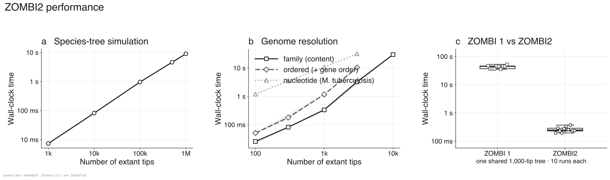

<h1>
  ZOMBI2&nbsp;
</h1>

**[🌐 Website](https://aadavin.github.io/zombi2/)** · [Gallery](https://aadavin.github.io/zombi2/gallery.html) · [Documentation](https://aadavin.github.io/zombi2/docs/) · [Manual (pdf)](https://aadavin.github.io/zombi2/zombi2-manual.pdf)

[](https://github.com/AADavin/zombi2/actions/workflows/ci.yml)
[](https://pypi.org/project/zombi2/)
[](https://aadavin.github.io/zombi2/docs/)
[](LICENSE)


**Simulating the evolution of species, genomes, sequences and traits.**

ZOMBI2 simulates evolution at **four levels** — the **species** tree of lineages, the
**genomes** that evolve along it, the **sequences** inside each gene, and the **traits** a
lineage carries. Use it to generate benchmark datasets with known ground truth for phylogenetic and comparative methods.

---

## Install

```bash
pip install zombi2
```

---

## Quickstart

Each level is its own subcommand. Here a dated species tree, then gene families evolving along it
under duplication, transfer, loss and origination, then sequences down each gene tree, then a trait
evolving along the tree:

```bash
zombi2 species   out/ --birth 1 --death 0.3 --n-extant 20 --seed 1
zombi2 genomes   out/ --duplication 0.2 --transfer 0.1 --loss 0.25 --origination 0.5 --seed 42
zombi2 sequences out/ --model hky85 --length 1000 --divergence 0.2 --seed 1
zombi2 traits    out/ --kind continuous --rate 1.0 --seed 1
```

Each command says where it wrote and refreshes **`out/run.zombi2`** — a one-page, plain-text report of
the whole run: every file it wrote and what each holds, the parameters, and the exact commands to
reproduce it. **Open that first.** `zombi2 <command> -h` documents each of `species`, `genomes`,
`sequences` and `traits`, with its own examples.

From Python, each level is one function, and the result object carries the history:

```python
from zombi2 import species, genomes

sp = species.simulate_species_tree(birth=1.0, death=0.3, n_extant=20, seed=1)
g  = genomes.simulate_genomes_family(sp, duplication=0.2, transfer=0.1, seed=42)

g.gene_trees                    # the true gene tree of every family
g.write("run/")                 # the event log and the copy-number profiles
```

---

## Levels

ZOMBI2 is organized around **four levels of evolution**. A genome, a sequence or a trait always
evolves along a species tree, so you run whichever you need, composed into one seeded,
reproducible run.

<p align="center">
  
</p>

- **[Species trees](https://aadavin.github.io/zombi2/docs/guide/species-trees/)** — a
  birth–death process with rates that can shift in time, saturate with diversity or drift down
  the tree, plus mass extinctions, incomplete sampling and fossils. Extinct lineages are kept,
  so the complete tree and the extant one are both available.
- **[Genomes](https://aadavin.github.io/zombi2/docs/guide/genomes/)** — gene families under
  duplication, transfer, loss and origination, at three resolutions: gene families,
  [ordered](https://aadavin.github.io/zombi2/docs/guide/genomes-ordered/) chromosomes with
  rearrangements, and
  [nucleotide](https://aadavin.github.io/zombi2/docs/guide/genomes-nucleotide/) genomes where
  genes are blocks of DNA.
- **[Sequences](https://aadavin.github.io/zombi2/docs/guide/sequences/)** — nucleotide (JC69,
  K80, HKY85, GTR) and protein substitution models run down each gene tree, with ancestral
  sequences at every node.
- **[Traits](https://aadavin.github.io/zombi2/docs/guide/traits/)** — continuous traits that
  diffuse, revert to an optimum or shift at speciation, and discrete traits switching between
  states.

## Combining levels

A level can be **conditioned** on another — a rate reads a value some other level produced — or
the two can be grown **jointly**, when neither can be simulated first because each drives the
other. Both are one mechanism, `DrivenBy(source, mapping)`, on any rate. See
[conditioning and joining](https://aadavin.github.io/zombi2/docs/guide/conditioning-and-joining/).

---

## Performance

ZOMBI2 is pure Python and runs on a laptop. The **species tree** is O(N) and reaches millions
of tips (one million in about 9 s). The **genome** step is the heavier level — a few thousand
tips in seconds, tens of thousands in about a minute — and runs at three resolutions:
gene-family content, content + gene order, and full nucleotide sequence. On the same
gene-family task, ZOMBI2 simulates roughly **180× faster than the legacy ZOMBI v1** (both pure
Python) and keeps scaling well past v1's practical ceiling.

<p align="center">
  
</p>

## Citation

A dedicated ZOMBI2 paper is in preparation. Until then, cite the original
[ZOMBI](https://github.com/AADavin/Zombi).

## License

ZOMBI2 is released under the [MIT License](LICENSE).
