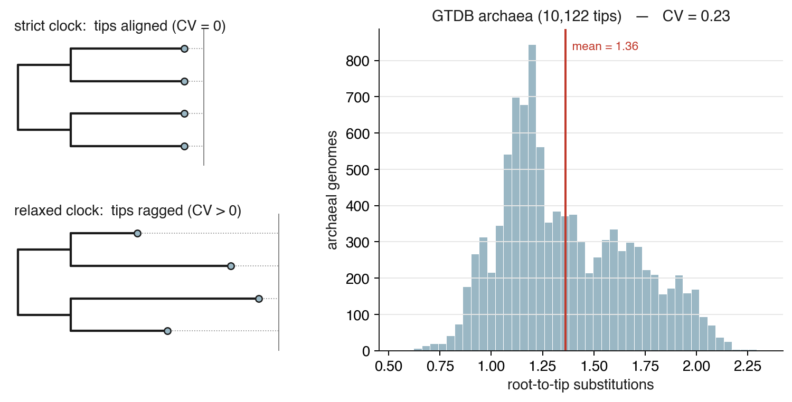
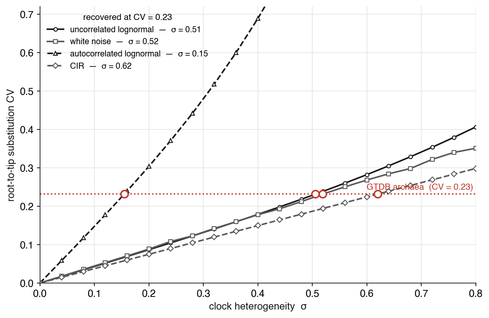

# Clock rate heterogeneity from a phylogeny

**What we infer:** the **among-lineage rate heterogeneity** of molecular evolution — how far real
lineages depart from a strict clock — as a ZOMBI2 relaxed-clock parameter σ. **How:** match one
model-free summary of a real phylogeny (the spread of root-to-tip substitutions) to a ZOMBI2 forward
simulation.

## The idea

A **strict clock** ticks at one rate everywhere. Applied to a timetree it stretches every branch by
the same factor, so a phylogram of contemporaneous species comes out **ultrametric** — every tip the
same number of substitutions from the root. Real lineages do not behave that way: some evolve fast,
some slow. A **relaxed clock** (Drummond et al. 2006) is the model of that variation, and its width
parameter **σ** says how much. So the plan is simple: measure how much rate variation real data
actually show, then read off the σ that reproduces it — the same match-a-summary-to-a-simulation move
as the [synteny recipe](synteny.md), one level up (on the tree instead of the genome).

## Data — the GTDB archaeal tree

We use the reference phylogeny of the **Genome Taxonomy Database** (GTDB): the archaeal tree,
**10,122 genomes**, with branch lengths in substitutions per site (Parks et al. 2018; Rinke et al.
2021). It is the tree that **Relative Evolutionary Divergence (RED)** — GTDB's rank-normalising
measure — is built on, and the system behind ZOMBI2's `RateVariation` clock. Crucially it is a
**phylogram** (substitutions), not a chronogram (time). That is exactly the point of this recipe.

## The observable — and why it is not circular

Every genome in the tree is **extant**: all tips sit at the present. So every tip is the *same amount
of time* from the root — the root's age — whatever its rate. Therefore any spread in root-to-tip
*substitutions* can only come from rate variation. We summarise it with a single number: the
**coefficient of variation (CV) of root-to-tip substitution distances**. A strict clock gives CV = 0;
heterogeneity spreads the tips out (Figure 1).

This is why we do **not** date the tree. Turning the phylogram into a chronogram — making it
ultrametric — would require assuming a rate model, the very thing we are trying to measure, and would
be circular (rates and times are jointly unidentifiable from substitutions alone). The root-to-tip CV
sidesteps that entirely: it reads the heterogeneity straight off the phylogram, model-free. Its one
assumption is that the tree is correctly rooted, which GTDB provides.

<figure markdown="span">
  { width="100%" }
  <figcaption markdown="span">Figure 1. Left: a strict clock makes a phylogram ultrametric — every extant tip the same number of substitutions from the root (aligned; CV = 0); a relaxed clock lets rates vary, so tips end ragged (CV > 0). Right: the real GTDB archaeal tree — the distribution of root-to-tip substitution distances across its 10,122 genomes, with CV = 0.23.</figcaption>
</figure>

**The real signal.** On the GTDB archaeal tree the root-to-tip CV is **0.23** — the fastest lineage
has accumulated about four times the substitutions of the slowest. Substantial, and a clean target.

## Fitting the heterogeneity

We recover σ exactly as the synteny recipe recovers the inversion rate: with a forward model matched
to the data.

**The forward model contains no real branch lengths.** We simulate a birth–death **timetree** of
GTDB's size (~10,000 tips), apply a ZOMBI2 relaxed `clock(σ)` to it — turning the timetree into a
phylogram — and measure the same root-to-tip CV. The timetree is *simulated*: GTDB's branch lengths
never enter the forward model; only the target CV (0.23) and the tree's size do. So no rate assumption
is smuggled back in, and the design stays free of the circularity above.

We then sweep σ for each relaxed-clock family and find where its CV(σ) curve crosses 0.23 (Figure 2).

## Results

**The amount of heterogeneity is identifiable; the σ is family-specific.** Every relaxed clock can
reproduce CV = 0.23 — but each at its own σ (Figure 2). The two standard **uncorrelated** clocks agree
tightly: uncorrelated-lognormal **σ ≈ 0.5** (white-noise 0.52). The **autocorrelated** clocks read the
same data through a different lens — autocorrelated-lognormal σ ≈ 0.16, CIR σ ≈ 0.62 (Thorne et al.
1998; Lepage et al. 2007) — because their σ parameterises a different process (a rate that drifts
along the tree, not one drawn afresh per branch).

<figure markdown="span">
  { width="92%" }
  <figcaption markdown="span">Figure 2. How much root-to-tip CV each relaxed clock produces as its heterogeneity σ grows. The GTDB archaeal target (CV = 0.23) is the horizontal line; where each family's curve crosses it (circles) is the recovered σ. The two uncorrelated clocks (solid) nearly coincide and cross near σ = 0.5; the autocorrelated clocks (dashed) cross elsewhere — the same data, a family-specific σ.</figcaption>
</figure>

The recovered σ is **robust to the simulated tree's shape**: across birth–death versus Yule trees,
extinction fractions, and sizes from 2,000 to 10,000 tips, the uncorrelated-lognormal σ stays in
**0.48–0.55**. The tree-shape assumption — the only place modelling enters the forward model — barely
moves the number.

So the preset is: **archaeal molecular evolution departs from a strict clock by σ ≈ 0.5 under the
standard uncorrelated-lognormal relaxed clock.** Drop it straight into ZOMBI2's clock —
`UncorrelatedLogNormalClock(sigma=0.5)`.

!!! tip "Match the parameter to the data"
    The data pin *how much* rate heterogeneity there is (CV = 0.23), not *what kind*: uncorrelated and
    autocorrelated clocks reproduce the same spread at different σ. Whether real rate variation is
    autocorrelated — whether neighbouring lineages evolve at similar rates — is a separate question
    that needs a separate observable (the correlation of rates between close relatives). The CV tells
    you the amount; the clock family is a modelling choice — so fix it, then read σ. This is the same
    lesson the synteny recipe reaches: a single summary pins one thing cleanly and leaves another to a
    choice.

## Assumptions and limitations

- **Model-free observable, rooted tree.** The root-to-tip CV assumes the tree is correctly rooted
  (GTDB's rooting) and its tips contemporaneous (extant genomes) — both hold. No dating and no
  ultrametricising: the heterogeneity is read straight off the phylogram.
- **σ is family-specific, not universal.** The identifiable quantity is the CV; σ is that CV read
  through a chosen clock family. The two uncorrelated clocks agree (σ ≈ 0.5); autocorrelated models
  differ, and their σ is not comparable to the uncorrelated one. Always report σ with its family.
- **Tree-shape dependence is mild.** The CV a given σ produces depends on how root-to-tip time is
  partitioned into branches, which comes from the simulated timetree. Across plausible tree shapes and
  sizes the recovered σ moves only within 0.48–0.55 — a modelling assumption to note, not a confound.
- **One domain.** This is archaea (GTDB); bacteria, or a dated eukaryote phylogeny, would each yield
  their own σ.

## Reproducing this recipe

```bash
cd ZOMBI2_COOKBOOK/red_clock
# real data: the GTDB archaeal reference tree (a phylogram, substitution branch lengths)
curl -fsSL -o data/ar53.tree https://data.gtdb.ecogenomic.org/releases/latest/ar53.tree
# measure the model-free target: root-to-tip substitution CV (= 0.23)
python scripts/measure_gtdb.py
# forward model: simulate GTDB-size timetrees, apply each relaxed clock across a sigma grid
python scripts/clock_sweep.py
# figures (the observable + the recovery)
python scripts/fig_observable.py
python scripts/figures.py
```

The clocks themselves are ZOMBI2's [`zombi2.sequences.clocks`](../reference/api.md) — uncorrelated
lognormal / white-noise / autocorrelated lognormal / CIR / the GTDB `RateVariation`. The recovered σ
per family is written to `results/clock_sweep.json`.

## References

- Drummond AJ, Ho SYW, Phillips MJ, Rambaut A (2006). *Relaxed phylogenetics and dating with
  confidence.* PLoS Biology 4:e88.
- Lepage T, Bryant D, Philippe H, Lartillot N (2007). *A general comparison of relaxed molecular clock
  models.* Molecular Biology and Evolution 24(12):2669–2680.
- Parks DH, Chuvochina M, Waite DW, et al. (2018). *A standardized bacterial taxonomy based on genome
  phylogeny substantially revises the tree of life.* Nature Biotechnology 36:996–1004.
- Rinke C, Chuvochina M, Mussig AJ, et al. (2021). *A standardized archaeal taxonomy for the Genome
  Taxonomy Database.* Nature Microbiology 6:946–959.
- Thorne JL, Kishino H, Painter IS (1998). *Estimating the rate of evolution of the rate of molecular
  evolution.* Molecular Biology and Evolution 15(12):1647–1657.
