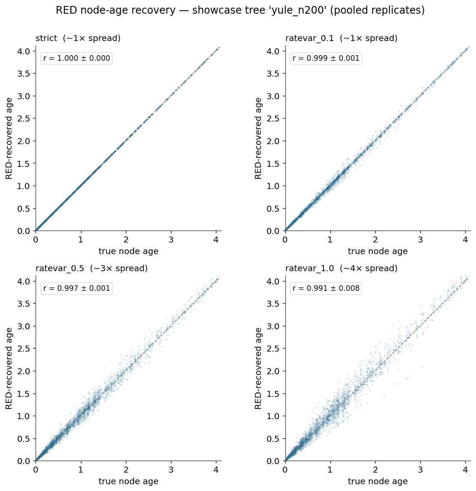
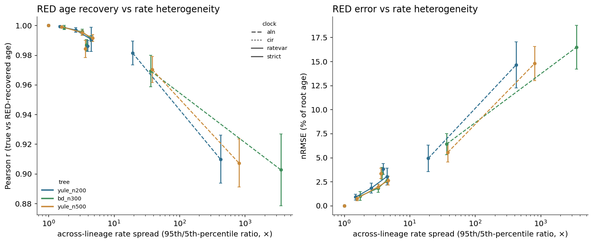

# Benchmarking with Snakemake — the RED node-age benchmark

A worked, reproducible example of using ZOMBI2 to **stress-test a method on simulated ground
truth**, driven by [Snakemake](https://snakemake.github.io). It lives in the repository under
[`examples/red_benchmark/`](https://github.com/AADavin/zombi2/tree/main/examples/red_benchmark) and
is the template to copy for your own parameter sweeps.

The method under test is [Relative Evolutionary Divergence](../tools/red.md) (RED) — the measure
GTDB uses to normalize taxonomic ranks. The question (after Rinke et al. 2021): **does RED recover a
tree's true node ages once its branch rates have been perturbed across lineages?** ZOMBI2 knows the
true ages, so the ground truth is built in; the sweep measures how the recovery holds up as tree
size, extinction, clock model, and rate heterogeneity vary.

## Install

```bash
pip install "zombi2[bench]"      # adds snakemake, matplotlib (+ the SLURM executor plugin)
```

## The workflow

Three Snakemake rules, one config file:

1. **`simulate_timetree`** — a forward Yule / birth–death tree, pruned to the extant (ultrametric)
   tree, with known node ages. Simulated once per (tree config, seed) and reused downstream.
2. **`perturb_and_red`** — apply a ZOMBI2 relaxed clock (time → substitution branch lengths), then
   recover ages with the shipped [`zombi2.tools`](../tools/red.md) RED implementation and compare to
   the truth → per-run `metrics.tsv` (Pearson/Spearman r, nRMSE, rate spread) + `points.csv`.
3. **`summarize`** — aggregate every run into `results/summary.tsv` and the two figures below.

The grid is one YAML file, chosen with `--config cfg=<path>` — `trees` (size / birth–death / seeds),
`perturbations` (clock + parameters), `replicates`, and a `showcase` tree for the scatter figure.

```bash
cd examples/red_benchmark

snakemake --cores 8                                   # full sweep  (config/sweep.yaml)
snakemake --cores 4 --config cfg=config/test.yaml     # tiny smoke grid
snakemake -n                                          # dry run — inspect the DAG
snakemake --profile workflow/profiles/slurm           # scale out to SLURM / Euler

pytest tests/                                          # unit tests for the RED core
```

Seeds are derived deterministically from each job's parameters, so a re-run reproduces every number
byte-for-byte and Snakemake re-runs only what changed.

## Result

The full sweep (245 runs, ~10 s on 10 cores) reproduces the Rinke/GTDB finding and generalizes it:

| clock | across-lineage spread (95/5) | Pearson r | nRMSE |
| --- | --- | --- | --- |
| strict (anchor) | 1× | **1.0000** | 0.00% |
| `ratevar` (GTDB discrete bins) | 1.5–4.7× | 0.999 → 0.991 | ≤ 3% |
| `cir` | ~3.8× | ~0.986 | ~3.5% |
| `aln` (heavy-tailed) | 19–3500× | 0.98 → 0.90 | up to ~16% |



*True vs RED-recovered node ages (showcase tree, replicates pooled). A strict clock recovers ages
exactly (r = 1.000); under increasing rate heterogeneity the scatter widens but stays tight around
the diagonal.*



*RED accuracy (left) and error (right) versus the realized across-lineage rate spread, one curve per
tree config × clock. **RED holds up (r ≥ 0.99, nRMSE ≤ 3%) under bounded / moderate rate variation**
— the regime GTDB relies on — and degrades only under extreme, heavy-tailed variation.*

Two invariants underpin the benchmark. The unit tests (`pytest tests/`) lock both down — RED on the
time tree equals `node.time / total_age` to machine precision, and a strict clock recovers ages
exactly — and the strict-clock one is re-asserted whenever the sweep is summarized (`summarize.py`).

## Adapting it

Edit `config/sweep.yaml` — add tree sizes or birth/death regimes under `trees`, add clocks under
`perturbations` (`strict`, `ratevar`, `aln`, `cir`, `whitenoise`, `ucln`), or raise `replicates`.
To benchmark a *different* method, keep `simulate_timetree` and replace the `perturb_and_red` step
with your analysis and `summarize.py` with your metric. See the
[RED tool page](../tools/red.md) for the estimator itself and the
[sequences guide](../guide/sequences.md) for the relaxed-clock models used to perturb rates.
