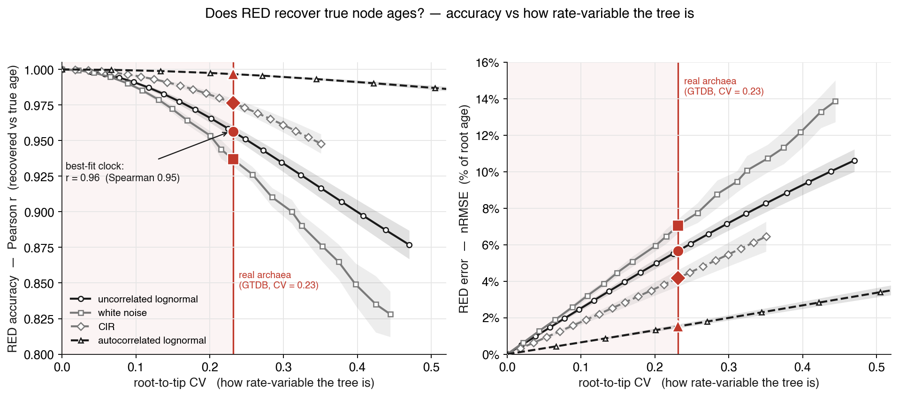
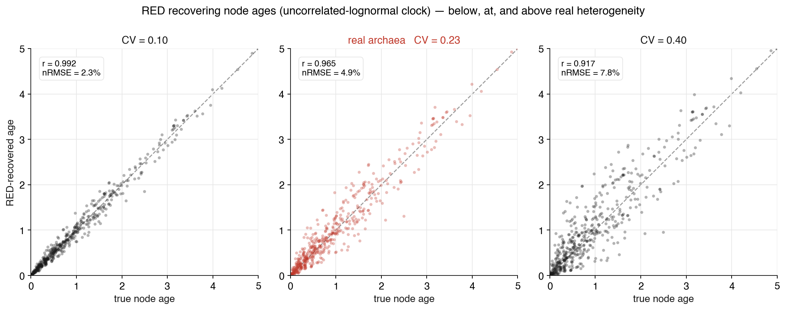

# Can you trust RED? Validating a tree-rescaling method

**What we test:** whether **Relative Evolutionary Divergence (RED)** — the measure GTDB uses to turn a
phylogram into a relative divergence scale — really recovers a tree's divergence times once real, uneven
molecular rates are in play. **How:** we cannot check RED on a real tree, because we never know its true
divergence times. So we read *how rate-variable real trees are* off one model-free number on a real
phylogeny (the GTDB archaeal tree), simulate trees that variable — where the true times are known by
construction — and grade RED against them.

## The question — is RED a faithful divergence scale?

**RED** (Parks et al. 2018) gives every node a number between 0 (the root) and 1 (the tips) from the
branch lengths alone: walking root to tip, it places each node along its path in proportion to
accumulated branch length. GTDB uses it to normalise taxonomic ranks across the tree of life — a phylum
should sit at a comparable RED whatever lineage it belongs to. That only works if RED is a faithful
stand-in for **relative divergence time**. Under a **strict clock** it is exact: branch length is
proportional to time, so RED equals node age over root age. But real lineages do not obey a strict clock
— some evolve fast, some slow — and then branch length is no longer time. Does RED still recover the ages,
or does the rate variation pull it off? That is the question this recipe answers, and it answers it with a
number.

## Why we can't just check on real data

On a real tree the answer is hidden. A phylogram measures **substitutions**, which are rate × time; from
substitutions alone rate and time are jointly unidentifiable, so the "true" node ages we would grade RED
against do not exist to be read off. Dating the tree first would mean *assuming* a rate model — the very
thing in question — and would make the test circular.

Simulation is the way out. In a simulated tree the true node ages are known, so RED can be graded exactly.
The only thing we still need from the real world is *how much rate variation to put in* — enough that the
test reflects real trees rather than an arbitrary choice. That single quantity is all we borrow from GTDB;
no real branch length ever enters the forward model, so the circularity above never arises.

## The observable — how ragged are real trees?

Every genome in the GTDB archaeal tree — **10,122 genomes**, branch lengths in substitutions per site
(Parks et al. 2018; Rinke et al. 2021) — is **extant**: all tips sit at the present. So every tip is the
*same amount of time* from the root, whatever its rate. Any spread in root-to-tip *substitutions* can
therefore only come from rate variation. We summarise it with one number: the **coefficient of variation
(CV) of root-to-tip substitution distances**. A strict clock gives CV = 0; heterogeneity spreads the tips
out (Figure 1).

This reads the raggedness straight off the phylogram — no dating, no ultrametricising, no rate model
assumed. Its one assumption is that the tree is correctly rooted, which GTDB provides.

<figure markdown="span">
  { width="100%" }
  <figcaption markdown="span">Figure 1. Left: a strict clock makes a phylogram ultrametric — every extant tip the same number of substitutions from the root (aligned; CV = 0); a relaxed clock lets rates vary, so tips end ragged (CV > 0). Right: the real GTDB archaeal tree — the distribution of root-to-tip substitution distances across its 10,122 genomes, with CV = 0.23.</figcaption>
</figure>

**The real signal.** On the GTDB archaeal tree the root-to-tip CV is **0.23** — the fastest lineage has
accumulated about four times the substitutions of the slowest. That is the raggedness the test must
reproduce to be realistic.

## Making the test realistic

We build the simulated trees the same way ZOMBI2 builds any tree, and calibrate their raggedness to the
real number. We simulate **20 species trees under the Yule process**, each with known node ages, apply a
ZOMBI2 relaxed `clock(σ)` (Drummond et al. 2006) — turning each timetree into a phylogram — and measure
the root-to-tip CV. Sweeping σ and finding where the mean CV crosses 0.23 gives the σ that makes a
simulated tree as ragged as real archaea (Figure 2): for the standard **uncorrelated-lognormal** clock,
**σ ≈ 0.56**.

<figure markdown="span">
  { width="90%" }
  <figcaption markdown="span">Figure 2. How much root-to-tip CV each relaxed clock produces as its heterogeneity σ grows. Where a family's curve crosses the GTDB target (CV = 0.23, dotted line) is the σ that reproduces real raggedness — marked with that family's own symbol. The two uncorrelated clocks (solid) cross near σ = 0.55; the autocorrelated clocks (dashed) cross elsewhere, because their σ parameterises a different process. Shaded bands are ±1 s.d. across the 20 Yule trees.</figcaption>
</figure>

The forward model contains **no real branch lengths**: GTDB's tree sets only the target CV. Every
relaxed-clock family — two **uncorrelated** (a fresh rate drawn per branch: lognormal, or white-noise) and
two **autocorrelated** (rates that drift along the tree, so close relatives stay similar:
autocorrelated-lognormal, and CIR) — can be tuned to CV = 0.23, each at its own σ, so we carry all of them
into the test, not just the best-fit one.

## Testing RED

Now the actual test. On the same simulated trees, apply the relaxed clock, compute RED from the resulting
substitution branch lengths, and compare RED's recovered node ages to the truth. Plotting RED's accuracy
against root-to-tip CV — the very quantity we measured on GTDB — puts the whole recipe on one axis: read up
from the real value (CV = 0.23) to find how well RED does at realistic raggedness (Figure 3). The per-tree
picture is Figure 4: RED hugs the diagonal below the real level, still tracks it at the real level, and
only frays well above it.

<figure markdown="span">
  { width="100%" }
  <figcaption markdown="span">Figure 3. Does RED recover true node ages? RED accuracy (left, Pearson r) and error (right, nRMSE) as a function of how rate-variable the tree is, one curve per relaxed-clock family. The vertical line is real archaea (CV = 0.23); filled markers read off RED's accuracy there. RED is near-exact for mild variation and degrades as trees get raggeder — fastest for the uncorrelated clocks, slowest for the autocorrelated one. Shaded bands are ±1 s.d. across the 20 Yule trees.</figcaption>
</figure>

<figure markdown="span">
  { width="100%" }
  <figcaption markdown="span">Figure 4. RED-recovered versus true node ages on one simulated tree under the best-fit (uncorrelated-lognormal) clock, at three raggedness levels: below, at, and above the real archaeal value. At CV = 0.23 (centre) RED still tracks the diagonal (r ≈ 0.96); the scatter only opens up well beyond real heterogeneity.</figcaption>
</figure>

## What it means

**At the raggedness real archaea actually show, RED holds up.** Reading off CV = 0.23, RED recovers node
ages with Pearson r between **0.94 and 0.997** depending on the clock family, and nRMSE of 2–7% of the root
age. For the uncorrelated-lognormal clock that best matches the real spread, **r = 0.96** (Spearman 0.95,
nRMSE ≈ 6%). The amount of rate variation in real archaea is simply not enough to break RED — a
quantitative version of the qualitative assumption GTDB relies on (Rinke et al. 2021).

Three things are worth being precise about:

- **RED is an ordinal proxy, not exact ages.** Even at the best fit there is a few-percent age error, and
  the *ranking* of nodes (Spearman 0.95) survives better than their metric ages. Use RED to order
  divergences and normalise ranks — its designed job — not to read absolute times off.
- **The residual uncertainty is the autocorrelation question.** RED's accuracy at a *fixed* CV still
  depends on the clock family — the vertical spread at CV = 0.23 in Figure 3. Autocorrelated variation
  (neighbouring lineages evolving at similar rates) preserves local order, so RED does better (r ≈ 0.997);
  fully uncorrelated variation scrambles it more (white noise, r ≈ 0.94). The CV pins *how much* variation
  there is, not *how it is structured*.
- **RED only truly breaks down past real data.** Beyond CV ≈ 0.23 the curves fall away — under fully
  uncorrelated rates RED drops to r ≈ 0.83 (nRMSE ≈ 14%) by CV ≈ 0.44. Real archaea sit comfortably on the
  safe side of that.

!!! tip "Calibrate realism, then test against known truth"
    You cannot grade a method like RED on the data it is meant for, because the data hide the answer. But
    you can measure one honest number that says how demanding the real case is (here, the raggedness
    CV = 0.23), reproduce that number in a simulation where the answer *is* known, and grade the method
    there. What the single observable cannot pin — here, whether the rate variation is autocorrelated —
    shows up as the honest residual: the spread across clock families at the real CV. This is the same move
    as the [synteny recipe](synteny.md), one level up: a summary pins one thing cleanly and hands what it
    cannot pin to a stated modelling choice.

## At scale — the Snakemake sweep

Figures 3–4 are the headline; the shipped example
[`examples/red_benchmark/`](https://github.com/AADavin/zombi2/tree/main/examples/red_benchmark) runs the
same test as a reproducible, cluster-ready **[Snakemake](https://snakemake.github.io)** sweep, generalised
across tree size, extinction fraction, clock model, and perturbation strength. It reproduces the
single-tree Rinke/GTDB result and extends it: under bounded or moderate across-lineage rate variation RED
stays at r ≥ 0.99 (nRMSE ≤ 3%), and degrades only under extreme, heavy-tailed variation far beyond what
real archaea show.

```bash
pip install "zombi2[bench]"                            # snakemake + matplotlib (+ SLURM plugin)
cd examples/red_benchmark

snakemake --cores 8                                   # full sweep  (config/sweep.yaml)
snakemake --cores 4 --config cfg=config/test.yaml     # tiny smoke grid
snakemake --profile workflow/profiles/slurm           # scale out to SLURM / Euler
pytest tests/                                         # unit tests for the RED core
```

Seeds are derived deterministically from each job, so a re-run reproduces every number and Snakemake
re-runs only what changed. Two invariants are asserted every run: RED on the time tree equals
`node.time / total_age` to machine precision, and a strict clock recovers ages exactly. The estimator
itself is the shipped [`zombi2 tools red`](../tools/red.md); to benchmark a *different* method, keep the
tree simulation and swap in your analysis and metric.

## Assumptions and limitations

- **Model-free observable, rooted tree.** The root-to-tip CV assumes the tree is correctly rooted.
- **CV pins the amount, not the structure.** The identifiable quantity is how much rate variation there is
  (CV = 0.23), not whether it is autocorrelated. RED's accuracy at that CV therefore comes as a band
  (r ≈ 0.94–0.997), not a point; pinning it to a single number would need a second observable — the
  correlation of rates between close relatives.
- **One domain.** This is archaea (GTDB). Bacteria, or a dated eukaryote phylogeny, would each set their
  own CV — and could land on a different part of the RED curve.

## Reproducing this recipe

```bash
cd ZOMBI2_COOKBOOK/red_clock
# real data: the GTDB archaeal reference tree (a phylogram, substitution branch lengths)
curl -fsSL -o data/ar53.tree https://data.gtdb.ecogenomic.org/releases/latest/ar53.tree
python scripts/measure_gtdb.py     # the observable: root-to-tip substitution CV (= 0.23)
python scripts/clock_sweep.py      # calibrate realism: sigma that reproduces CV = 0.23 (20 Yule trees)
python scripts/red_bridge.py       # the test: RED recovery vs raggedness (the bridge)
python scripts/fig_observable.py scripts/figures.py scripts/fig_red_bridge.py scripts/fig_red_scatter.py
```

The relaxed clocks are ZOMBI2's [`zombi2.sequences.clocks`](../reference/api.md); the test reuses the
shipped RED implementation (`zombi2.tools.relative_evolutionary_divergence`, the same code behind
`zombi2 tools red`). For the full parameter sweep, see the Snakemake example above.

## References

- Drummond AJ, Ho SYW, Phillips MJ, Rambaut A (2006). *Relaxed phylogenetics and dating with confidence.*
  PLoS Biology 4:e88.
- Parks DH, Chuvochina M, Waite DW, et al. (2018). *A standardized bacterial taxonomy based on genome
  phylogeny substantially revises the tree of life.* Nature Biotechnology 36:996–1004.
- Rinke C, Chuvochina M, Mussig AJ, et al. (2021). *A standardized archaeal taxonomy for the Genome
  Taxonomy Database.* Nature Microbiology 6:946–959.
- Thorne JL, Kishino H, Painter IS (1998). *Estimating the rate of evolution of the rate of molecular
  evolution.* Molecular Biology and Evolution 15(12):1647–1657.
