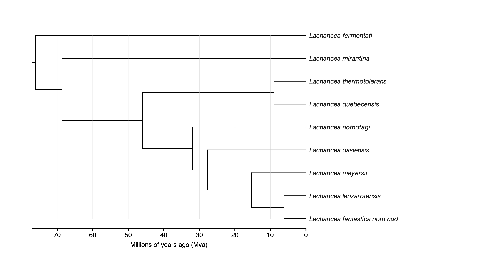
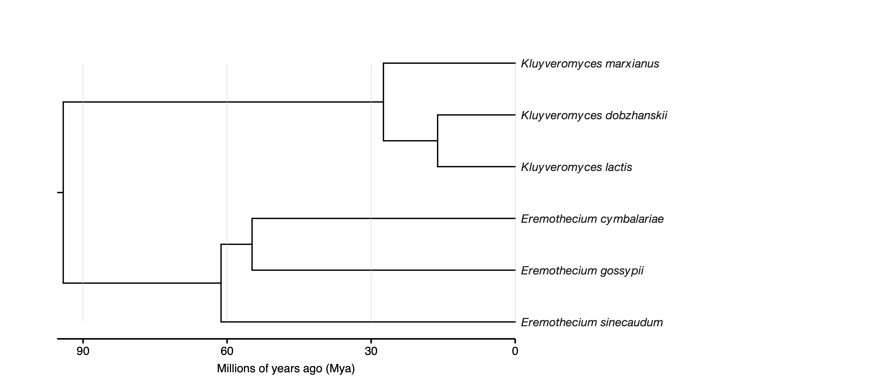
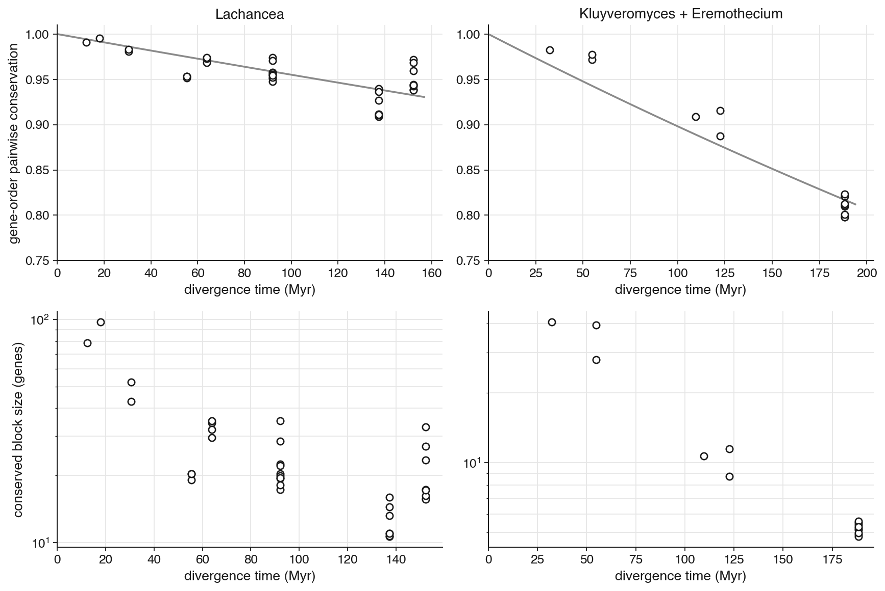
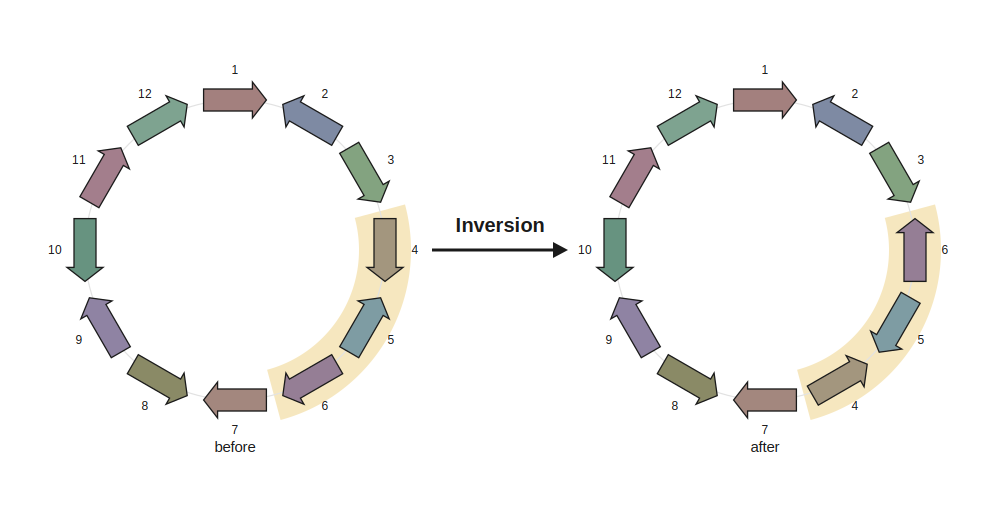
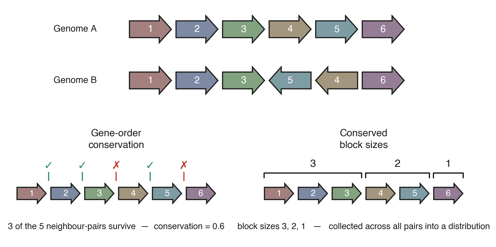
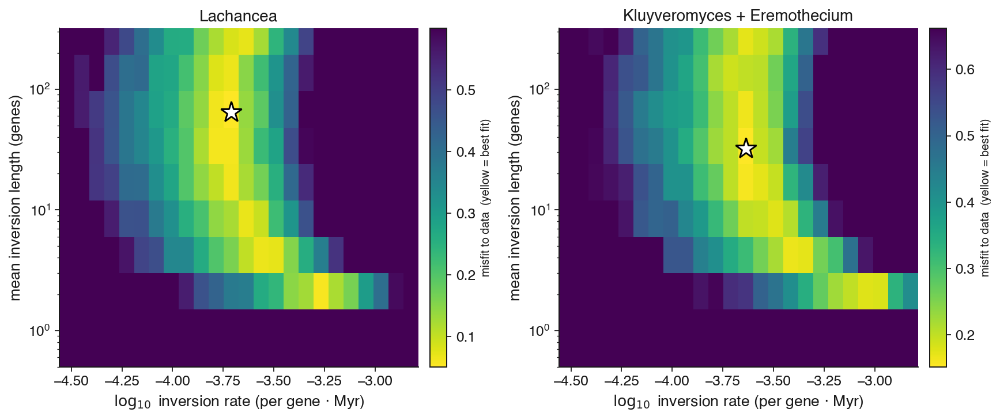

# Inferring the inversion rate from synteny

**What we infer:** the **inversion rate** — how often inversions reshuffle gene order — in
inversions per gene per Myr. **How:** match a small set of synteny *observables* between real
genomes and a ZOMBI2 forward simulation run down a **dated** species tree.

## The idea

Over time, an **inversion** reverses a chromosomal segment (and flips the strand of the genes in
it), so gene order slowly diverges between species. The *amount* of divergence between two genomes,
plotted against *how long ago they split*, carries the inversion rate. The one ingredient that makes
this a **rate** rather than a bare count is a **dated tree**: it turns "how much gene order has been
scrambled" into "inversions per gene per Myr". We summarise gene order with a few **observables**,
simulate genome evolution with ZOMBI2 under a proposed inversion rate down the real dated tree, and
accept the rate whose observables match the data (Approximate Bayesian Computation). In the vocabulary
of genome rearrangement: the exercise is ABC with the **breakpoint distance** (equivalently, the
gene-order conservation below) and the **conserved segment length** as summary statistics, used to
infer the inversion rate.

## Data and the timescale window

We use **two well-scaled clades to measure the rate**, at two depths inside the usable window:

| Clade | Genomes | Crown age | Role |
|---|---|---|---|
| *Lachancea* | GRYC/Génolevures, chromosome-level + strand (9 species) | 76 Myr | rate |
| *Kluyveromyces* + *Eremothecium* | NCBI RefSeq (6 species) | 94 Myr (pairs to 188 Myr) | rate (corroboration) |

Gene order comes from the annotations. Of the ~5,000 protein-coding genes in each genome, the ones
that are single-copy and present in **every** species of the clade (1:1 orthologs, mmseqs2) form the
core we analyse — **3,306 genes** in *Lachancea* and **2,593** in *Kluyveromyces*+*Eremothecium*.
Every pairwise comparison below is over that core. Both dated trees are pruned from the
time-calibrated phylogeny of Shen et al. (2018) and rescaled to Myr — which is where the *rate* units
come from. The *Kluyveromyces*+*Eremothecium* clade is the classic pre-WGD synteny group: its deepest
pair, *K. lactis* vs *Ashbya* (*Eremothecium*) *gossypii*, is exactly the one Keogh et al. (2000)
measured.

!!! note "A note on the names"
    *Lachancea* and *Kluyveromyces* are today **separate genera**, but both were once lumped in a
    broad *Kluyveromyces* — *Lachancea thermotolerans*, for example, was formerly *Kluyveromyces
    thermotolerans* — until Kurtzman (2003) split the genus. So the two clades here are **disjoint**:
    no species is shared between them, and *Lachancea* is not a subtree of *Kluyveromyces*. The
    historical synonymy is only a naming artefact, not an overlap in the data.

<figure markdown="span">
  { width="80%" }
  <figcaption markdown="span">Figure 1. The dated *Lachancea* tree (9 species, pruned from Shen et al. 2018), time axis in millions of years ago; 76-Myr crown.</figcaption>
</figure>

<figure markdown="span">
  { width="80%" }
  <figcaption markdown="span">Figure 2. The dated *Kluyveromyces* + *Eremothecium* tree (6 species); 94-Myr crown, with cross-genus pairs reaching ~188 Myr, so a stronger inversion signal.</figcaption>
</figure>

**Why these clades — the timescale window.** Inversions are only readable from synteny in a window
of roughly **20–200 Myr**: younger than ~20 Myr, too few inversions have happened (no signal); older
than ~200 Myr, local gene order is already scrambled (nothing left to read). This is also why the
subphylum-wide (400 Myr) tree is *not* used here — its gene order is saturated and its all-species
core is too sparse to see local inversions. Both *Lachancea* and *Kluyveromyces*+*Eremothecium* sit
comfortably inside the window, where both synteny observables fall off measurably with divergence
time — the decay the rate is read from (Figure 3).

<figure markdown="span">
  { width="100%" }
  <figcaption markdown="span">Figure 3. The two synteny observables on the real genomes, one column per clade: gene-order pairwise conservation (top) and mean conserved block size (bottom) versus divergence time. Both decay measurably with time — that decay is what the fit reads. Each point is a pair of genomes.</figcaption>
</figure>

## The observables

On the core single-copy gene order of each genome, for every pair of genomes we compute two
observables (Figure 5):

| Observable | What it measures |
|---|---|
| **Gene-order conservation** — fraction of neighbouring gene-pairs still shared, vs divergence time | how fast synteny erodes → the rate |
| **Conserved block size** — mean length of the runs that stay together, vs divergence time | breakpoint spacing (corroborates conservation) |

Conservation is the workhorse. A reversal is a **two-break** operation — an inversion cuts exactly
two adjacencies, at its two ends (Figure 4) — so the rate at which conservation decays with time *is*
the inversion rate. Conserved block size is the *same* signal seen the other way round: the colinear
runs *between* those breaks. It corroborates conservation rather than adding independent information —
a fact that turns out to matter when we ask what the data can and cannot pin down (Results).

These two observables are standard objects: gene-order conservation is the **complement of the
breakpoint distance** — the breakpoint distance counts the adjacencies broken between two genomes, and
conservation is the fraction left intact — and conserved block size is the **conserved segment
length** (Caprara & Lancia 2000). We summarise with the breakpoint distance rather than the **inversion
(reversal) distance** for three reasons. Its expectation under a rate is analytically clean — it is
what gives the exp(−2·r·t) moment estimate below — so it varies smoothly and monotonically with the
rate across the whole window, where the reversal distance saturates. It is cheap, O(genes). And,
looking ahead to richer models, it is *event-agnostic*: a translocation or transposition breaks
adjacencies too, so the breakpoint distance stays the right currency once more event types are added,
whereas the reversal distance bakes in the inversions-only assumption.

<figure markdown="span">
  { width="72%" }
  <figcaption markdown="span">Figure 4. An inversion reverses a chromosomal segment and flips the strand of every gene inside it — the elementary event whose rate we measure.</figcaption>
</figure>

<figure markdown="span">
  { width="95%" }
  <figcaption markdown="span">Figure 5. The two observables on a toy pair of genomes related by an inversion of the {4,5} segment. **Gene-order conservation** is the fraction of neighbouring gene-pairs that survive (here 3 of 5). **Conserved block sizes** are the lengths of the runs that stay together (3, 2, 1); collected across all genome pairs, their distribution is the second observable.</figcaption>
</figure>

## Fitting the rate

The goal is to find the inversion rate (and length) under which ZOMBI2 produces genomes whose synteny
observables match the real ones. There are two general strategies for this.

**1. Likelihood-based inference.** Write the probability of the observed gene orders as a function of
the rate and maximise it — or put a prior on the rate and integrate. This is the gold standard when
it is available, and for inversions it is genuinely hard: the probability of turning one gene order
into another is a sum over *every* inversion history that could connect them, and the number of such
histories grows combinatorially with genome size, so the likelihood has no closed form and has thus
far been difficult to evaluate directly. It is not, however, out of reach. The sum can be
approximated — for a pair of chromosomes, York, Durrett & Nielsen (2002) estimate the number of
inversions by MCMC over histories, and later relate the rate to inversion tract length (York et al.
2007); breakpoint- and reversal-based estimators go back further still (Caprara & Lancia 2000). And
what is *cheap* to compute exactly is the **minimum** number of inversions between two signed gene
orders — the inversion (reversal) distance, solved in polynomial time by Hannenhalli–Pevzner theory
(Hannenhalli & Pevzner 1999) — though the minimum is not the likelihood: it ignores the many longer
histories real evolution also takes, and it saturates once genomes are well diverged. So for a single
event type on a pair of genomes, tailored likelihood methods already exist, and ABC is not
necessarily more efficient than they are. Where the balance tips is **multiple event types acting at
once**: extending an exact likelihood to inversions *and* translocations *and* transpositions
together is hard, whereas a simulator absorbs each new event type as just one more parameter — which
is the case ABC is really built for.

**2. Approximate Bayesian Computation (ABC).** When the likelihood is expensive (or the model outgrows
the tailored methods above) but *simulating* the process is easy, ABC replaces the likelihood with the
simulator: propose parameter values,
simulate the genome's evolution down the dated tree — which yields a genome at *every* tip, exactly as
in the data — reduce those genomes to the same pairwise observables, and keep the proposals whose
observables land closest to the real ones. Because ZOMBI2 simulates inversions on an
ordered genome directly and cheaply, and the model we need to capture this behaviour has only one or
two parameters to tune, we can simply **sweep a grid** over (inversion rate × inversion length)
instead of sampling a prior: every cell is one simulation, and its distance to the real observables
says how well that (rate, length) fits. Mapping the *whole* grid — rather than reporting only the
best cell — is what lets us read off not just the estimate but *what the data can and cannot pin
down* (Figure 6). This is the strategy we use.

We are **not flying blind**. Two anchors frame the answer before the sweep runs:

1. **Literature.** Fischer et al. (2006) measured yeast inversion rates of ~3×10⁻⁴–2×10⁻³ per
   gene·Myr; this sets the grid's range.
2. **A moment estimate.** The observed conservation decays roughly as exp(−2·r·t), so
   r ≈ −ln(conservation) / (2·t) gives a first-pass rate directly from the data.

The moment estimate gives the ballpark; the grid sweep refines it and, crucially, shows how tightly
each parameter is actually constrained.

## Results

**With the inversion length fixed at a few genes (small, as yeast inversions are — Keogh et al.
2000), the inversion rate is ≈ 3–4×10⁻⁴ per gene·Myr in both clades** — *Lachancea* **2.7×10⁻⁴**
and *Kluyveromyces*+*Eremothecium* **3.9×10⁻⁴** (moment estimates 1.8 and 6.7×10⁻⁴). Both sit inside
the range of Fischer et al. (2006) (3×10⁻⁴–2×10⁻³). That is the number the recipe delivers.

Figure 6 maps the misfit to the real data over the whole (inversion rate × inversion length) grid. The
bright band is the result — a **diagonal ridge** of equally good fits, because rate and length trade
off: more, shorter inversions scramble gene order about as much as fewer, longer ones (a reversal
breaks two adjacencies whatever its size). The ridge is **narrow across** — fix a length and the rate
is pinned — but runs the **full height** — any length fits, with its own matching rate. So gene order
constrains the *rate*, not the *length*. It does fix one edge: single-gene inversions merely flip a
strand without separating neighbours, so they cannot erode gene order — the fit collapses below two
genes.

<figure markdown="span">
  { width="100%" }
  <figcaption markdown="span">Figure 6. The fit to the real data over the (inversion rate × inversion length) grid, one panel per clade — brighter (yellow) is a closer fit; the star is the best cell. The bright band is a rate–length trade-off: it is narrow in rate (fixing a length pins the rate) but spans all lengths (gene order does not constrain the inversion size). The two bright ends are the same ridge, not two answers. Reading the rate at a fixed literature length (a few genes) gives ~3–4×10⁻⁴ per gene·Myr.</figcaption>
</figure>

So we **fix the length from the literature** (a few genes) rather than fit it, and read the rate off
the ridge. The dependence is mild above two genes: the rate holds to within a factor of ~2 for lengths
from ~4 to ~200 genes, rising only for the very shortest inversions. The two clades agree to within
their spread, at the low end of the Fischer et al. (2006) range, consistent with these being
genomically stable pre-WGD yeasts. The simulations are chromosome-faithful — real karyotypes of 8 and
7 linear chromosomes — via ZOMBI2's multichromosome ordered genome.

!!! tip "Match the parameter to the data"
    Gene order tells you the *rate* of rearrangement, not the *size* of individual events — a
    reversal breaks two adjacencies whatever its length, so the two are averaged away. Measuring
    event size needs a different view: the events one at a time, from a reversal-distance
    reconstruction or a sequence alignment. Choosing a recipe is partly knowing which parameter each
    kind of data can actually constrain — synteny is the right tool for the rate, not for the size.

## Assumptions and limitations

- **Empirical inputs, simulated process.** The two inputs are real data — the dated tree (Shen et al.
  2018) and the observed gene orders (GRYC/Génolevures, NCBI) — and *only* the rearrangement process
  is simulated; the inferred rate is the one that makes the simulated genomes consistent with those
  real inputs. (This is not a study where the tree is simulated too.)
- **Inversions-only model.** Yeast gene orders are not reshaped by inversions alone — the same
  sources report occasional translocations (Fischer et al. 2006; Keogh et al. 2000) — but small
  inversions dominate the micro-synteny signal, so treating *all* local rearrangement as inversions
  makes the rate at most a slight upper bound. Because our summary statistic is the breakpoint distance
  (event-agnostic; see "The observables"), the natural extension is to add a translocation rate as a
  second parameter and let the grid become a plane — precisely the multi-event regime where ABC earns
  its keep over tailored likelihood methods. ZOMBI2's multichromosome model supports cross-chromosome
  translocations directly, so this is a matter of one more axis in the sweep; we expect the inversion
  rate to be largely unchanged but the demonstration to be more complete. This extension is the
  recommended next step for this recipe.
- **Inversion length is fixed, not fitted.** Gene order constrains the rate, not event size (a
  reversal breaks two adjacencies whatever its length; Figure 6), so we set the inversion length from
  the literature (Keogh et al. 2000) rather than infer it. The rate barely moves with the assumed
  length above a few genes, so this costs the headline little; measuring the size itself would need a
  reversal-distance reconstruction or a sequence alignment (see the note above).
- **Genes are dimensionless tokens.** The model has gene *order* but no nucleotide lengths or
  intergenic spacing, so "inversion length" is a gene count, not a physical span. A nucleotide-level
  model would make length physical, but the rate — the quantity the data actually constrain — is
  unchanged, so this is not pursued here.
- **Single-copy core only**, so gene gain, loss and duplication are factored out. The core (3,306 /
  2,593 genes) is density-matched: the simulation evolves the full ~5,000-gene genome and observes an
  evenly-spread subset of the same size, so the fitted rate is a genome-wide per-gene rate.

## Reproducing this recipe

The pipeline is four steps:

1. **Dated trees** — prune the time-calibrated phylogeny of Shen et al. (2018) to each clade and
   rescale to Myr.
2. **Real gene order** — take the annotations, keep the single-copy core (1:1 orthologs via mmseqs2),
   and record each gene's chromosome, family, and strand.
3. **Grid sweep** — for each (inversion rate × inversion length) cell, simulate chromosome-faithful
   genomes down the dated tree (one at every tip) with ZOMBI2's multichromosome ordered genome, reduce
   them to the two pairwise observables, and score their distance to the real data.
4. **Read the rate** — fix the inversion length from the literature and read the best-fitting rate
   off the ridge.

!!! note "Runnable code"
    This page documents the method and the result. The scripts are being ported onto ZOMBI2's
    multichromosome ordered genome (now part of the core engine) and will ship alongside the recipe.

## References

- Caprara A, Lancia G (2000). *Experimental and statistical analysis of sorting by reversals.* In:
  Sankoff D, Nadeau JH (eds), *Comparative Genomics.* Springer, Dordrecht, 171–183.
- Fischer G, Rocha EPC, Brunet F, Vergassola M, Dujon B (2006). *Highly variable rates of genome
  rearrangements between hemiascomycetous yeast lineages.* PLoS Genetics 2:e32.
- Hannenhalli S, Pevzner PA (1999). *Transforming cabbage into turnip: polynomial algorithm for
  sorting signed permutations by reversals.* Journal of the ACM 46(1):1–27.
- Keogh RS, Seoighe C, Wolfe KH (2000). *Prevalence of small inversions in yeast gene order
  evolution.* Yeast 16:1009–1020.
- Kurtzman CP (2003). *Phylogenetic circumscription of Saccharomyces, Kluyveromyces and other members
  of the Saccharomycetaceae, and the proposal of the new genera Lachancea, Nakaseomyces, Naumovia,
  Vanderwaltozyma and Zygotorulaspora.* FEMS Yeast Research 4(3):233–245.
- Shen X-X, Opulente DA, Kominek J, et al. (2018). *Tempo and mode of genome evolution in the budding
  yeast subphylum.* Cell 175:1533–1545.
- York TL, Durrett R, Nielsen R (2002). *Bayesian estimation of the number of inversions in the
  history of two chromosomes.* Journal of Computational Biology 9(6):805–818.
- York TL, Durrett R, Nielsen R (2007). *Dependence of paracentric inversion rate on tract length.*
  BMC Bioinformatics 8:115.
