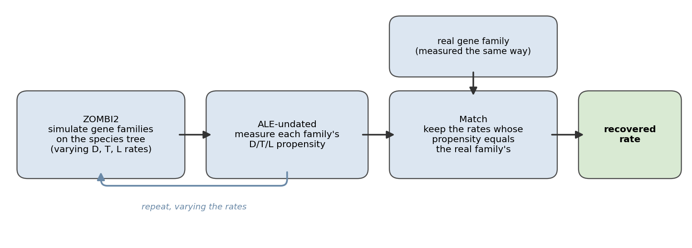
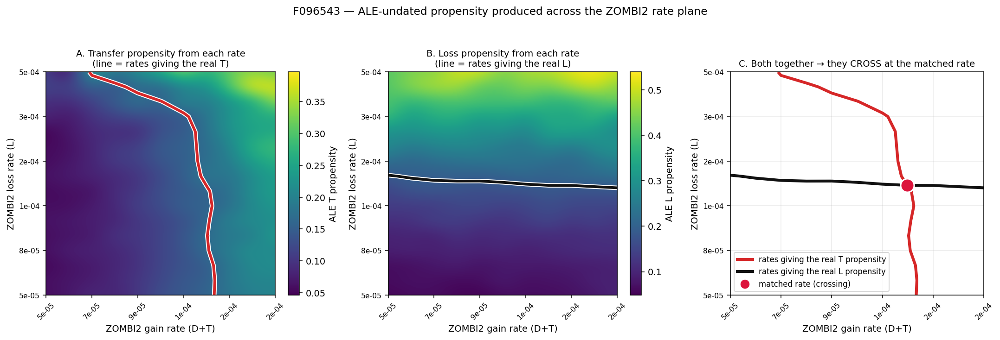
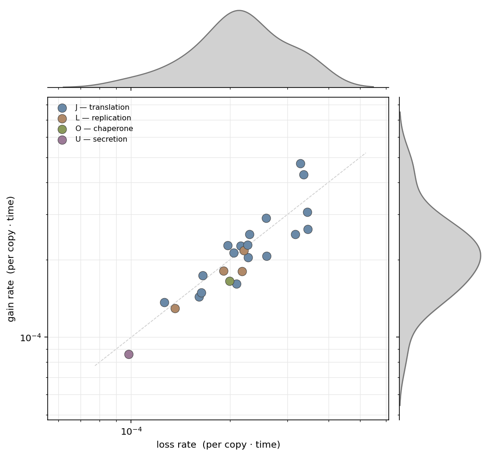

# Gene-turnover rates for the universal core

**Pattern in real data:** the per-branch duplication / transfer / loss signal an *undated*
reconciliation reports for universal single-copy genes.
**What you recover:** realistic ZOMBI2 **gain** and **loss** rates for the bacterial/archaeal core.
**Take-away:** turnover is **balanced** at **gain ≈ loss ≈ 2 × 10⁻⁴ per gene copy · tree-time** —
and it is transfer, not duplication.

## The idea

To simulate realistic genomes you must give ZOMBI2 per-copy rates. The obvious source is a
reconciliation of real families against a species tree — but the reconciliations we can build at
scale are **undated** (`ALEml_undated`), and an undated model has no clock: it reports per-branch
**propensities** (odds), not per-time **rates**. Rate and branch length are fused into one number,
and you cannot divide your way back to a rate (the *units problem*). So we never try.

Instead we go forward — **simulate, measure, match**:

{ width="100%" }

Simulate gene families with ZOMBI2 under many candidate rates; measure the propensity ALE-undated
reports for each simulated family; keep the rates whose propensity matches the real family's, where
the real family is scored by the *same* ALE-undated step. Because that measurement is identical for
real and simulated families, its unit-mixing cancels — we only ever compare propensities to
propensities, and the thing being fit is the ZOMBI2 rate.

## A two-rate fit for the universal core

Universal single-copy genes (ribosomal proteins, aminoacyl-tRNA synthetases, core
replication/translation machinery) make the fit clean: they originate at the root, they do not
duplicate (so duplication ≈ 0 and gain is pure transfer), and their presence/absence is
uninformative (they are in everything). What remains is a **two-rate** fit — recover **gain** and
**loss** by matching two propensities. Matching the *transfer* propensity mainly pins gain; matching
the *loss* propensity mainly pins loss:

{ width="100%" }

Each panel is over the ZOMBI2 rate plane for one family (*rplN*, ribosomal protein L14). The red
line (A) is the rates reproducing the real transfer propensity — nearly vertical, set by gain; the
black line (B) does the same for loss — nearly horizontal. They **cross** at the recovered rate (C).

## Results

Across 24 universal single-copy families the recovered rates cluster tightly:

{ width="82%" }

Every family sits on the **gain = loss** diagonal — balanced turnover is exactly what keeps a gene
universal and single-copy — around **2 × 10⁻⁴**, independent of function (translation, replication,
chaperone and secretion families all overlap).

`gain, loss` below are the recovered rates in **10⁻⁴ per copy · tree-time**; `T, L` are the
ALE-undated transfer and loss propensities they reproduce. `D ≈ 0` on both sides (single-copy ⇒ no
duplication).

| Gene | COG | gain | loss | T | L |
|---|---|---:|---:|---:|---:|
| rpsO (30S S15) | J | 4.73 | 3.28 | 0.35 | 0.29 |
| rpmA (50S L27) | J | 4.29 | 3.36 | 0.35 | 0.30 |
| map (Met-AP) | J | 3.07 | 3.45 | 0.33 | 0.37 |
| rpsH (30S S8) | J | 2.91 | 2.58 | 0.30 | 0.28 |
| thrS (ThrRS) | J | 2.62 | 3.46 | 0.33 | 0.39 |
| efp (EF-P) | J | 2.52 | 2.30 | 0.27 | 0.25 |
| gltX (GluRS) | J | 2.51 | 3.17 | 0.30 | 0.36 |
| rplP (50S L16) | J | 2.28 | 2.27 | 0.26 | 0.26 |
| rpsM (30S S13) | J | 2.27 | 1.97 | 0.25 | 0.23 |
| rplF (50S L6) | J | 2.27 | 2.16 | 0.25 | 0.25 |
| ruvB (HJ helicase) | L | 2.17 | 2.21 | 0.25 | 0.26 |
| frr (recycling) | J | 2.13 | 2.05 | 0.24 | 0.24 |
| rplK (50S L11) | J | 2.07 | 2.59 | 0.25 | 0.30 |
| rpsD (30S S4) | J | 2.04 | 2.28 | 0.25 | 0.27 |
| uvrB (excinuclease) | L | 1.81 | 1.92 | 0.21 | 0.23 |
| recR (recombination) | L | 1.81 | 2.18 | 0.22 | 0.26 |
| rplB (50S L2) | J | 1.74 | 1.65 | 0.19 | 0.20 |
| dnaK (Hsp70) | O | 1.65 | 2.00 | 0.17 | 0.23 |
| rpsS (30S S19) | J | 1.61 | 2.10 | 0.19 | 0.24 |
| rplN (50S L14) | J | 1.49 | 1.64 | 0.17 | 0.19 |
| valS (ValRS) | J | 1.44 | 1.61 | 0.16 | 0.19 |
| rpsJ (30S S10) | J | 1.37 | 1.26 | 0.16 | 0.15 |
| gyrA (gyrase) | L | 1.29 | 1.36 | 0.14 | 0.16 |
| secY (translocase) | U | 0.86 | 0.98 | 0.10 | 0.12 |

COG: J translation, L replication/repair, O chaperone/PTM, U secretion. Median **gain ≈ loss ≈
2 × 10⁻⁴**.

## Using the rates

Drop them straight into a ZOMBI2 run. Single-copy core ⇒ no duplication; gain is transfer:

```python
from zombi2.species import simulate_species_tree, BirthDeath
from zombi2.genomes import simulate_genomes

# a dated tree on the same time scale the rates were calibrated on (crown ≈ 4447)
tree = simulate_species_tree(BirthDeath(1e-3, 3e-4), n_tips=120, age=4447, seed=1)

genomes = simulate_genomes(tree, duplication=0.0, transfer=2e-4, loss=2e-4,
                           origination=1e-4, initial_families=100, seed=42)
```

or from the command line:

```bash
zombi2 genomes --tree species_tree.nwk --dup 0 --trans 2e-4 --loss 2e-4 --orig 1e-4 -o out/
```

## Assumptions and limitations

- **The rates are per unit tree-time**, tied to the dated tree they were measured on (crown ≈ 4447).
  Simulate on a comparably-scaled tree and they transfer directly; on a tree with a different time
  scale, multiply the rates by the ratio of time units.
- **This is the informational core** — universal single-copy genes. It says nothing about the
  accessory genome or lineage-specific rate variation.
- **Duplication is (correctly) absent** here: single-copy genes do not duplicate, so "gain" is
  transfer. Separating duplication from transfer needs *multi-copy* families — a different recipe.

## Reproducing this recipe

Build the 120-genome gold dataset (MMseqs2 → MAFFT → trimAl → IQ-TREE `LG+G` → ALE), take the
universal single-copy core (present in ≥118 of 120 genomes, one dominant function, <1.4 copies per
genome, 24 families), read each family's transfer/loss propensity from the reconciliation, then
sweep `(gain, loss)` and keep the rate whose simulated propensity matches.

## References

- Davín, A. A., Woodcroft, B. J., Soo, R. M., Morel, B., *et al.* (2025). A geological timescale for
  bacterial evolution and oxygen adaptation. *Science* **388**(6742), eadp1853.
  [doi:10.1126/science.adp1853](https://doi.org/10.1126/science.adp1853)
- Szöllősi, G. J., Tannier, E., Lartillot, N., Daubin, V. (2013). Lateral gene transfer from the
  dead. *Systematic Biology* **62**(3), 386–397.
  [doi:10.1093/sysbio/syt003](https://doi.org/10.1093/sysbio/syt003)
