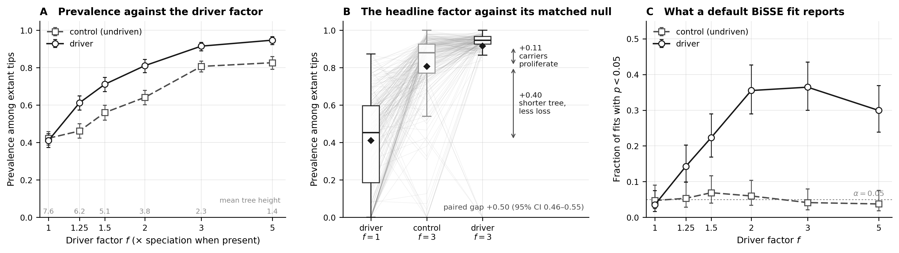

# Can BiSSE find the gene that drives speciation?

A gene that changes how fast its lineage diversifies, and the standard test that is
supposed to detect it, scored on data where the truth is known. All the relevant files are
in [`analyses/bisse/`](https://github.com/AADavin/zombi2/tree/main/analyses/bisse).

## The question

A genomic key innovation is a gene whose possession changes how fast a lineage
diversifies. The standard tool for detecting that pattern is state-dependent
diversification: BiSSE fits a model in which a binary character sets the speciation and
extinction rates, and a likelihood-ratio test asks whether the rates really differ by
state. On real data the character is often a gene's presence or absence. **Does the test
find a gene that truly drives speciation, and does it stay quiet on one that does not?**

## Why real data cannot answer it

On a real clade nobody knows whether the gene drives diversification; that is the question
being asked. Worse, a gene can be common among surviving species for reasons that have
nothing to do with selection on the gene, and real data offer no way to hold those reasons
still. A simulated dataset can, because the simulator knows which gene drives and by how
much, and can plant a second gene, identical in every rate, that drives nothing.

## The run

One joint run grows the species tree and the genome together: a `driver` family, present
at the root and lost per copy at rate 0.12, multiplies the speciation rate by a factor
`f` while it is present.

```python
from zombi2 import genomes, joint, species
from zombi2.params import PerLineage

result = joint.simulate(
    species.birth_death(
        birth=PerLineage(1.0).scaled_by("genomes:driver",
                                        {"present": 3.0, "absent": 1.0}),
        death=0.3, n_extant=150),
    genomes.genome(duplication=0.0, loss=0.12, origination=0.0,
                   families=[genomes.family("driver"), genomes.family("control")]),
    seed=1)
```

We grew 200 replicate clades to 150 extant tips at each of six factors, `f` = 1 to 5, on
matched seeds; at `f` = 1 the driver reads as a factor of one, so that arm is the null.
Every genome also carries the `control` family, lost at the same rate, that no rate
reads. The whole sweep is 1,400 joint runs.

## What the dependency does to the data

The driver's prevalence among the extant tips rises with the factor, from 0.41 in the
null to 0.95 at five-fold (panel A below). The control shows that most of that rise is
not selection: carried through the very same runs, it rises from 0.42 to 0.83 with
nothing driving it, because a driven clade reaches its 150 tips sooner (the mean tree
height falls from 7.6 to 1.4) and a younger tree has lost less of everything. At `f` = 3
the decomposition is exact (panel B): of the raw +0.50 gap between the driven run and its
matched null, +0.40 is the shorter tree, shared with the control, and +0.11 is carriers
proliferating differentially, the only part that is selection on the gene. An analysis of
real genomes would see the raw gap; this run carries its own control.



## What BiSSE reports

For every replicate we fit BiSSE with `diversitree`, exactly as its documentation
recommends, on the driver's tip presence and on the control's: 2,165 fits (an invariant
character cannot be fit, which skipped 235 of the 2,400).

The test is well calibrated here. It rejects on the driver at the null in 3.5% of fits
and on the control in 5.2%, even on the driven trees, whose rate heterogeneity is real
but belongs to the other family. When it rejects at `f` > 1, it puts the higher
speciation rate on the carrier state in 255 of 256 fits. What limits it is power, and not
monotonically (panel C): a three-fold effect on speciation, enough to move prevalence by
+0.50, is found in 36% of 150-tip clades, and a five-fold effect is found *less* often,
in 30%, because a stronger driver pushes the family toward fixation and the shorter, more
uniform trees carry fewer of the events the likelihood needs. On data like these the risk
is not the false positive; it is reading a non-significant result as the absence of the
effect.

## The recipe, generalised

Simulate the dependency you suspect, at a range of strengths, with the null and a neutral
control from the same machinery. Run the inference method exactly as its documentation
recommends. The dataset then scores the method: its false-positive rate where nothing
drives, its power where something does, and the direction of its errors. Every number
above regenerates from one script and one master seed; see
[`analyses/bisse/REPORT.md`](https://github.com/AADavin/zombi2/blob/main/analyses/bisse/REPORT.md)
for the exact commands.
