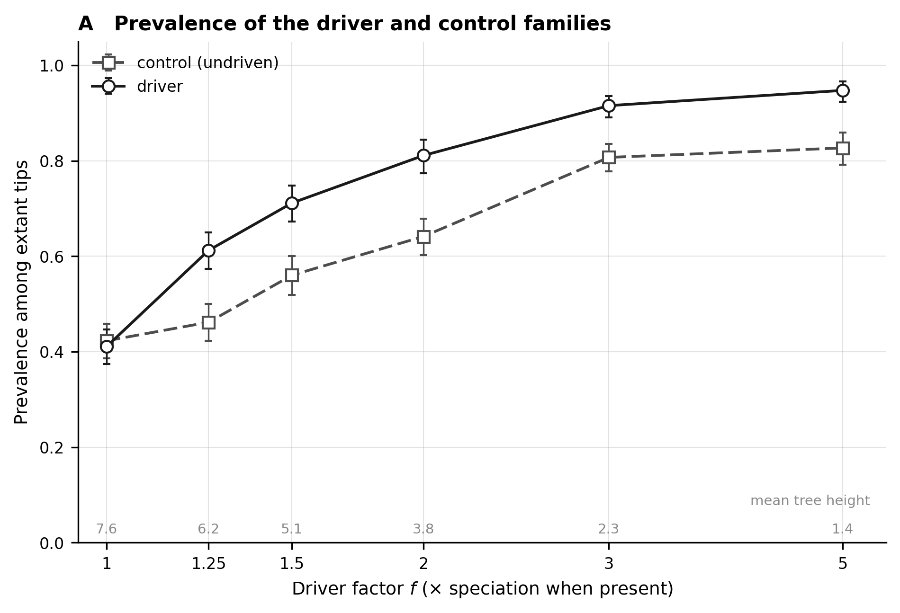
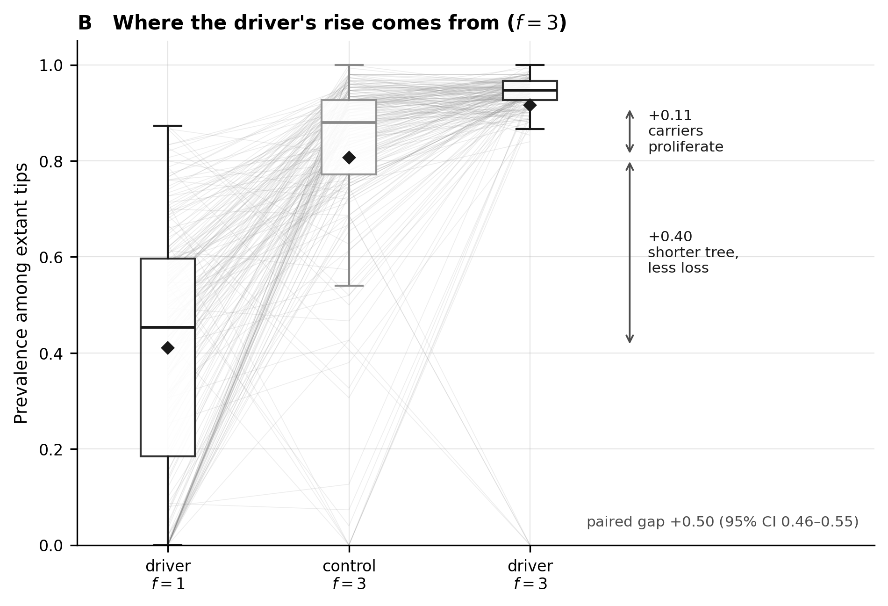
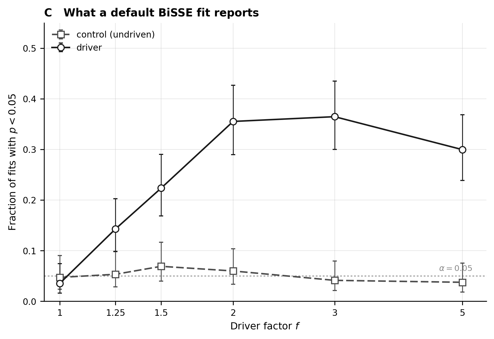

# Can BiSSE find the gene that drives speciation?

A gene that changes how fast its lineage diversifies, and the standard test that is
supposed to detect it, scored on data where the truth is known. All the relevant files are
in [`analyses/bisse/`](https://github.com/AADavin/zombi2/tree/main/analyses/bisse).

## The question

A genomic key innovation is a gene whose possession changes how fast a lineage
diversifies. The standard tool for detecting that pattern is state-dependent
diversification: BiSSE fits a model in which a binary character sets the speciation and
extinction rates, and a likelihood-ratio test asks whether the rates really differ by
state. On real data the character is often a gene's presence or absence. **Does the test
find a gene that truly drives speciation, and does it stay quiet on one that does not?**

## Why real data cannot answer it

On a real clade nobody knows whether the gene drives diversification; that is the question
being asked. Worse, a gene can be common among surviving species for reasons that have
nothing to do with selection on the gene, and real data offer no way to hold those reasons
still. A simulated dataset can, because the simulator knows which gene drives and by how
much, and can plant a second gene, identical in every rate, that drives nothing.

## The run

One joint run grows the species tree and the genome together: a `driver` family, present
at the root and lost per copy at rate 0.12, multiplies the speciation rate by a factor
`f` while it is present.

```python
from zombi2 import genomes, joint, species
from zombi2.params import PerLineage

result = joint.simulate(
    species.birth_death(
        birth=PerLineage(1.0).scaled_by("genomes:driver",
                                        {"present": 3.0, "absent": 1.0}),
        death=0.3, n_extant=150),
    genomes.genome(duplication=0.0, loss=0.12, origination=0.0,
                   families=[genomes.family("driver"), genomes.family("control")]),
    seed=1)
```

We grew 200 replicate clades to 150 extant tips at each of six factors, `f` = 1 to 5, on
matched seeds. At `f` = 1 the family multiplies the speciation rate by one, which is to
say it has no effect at all: those 200 runs are the null, the same machinery with nothing
to find.

Every genome also carries a second family, called `control`. It appears at the root and
is lost at the same rate as the driver, but nothing in the simulation depends on it: no
rate reads it, so it cannot make any lineage speciate faster or slower. If its prevalence
still rises in the driven runs, that rise can only come from the shape of the tree, never
from anything the family itself does. The whole sweep is 1,400 joint runs.

## What the dependency does to the data

The driver's prevalence among the extant tips rises with the factor, from 0.41 in the
null to 0.95 at five-fold (panel A). But the control rises too, from 0.42 to 0.83, with
nothing driving it. The reason is the shape of the tree: a driven clade reaches its 150
tips sooner (the mean tree height falls from 7.6 to 1.4 time units), and on a younger
tree every family, driven or not, has had less time to be lost.



Panel B takes one factor, `f` = 3, and splits the driver's rise into its two causes.
Three boxes summarise three measurements of prevalence, 200 replicates each, and one grey
line follows each replicate across them. On the left, the driver in the null runs: 0.41
on average, what the family does under loss alone. In the middle, the control inside the
driven runs: 0.81. It rose by +0.40 without being driven, so that step is the tree-age
effect on its own, what any family gains from a younger tree. On the right, the driver in
those same driven runs: 0.92. That final step, +0.11, is the only part caused by the gene
itself: lineages that carry it speciate three times faster, so tips descending from
carriers end up overrepresented. The two steps sum exactly to the raw +0.50 gap. An
analysis of real genomes would see only that raw gap, with no way to tell the two causes
apart; this dataset carries its own control, so it can.



## What BiSSE reports

For every replicate we fit BiSSE with `diversitree`, exactly as its documentation
recommends, on the driver's tip presence and on the control's: 2,165 fits (an invariant
character cannot be fit, which skipped 235 of the 2,400).

The test is well calibrated here. It rejects on the driver at the null in 3.5% of fits
and on the control in 5.2%, even on the driven trees, whose rate heterogeneity is real
but belongs to the other family. When it rejects at `f` > 1, it puts the higher
speciation rate on the carrier state in 255 of 256 fits. What limits it is power, and not
monotonically (panel C): a three-fold effect on speciation, enough to move prevalence by
+0.50, is found in 36% of 150-tip clades, and a five-fold effect is found *less* often,
in 30%, because a stronger driver pushes the family toward fixation and the shorter, more
uniform trees carry fewer of the events the likelihood needs. On data like these the risk
is not the false positive; it is reading a non-significant result as the absence of the
effect.


