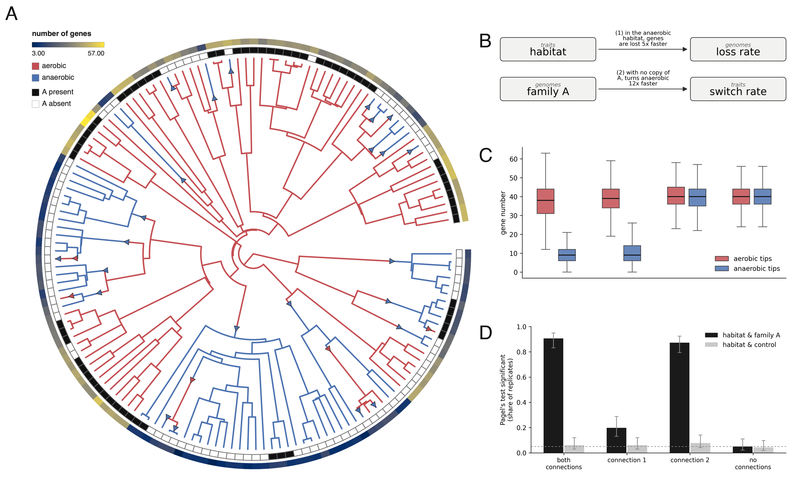

# Can Pagel's test detect a feedback?

A genome and a trait that shape each other, and the standard test for correlated
evolution, scored on data where the truth is known. All the relevant files are in
[`analyses/pagel/`](https://github.com/AADavin/zombi2/tree/main/analyses/pagel).

## The question

Pagel's test asks whether two binary characters evolved dependently on a tree: it
compares a Markov model in which each character's transition rates depend on the other
character's state against one in which they do not, with a likelihood-ratio test. On
real data the characters might be a habitat and a gene family's presence. **Does the
test detect a true feedback between them, does it detect each direction alone, and does
it reject at the nominal rate when there is nothing to find?**

## Why real data cannot answer it

On a real clade nobody knows whether the habitat and the gene family depend on each
other; that is the question being asked. In a simulated dataset the dependency is
known, because it is written into the run: which rate reads which state, and by how
much. And the simulation can add a second family that depends on nothing, carried on
the very same trees, so any signal the test finds on that family is an artifact.

## The run

One joint run simulates the genome and the habitat together along a dated tree of 150
extant tips. Two connections, one in each direction, close the feedback loop: the habitat
multiplies the loss rate of every gene family (an anaerobic lineage loses gene copies
five times faster), and the absence of one family, called A, multiplies the rate of
switching into the anaerobic habitat by twelve. The family stands for a gene required
for aerobic respiration: a lineage that loses it is pushed toward anaerobic habitats,
and an anaerobic lineage loses genes faster.

```python
from zombi2 import joint, traits
from zombi2.genomes import family, genome
from zombi2.params import PerCopy, PerLineage
from zombi2.species import simulate_species_tree

tree = simulate_species_tree(birth=1.0, n_extant=150, seed=1).complete_tree
result = joint.simulate(
    genome(duplication=0.05, origination=8.0, initial_families=40,
           loss=PerCopy(0.25).scaled_by("trait", {"anaerobic": 5.0, "aerobic": 1.0}),
           families=[family("A")]),
    traits.discrete(states=["aerobic", "anaerobic"], start="aerobic",
                    switch={"aerobic->anaerobic": PerLineage(0.08).scaled_by(
                                "genomes:A", {"present": 1.0, "absent": 12.0}),
                            "anaerobic->aerobic": 0.10}),
    tree=tree, seed=1)
```

Four experiments of 150 replicates each, on the same trees with matched seeds: both
connections, each connection alone, and no connections, in which both are written but
multiply by one. Each replicate also carries a **control** character, connected to nothing: one
family from a separate genome run on the same tree.

## What the test reports

For every replicate we fit `fitPagel` (from `phytools`) to the habitat paired with
family A's tip presence, and to the habitat paired with the control: 1,200 fits, of
which 341 were skipped because a character invariant at the tips cannot be fit.

| experiment | habitat × A | habitat × control |
|---|---|---|
| both connections | **90.6%** | 6.0% |
| connection 1: the habitat drives the loss rate | **19.8%** | 6.0% |
| connection 2: family A drives the switch rate | **87.3%** | 7.8% |
| no connections | 5.0% | 4.3% |

The test is well calibrated: with no connections it rejects at the nominal 5%, and so
does the control in every experiment, even on trees whose gene content and habitat are
genuinely dependent. Its power, however, depends on which rate the connection is
written on. With both connections, and with connection 2 alone, the dependence is
detected in about nine replicates of ten. With connection 1 alone it is detected in
one replicate of five, even though that connection is a five-fold change in the loss
rate of every family in the genome.



## Why the asymmetry

A connection produces extra events only where the driving state is present. Lineages
missing family A are common, because copies are steadily lost, so the twelve-fold
switch rate applies across much of the tree; anaerobic lineages are rare at the base
switch rates, so the five-fold loss applies to few branches. Tip presence is also a coarse
measure of the loss rate: a family present in several copies must lose them all before
the character changes.

Two practical lessons follow, as in the [BiSSE example](bisse.md). A non-significant
Pagel test says little about whether the habitat shapes the genome: the direction that
is nearly invisible here is a strong, genome-wide effect. And a significant test
reports dependence, not a direction: the both-connections experiment and the
connection-2 experiment cannot be told apart from the test result.
