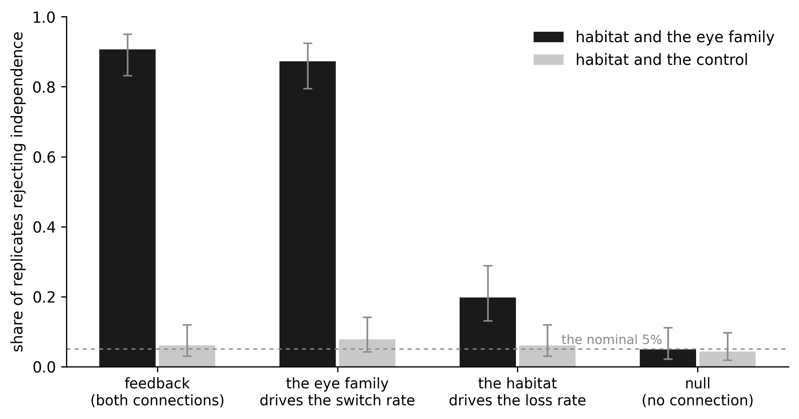

# Can Pagel's test detect a feedback?

A genome and a trait that shape each other, and the standard test for correlated
evolution, scored on data where the truth is known. All the relevant files are in
[`analyses/pagel/`](https://github.com/AADavin/zombi2/tree/main/analyses/pagel).

## The question

Pagel's test asks whether two binary characters evolved dependently on a tree: it
compares a Markov model in which each character's transition rates depend on the other
character's state against one in which they do not, with a likelihood-ratio test. On
real data the characters might be a habitat and a gene family's presence. **Does the
test detect a true feedback between them, does it detect each direction alone, and does
it stay quiet when there is nothing to find?**

## Why real data cannot answer it

On a real clade nobody knows whether the habitat and the gene family depend on each
other; that is the question being asked. A simulated dataset knows, because the
dependency is written into the run: which rate reads which state, and by how much. And
the simulation can carry a second family on the very same trees that depends on nothing,
so any signal the test finds on it is an artifact.

## The run

One joint run grows the genome and the habitat together along a dated tree of 150 extant
tips. Two connections close the loop: the habitat multiplies the loss rate of every gene
family (a cave lineage loses gene copies five times faster), and the `eye` family's
absence multiplies the rate of switching into the cave by twelve.

```python
from zombi2 import joint, traits
from zombi2.genomes import family, genome
from zombi2.params import PerCopy, PerLineage
from zombi2.species import simulate_species_tree

tree = simulate_species_tree(birth=1.0, n_extant=150, seed=1).complete_tree
result = joint.simulate(
    genome(duplication=0.05, origination=8.0, initial_families=40,
           loss=PerCopy(0.25).scaled_by("trait", {"cave": 5.0, "surface": 1.0}),
           families=[family("eye")]),
    traits.discrete(states=["surface", "cave"], start="surface",
                    switch={"surface->cave": PerLineage(0.08).scaled_by(
                                "genomes:eye", {"present": 1.0, "absent": 12.0}),
                            "cave->surface": 0.10}),
    tree=tree, seed=1)
```

Four arms of 150 replicates each, on the same trees with matched seeds: the feedback,
each direction alone, and the null, which is the same machinery with both mappings set
to one. Each replicate also carries a **control** character from an independent genome
run on the same tree, connected to nothing.

## What the test reports

For every replicate we fit `fitPagel` (from `phytools`) to the habitat paired with the
eye family's tip presence, and to the habitat paired with the control: 1,200 fits, of
which 341 were skipped because a character invariant at the tips cannot be fit.

| arm | habitat × eye | habitat × control |
|---|---|---|
| feedback (both directions) | **90.6%** | 6.0% |
| the eye family drives the switch rate | **87.3%** | 7.8% |
| the habitat drives the loss rate | **19.8%** | 6.0% |
| null (no dependency) | 5.0% | 4.3% |

The test is well calibrated: the null sits at the nominal 5%, and the control does too
in every arm, even on trees whose gene content and habitat are genuinely dependent. Its
power, however, depends on which rate the dependency touches. The feedback and the
switch-rate direction are detected in about nine runs of ten; the loss direction, a
five-fold change in the loss rate of every family in the genome, in one run of five.



## Why the asymmetry

A connection produces extra events only where the driving state is occupied. Lineages
missing the eye family are common, because copies are steadily lost, so the twelve-fold
switch rate acts across much of the tree; cave lineages are rare at the base switch
rates, so the five-fold loss rate acts on little of it. Tip presence is also a coarse
readout of loss: a family present in several copies must lose them all before the
character changes.

The practical reading mirrors the [BiSSE example's](bisse.md). A non-significant Pagel
test says little about whether the habitat shapes the genome, because the direction that
is nearly invisible here is a strong, genome-wide effect. And a significant one reports
dependence, not a direction: the feedback and the one-way switch arm look alike in the
verdict.
