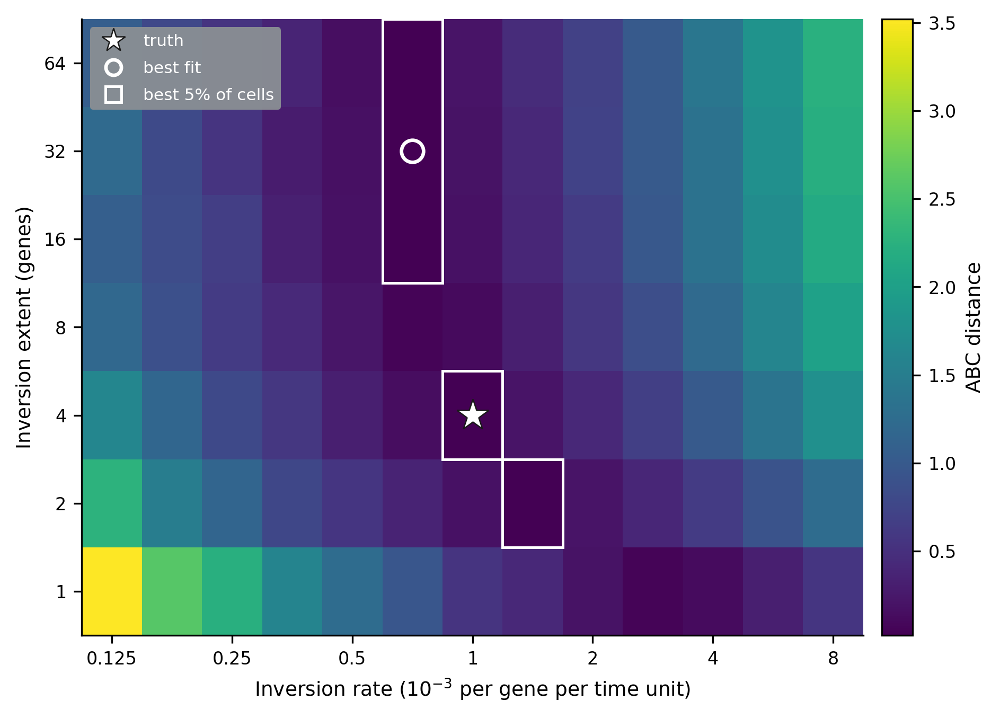
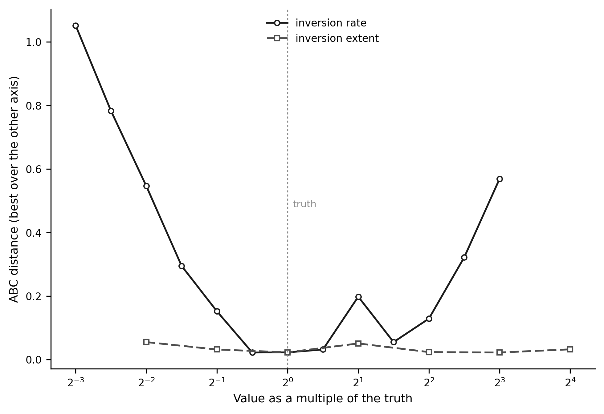
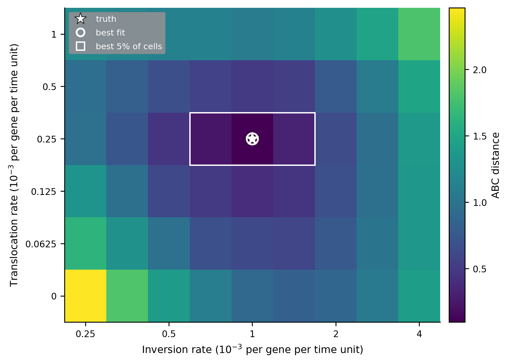
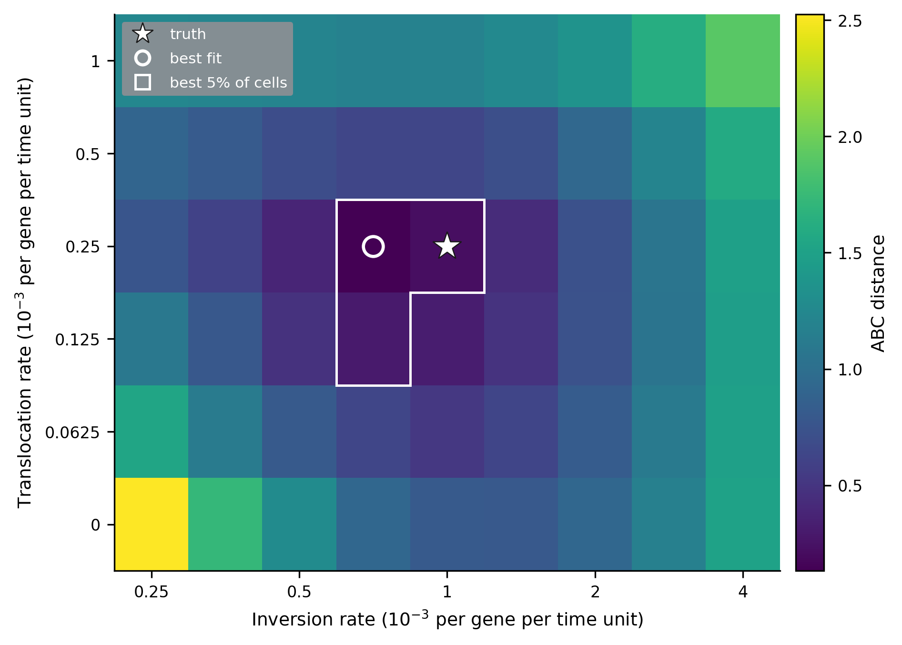

# Which rearrangement parameters can be recovered from gene order?

A genome rearrangement model, inferred back from the gene orders it produced, so that
every estimate can be checked against the value that generated the data. All the relevant
files are in
[`analyses/rearrangements/`](https://github.com/AADavin/zombi2/tree/main/analyses/rearrangements).

## The question

An inversion reverses a segment of a chromosome. A translocation moves a segment from one
chromosome to another. Both break adjacencies between neighbouring genes, so gene order
diverges between species, and the amount of divergence carries information about the
events behind it. Two things about each event type could in principle be read from the
data: how often it happens, and how large it is. **Which of the two does gene order
actually pin, and can two event types acting together be told apart?**

On real genomes there is no way to check an inferred rearrangement rate, because the true
rate is unknown. So the study runs entirely on simulated data: genomes are simulated at
known rates down a dated tree, the parameters are inferred back, and the answer is
compared to the truth.

## The design

A birth-death tree grown to 40 extant tips, rescaled to a crown depth of 100 time units.
Down it, at the nucleotide resolution, evolve genomes of 2,000 genes on 8 linear
chromosomes. The truth: inversions at 1.0×10⁻³ per gene per time unit with a mean extent
of 4 genes, and, in the mixed arms, translocations at 2.5×10⁻⁴ (a 0.20 share of all
events). Inference is approximate Bayesian computation over a parameter grid: simulate at
each candidate value, compare to the observed genomes through two summary statistics, the
**breakpoint distance** (the count of broken adjacencies, read as gene-order
conservation) and the **conserved segment length**, both binned by divergence time, and
keep the candidates that fit. Three observed datasets per arm, three simulation
replicates per grid cell, every seed recorded.

## One event type: the rate is pinned, the extent is not

With inversions only, the ABC distance surface has a sharp valley along the rate axis and a
flat ridge along the extent axis. The inversion rate comes back within one grid step of
the truth in every replicate. The mean extent does not come back at all: its credible
interval covers the entire grid, from 1 gene to 64 genes. Profiled along each axis, the
distance moves 31 times more when the rate changes than when the extent does. Gene order
tells you how often inversions happen; it does not tell you how big they are.

## Two event types: both rates come back, and the mixture is real

In the mixed arm the method recovers everything it is asked for, exactly, in all three
replicates: the inversion rate, the translocation rate, and the 0.20 translocation share.
The data also reject the simpler model rather than merely tolerating the mixture: the
best inversion-only cell sits 8.2 times further from the mixed data than the best mixed cell.
The statistic behind that separation is clean by construction, since cross-chromosome
breaks read exactly zero when only inversions act.

One expectation failed, and the failure is the most practical lesson in the study. Fixing
the inversion extent at the wrong value, twice the truth, is not harmless: it pulls the
inversion rate 29% low and inflates the apparent translocation share from 0.20 to 0.26,
while leaving the translocation rate exact. A parameter the data cannot identify can
still distort the ones they can.

## Why ABC, and why the breakpoint distance

For an inversion-only model the likelihood is not out of reach, and this study does not
claim otherwise: Caprara and Lancia (2000) analysed sorting by reversals experimentally
and statistically, and York, Durrett and Nielsen (2002; 2007) built Bayesian samplers
that estimate inversion counts, the 2007 version with variable tract lengths. If the
question were only about inversions, one of those would be the sharper tool. The case for
approximate Bayesian computation is the mixed arm: once translocations act alongside
inversions, the distance and likelihood machinery developed for pure reversal models no
longer applies, and ABC needs only a simulator that produces both event types and a
summary statistic that keeps its meaning under both.

The breakpoint distance is that statistic, and it is worth saying plainly why it is used
instead of the inversion distance. Not because it is cheaper, and not because it holds
out longer: both are monotone in the number of events, both cost time linear in the
number of genes, and of the two it is the inversion distance that saturates later. The
reason is that the breakpoint distance counts broken adjacencies whatever broke them, so
it keeps its meaning when the event model is mixed, which is exactly the regime this
study targets.

**References.** Caprara A, Lancia G. 2000. Experimental and statistical analysis of
sorting by reversals. In: Sankoff D, Nadeau JH, editors. *Comparative Genomics*.
Dordrecht: Springer. p. 171–183. · York TL, Durrett R, Nielsen R. 2002. Bayesian
estimation of the number of inversions in the history of two chromosomes. *Journal of
Computational Biology* 9:805–818. · York TL, Durrett R, Nielsen R. 2007. Dependence of
paracentric inversion rate on tract length. *BMC Bioinformatics* 8:115.
