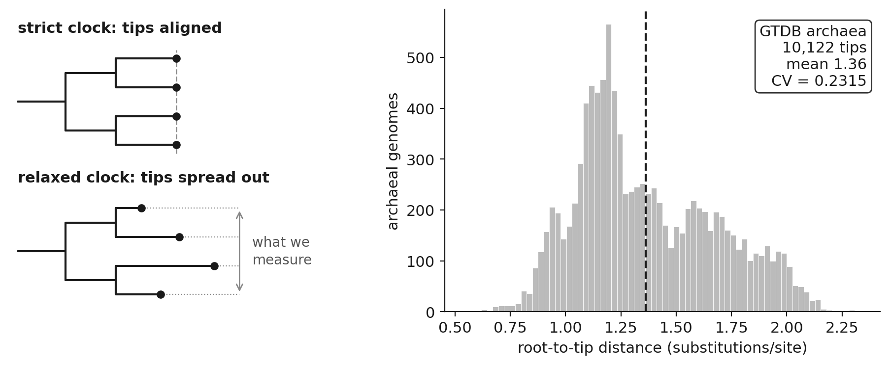
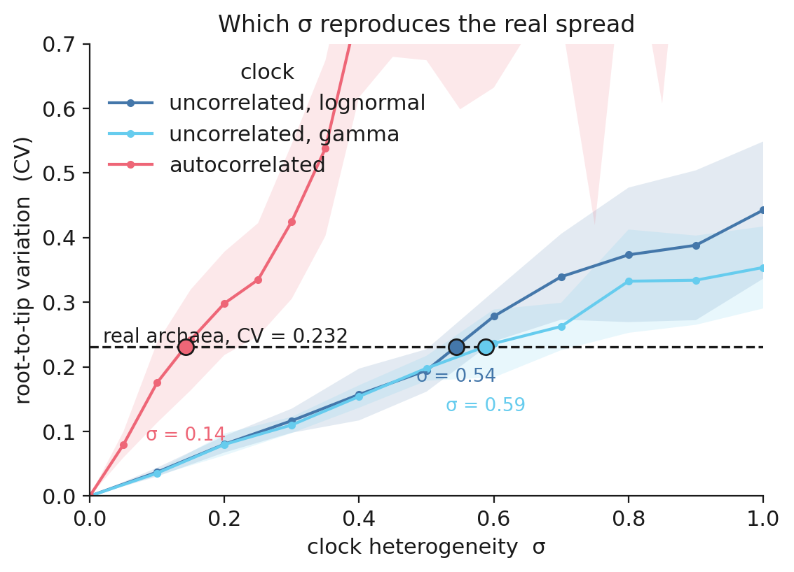
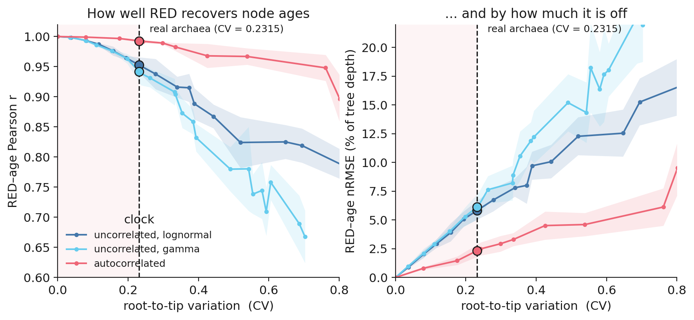
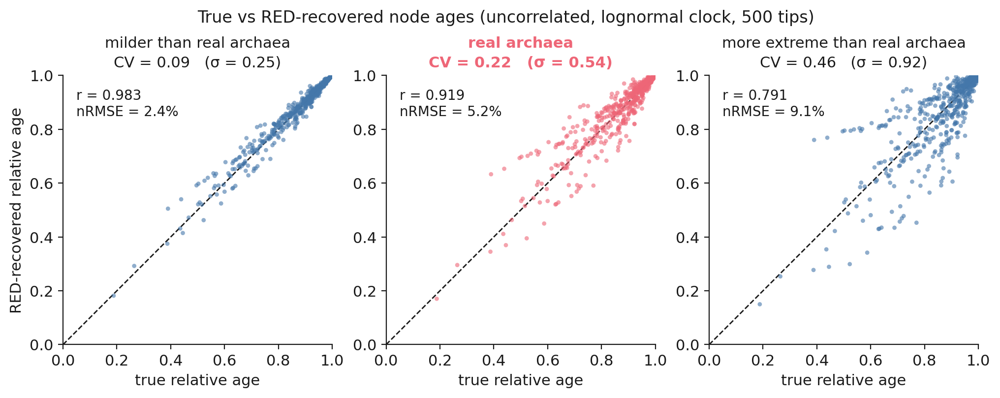

# Can RED be trusted?

A method for reading relative ages off a tree, tested at the rate variation real archaea show. All
the relevant files are in
[`analyses/red/`](https://github.com/AADavin/zombi2/tree/main/analyses/red).

## The question

**Relative Evolutionary Divergence** (RED; Parks et al. 2018) turns a phylogram into a relative
divergence scale. Walking from the root to the tips, it places each node along its path in proportion
to the branch length accumulated so far, giving a number between 0 at the root and 1 at the tips.
GTDB uses it to make taxonomic ranks comparable across the tree of life, so that a phylum sits at
about the same RED whichever lineage it belongs to.

That works only if branch length is a good stand-in for time. Under a strict clock it is exact,
because branch length is then proportional to time. Real lineages do not share a strict clock.
**Does RED still recover the ages?**

## Why real data cannot answer it

A phylogram measures substitutions, and substitutions are rate times time. From substitutions alone
you cannot separate the two, so the true node ages you would need to test RED against cannot be read
off the tree. Dating the tree first would mean assuming a rate model, which is the thing being
tested.

In a simulation the ages are known, because you chose them. That is what makes the question
answerable at all.

## Measuring an observable variable

One quantity can be measured on the real tree without assuming anything. Every genome in the GTDB
archaeal tree is alive today, so every tip sits the same amount of *time* from the root. Any spread
in root-to-tip *substitutions* can therefore only come from rate variation.

We call that spread **root-to-tip variation**, and measure it as the coefficient of variation (CV) of
the root-to-tip distances.



Across 10,122 archaeal genomes the CV is **0.2315**. The fastest lineage has accumulated roughly four
times the substitutions of the slowest. That one number is all we take from the real world; no real
branch length enters the simulation.

## Running the simulation

Now build trees whose ages are known. Grow a dated species tree, evolve sequences down it under a
clock that varies from lineage to lineage, and read the phylogram that comes out. RED on the dated
tree is the truth. RED on the phylogram is what a real study would have seen.

```python
import numpy as np
from zombi2 import genomes, sequences, species
from zombi2.params import LogNormal, PerSite
from zombi2.sequences import substitution_models as sm
from zombi2.tree import read_newick
from zombi2.tree import relative_evolutionary_divergence as red_of

# a dated tree: we know its node ages, because we simulated them
sp = species.simulate_species_tree(birth=1.0, n_extant=200, seed=100)
truth = red_of(sp.extant_tree)                 # RED is exact on a dated tree

# evolve it under a relaxed clock and read the phylogram that leaves behind. Only the branch
# lengths matter here, so one site per gene is enough to carry them.
g = genomes.simulate_genomes_family(sp.complete_tree, initial_families=5,
                                    duplication=0.01, loss=0.01, seed=100)
seq = sequences.simulate_sequences(
    g, model=sm.jc69(), length=1,
    substitution=PerSite(1.0).varying_among('lineages', LogNormal(0.0, 0.544)), seed=7)

phylogram, _ = read_newick(seq.species_phylogram["extant"])
estimate = red_of(phylogram)                   # RED, now on substitutions instead of time

nodes = [i for i in truth if i in estimate and sp.extant_tree.nodes[i].children]
r = np.corrcoef([truth[i] for i in nodes], [estimate[i] for i in nodes])[0, 1]
print(f"RED recovers relative node age with r = {r:.3f} across {len(nodes)} nodes")
```

That is one tree under one clock. The study repeats it over 8 trees of 400 tips each, so the answer
comes with an error bar rather than a seed.

It also runs three clocks rather than one. A CV says how much rate variation there is, but not how it
is arranged, and arrangement matters for a method that walks from root to tip:

- **uncorrelated** (`varying_among('lineages', dist)`), where each lineage draws its own rate independently, with either a
  lognormal or a gamma tail;
- **autocorrelated** (`varying_among('lineages', Drift(dist))`), where each lineage inherits its parent's rate and drifts from
  it, so close relatives evolve at similar rates.

Each clock has a spread parameter σ. Turning σ up makes the simulated trees vary more, so for each
clock we look for the σ that reproduces the real archaeal value of 0.2315.



The three clocks reach it at very different σ: 0.54 and 0.59 for the two uncorrelated ones, 0.14 for
the autocorrelated one, because an inherited rate compounds down the tree. What matters is not σ but
the variation it produces, so every comparison below is made at the same CV.

## Grading RED

Sweep each clock across its σ grid. At every point, compare RED computed on the phylogram against RED
computed on the dated tree it came from. Two measures: how well they correlate, and how far apart
they are as a percentage of tree depth.



Then read straight up from 0.2315, the value real archaea show.

## The answer

| clock | Pearson r | error (% of tree depth) |
|---|---|---|
| uncorrelated, lognormal | 0.953 | 5.8% |
| uncorrelated, gamma | 0.942 | 6.1% |
| autocorrelated | 0.993 | 2.3% |

**At the variation real archaea show, RED holds up.** It holds up under all three clocks, so the
conclusion does not rest on guessing which one archaea actually have. Uncorrelated rates are the
harder case, so 0.94 is the conservative number to quote.

Node by node, on one 500-tip tree under the uncorrelated lognormal clock, below the real value, at
it, and past it:



Two things worth being precise about. RED is an **ordinal** proxy: even at its best there is a
few-percent age error, so use it to order divergences and normalise ranks, which is its designed job,
rather than to read absolute times off. And it does break down, but past where real data sits. By CV
≈ 0.5 the correlation has fallen to about 0.82 and the error has risen to about 12% of tree depth.
Real archaea are on the safe side of that, which is a quantitative version of the assumption GTDB
relies on.

## The recipe

Nothing above is specific to RED. The three moves are always the same:

1. Measure one honest number on real data.
2. Reproduce that number in a simulation, where the answer is known.
3. Test the method there.

The full write-up, with the assumptions, the limitations and the provenance of every number, is in
[`analyses/red/REPORT.md`](https://github.com/AADavin/zombi2/blob/main/analyses/red/REPORT.md). It
regenerates from fixed seeds in three commands.

## References

- Drummond AJ, Ho SYW, Phillips MJ, Rambaut A (2006). *Relaxed phylogenetics and dating with
  confidence.* PLoS Biology 4:e88.
- Parks DH, Chuvochina M, Waite DW, et al. (2018). *A standardized bacterial taxonomy based on genome
  phylogeny substantially revises the tree of life.* Nature Biotechnology 36:996–1004.
- Rinke C, Chuvochina M, Mussig AJ, et al. (2021). *A standardized archaeal taxonomy for the Genome
  Taxonomy Database.* Nature Microbiology 6:946–959.
- Thorne JL, Kishino H, Painter IS (1998). *Estimating the rate of evolution of the rate of molecular
  evolution.* Molecular Biology and Evolution 15(12):1647–1657.
