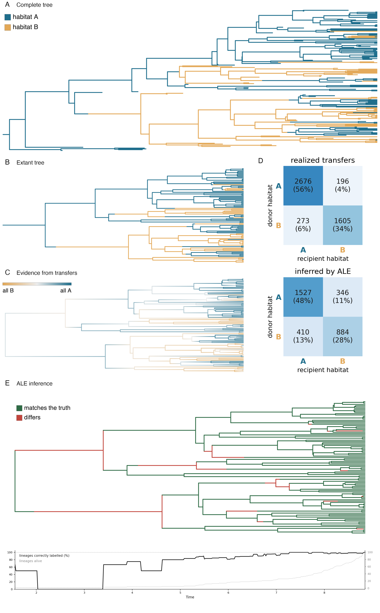

# Who trades genes with whom?

Gene transfers as a record of who lived together, read back with a standard
reconciliation program and scored on data where the truth is known. All the relevant
files are in
[`analyses/transfers/`](https://github.com/AADavin/zombi2/tree/main/analyses/transfers).

## The question

Gene transfers happen preferentially between lineages that share a habitat, so an
inferred transfer network also records which lineages lived in the same habitat. **Can
the habitats of ancestral lineages be recovered from that record?** On real data nobody
knows the habitat of a lineage that lived a billion years ago; in a simulated dataset
the habitat of every lineage at every instant is known, so the answer can be scored
exactly.

## The run

A two-state habitat is simulated first, on a complete tree of 100 extant and 75 extinct
lineages. The switches are rare, so each habitat covers whole clades. One thousand gene
families then evolve along the same tree under constant duplication, transfer and loss
rates, in a conditioned run with one connection: the recipient of every transfer is
drawn with a tenfold preference for lineages sharing the donor's habitat at that moment.

```python
from zombi2.genomes import simulate_genomes_family
from zombi2.params import Between, PerLineage, Recipients
from zombi2.species import simulate_species_tree
from zombi2.traits import simulate_discrete

ct = simulate_species_tree(birth=1.0, death=0.5, n_extant=100, seed=11).complete_tree
habitat = simulate_discrete(ct, states=["A", "B"], start="A", seed=1,
                            switch={"A->B": 0.05, "B->A": 0.05})
g = simulate_genomes_family(
    ct, initial_families=1000, duplication=0.02, transfer=0.05, loss=0.15, seed=7,
    transfer_to=Recipients().weighted_by(habitat,
                    Between({("A", "A"): 10.0, ("B", "B"): 10.0}, default=1.0)))
```

With this preference, 90.1% of the 4,750 transfers connect lineages in the same
habitat.

## The ceiling, before any tool runs

The observed data are the extant species tree and the extant gene trees. Because the
run records the complete history, the limit of any inference can be computed first. A
third of the transfers left no trace, because every descendant of the transferred copy
died. Two thirds are detectable in principle, and 22.5% of those come from donors with
no surviving descendants; such a transfer can at best be assigned to the extant branch
from which the donor's lineage diverged. After extinction and this reassignment, the
same-habitat share of the detectable transfers is 86.6%. That share is the ceiling: no
method can exceed it.

## What ALE recovers

The true gene tree of every family was reconciled against the extant species tree with
the ALE program `ALEml_undated` (true gene trees on purpose: this isolates
reconciliation error from gene tree error). Of the transfers inferred with frequency
above 0.5, 88% are true, and they recover 53% of the detectable transfers; the total
inferred count is nearly unbiased (3,167 against 3,160 detectable); and the
same-habitat share of the inferred network is 76.1%, against a random-mixing baseline
near 55%.

The habitat of every ancestral branch is then inferred by a vote: each tip keeps its
observed habitat, and each inferred transfer contributes one vote to each of the two
branches it connects, for the partner's habitat, weighted by the transfer's frequency.
The votes assign a habitat to all 99 ancestral branches, and 92% of the assignments are
correct, which is also what the same vote reaches on the error-free network built from
the truth: the reconciliation's errors do not lower the accuracy.



## The limits

The errors concentrate where lineages are few: the share of contemporaneous lineages
correctly labelled rises from 50% near the root to nearly 100% at the present, and the
deepest branches are misclassified even on the error-free network. An undated
reconciliation also cannot place a habitat switch inside a branch, so on the seven
branches whose habitat switched within their span, part of the branch is mislabelled
whichever habitat is assigned. And one practical lesson: letting classified branches
vote in later rounds helps on the error-free network but hurts on the inferred one,
because wrong calls then propagate. On inferred networks, the tip-anchored votes are
the ones to trust.
