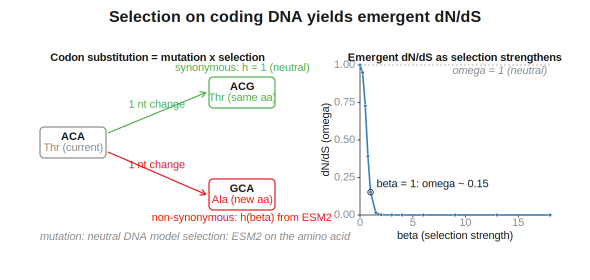

# Language-model selection

ZOMBI2 evolves protein-coding sequences under a **neutral** substitution model. Left to drift long
enough, a gene wanders into sequence that no longer folds or functions — statistically a protein,
biologically noise. Real coding sequences are held in place by **selection**. This experimental feature
overlays selection on sequence evolution using a **protein language model** (a PLM such as ESM2) as a
learned model of what proteins look like: sequences it scores as protein-like are favoured, unlikely
ones are suppressed. One knob, `beta`, turns selection from off (neutral) up to strongly purifying, and
**dN/dS emerges as an output**.

!!! warning "Experimental"
    Everything here lives in `zombi2.experimental`: usable, but not yet validated for publication, and
    the API may change. Install the optional dependencies with `pip install 'zombi2[selection]'`
    (PyTorch, `fair-esm`, SciPy). On the command line it is reached only through the
    `zombi2 experimental` group.

## The model: substitution = mutation × selection

A substitution that reaches fixation is a **mutation** happening times that mutation being **fixed**.
ZOMBI2's neutral model supplies the mutation rate `mu(a→b)`; the language model supplies the fixation
factor. The selection-aware rate is the classical Halpern–Bruno / Sella–Hirsh mutation–selection form:

```
Q(a→b) = mu(a→b) · h(F_b − F_a),   F_x = beta · ln(preference_x),   h(x) = x / (1 − e^−x)
```

Its stationary distribution is the neutral one tilted by the language model's preference,
`pi_target ∝ pi_mut · preference^beta`, and at `beta = 0` the factor `h` is exactly 1, so the kernel
reduces **exactly** to the neutral model — selection is a strict overlay. `beta` is the
population-scaled strength of selection (the `2·Ne·s` axis): `0` is neutral drift, larger values pull
harder toward protein-like sequence.

!!! note "The critic is pluggable"
    `ESM2Critic` is the first implementation, but any object that turns a protein into a per-site
    amino-acid preference satisfies the `Critic` interface — a smaller PLM, a hand-supplied profile
    (`FixedProfileCritic`), or a future model.

## Two modes: frozen and live

A language model scores a *whole* sequence, so *when* it is read matters.

<figure markdown="span">
  { width="820" }
</figure>

- **Frozen** (default): read the critic **once**, on the root protein. Each site's preference is baked
  in and the sites evolve independently — no epistasis, one call per gene, embarrassingly parallel.
- **Live**: re-read the critic on the **current** sequence every `refresh` substitutions per site, so
  each site feels the others' current states (within-gene epistasis). Many calls; `refresh = ∞`
  recovers frozen.

## Emergent dN/dS

At the codon level, **mutation acts on the nucleotides** and **selection acts on the encoded amino
acid**. A synonymous change keeps the amino acid, so its fixation factor is `h(0) = 1` (neutral,
`dS = 1`); a non-synonymous change is scrutinised by the critic. The genome-wide ratio `omega = dN/dS`
is therefore an **output**, not a parameter.

<figure markdown="span">
  { width="820" }
</figure>

`CodonSelection.dnds(protein)` returns the expected `omega` analytically; `calibrate_beta(critic,
protein, target_dnds)` inverts it, so you can ask for a target `omega` and get the `beta` that
delivers it.

## Whole genomes: selection block by block

The flagship use starts from a **real annotated genome** at the root and evolves it with selection on
its genes. Genes duplicate, transfer, invert and are lost, so a gene's tree is not the species tree —
ZOMBI2's **block** decomposition handles this.

Because a gene is never split by a breakpoint, a whole coding sequence is exactly one **block** and
evolves as one unit down **its own gene tree** (never the species tree): gene blocks get codon
selection, intergene blocks drift neutrally, and everything reassembles into the genome at every node —
the root reproducing the input exactly. Genes that cannot be put under selection (a novel gene with no
real coding sequence, a frame/stop problem, or no root sequence) fall back to neutral and are reported.

## Usage

Install the extra, then use the CLI or the Python API.

```bash
pip install 'zombi2[selection]'

# evolve a real genome down a species tree with ESM2 purifying selection on its genes
zombi2 experimental selection -t species_tree.nwk --gff genome.gff --genome-fasta genome.fna \
    --beta 1.0 --dup 0.01 --loss 0.01 --seed 1 -o out/
```

Key flags: `--esm-model` picks the critic (small `esm2_t6_8M_UR50D` by default, or a large one such as
`esm2_t33_650M_UR50D`); set the strength with `--beta` **or** `--target-dnds` (which calibrates a single
genome-wide `beta` from the root proteins); the nucleotide mutation model and structural-event rates are
the usual `--subst-model` / `--dup` / `--loss` / `--transfer` / … . Outputs: `Genomes/<node>.fasta.gz`,
the block architecture, extant per-gene alignments, and a `Selection_report.tsv`.

```python
from zombi2.experimental import (
    ESM2Critic, read_cds_gff, simulate_nucleotide_selection,
)

critic = ESM2Critic("esm2_t6_8M_UR50D")
cds = read_cds_gff("genome.gff")
result, report = simulate_nucleotide_selection(
    species_tree, genome_str, cds, critic=critic, beta=1.0,
    inversion=0.01, duplication=0.01, loss=0.01, seed=1,
)
result.node_sequence(species_tree.root)   # == genome_str (the root reproduces the input)
```

Lower-level pieces are available too: `PLMSelection` (amino-acid selection over a gene tree, frozen or
live), `CodonSelection` (codon selection + `dnds`), and `frechet_esm_distance` (a realism metric in the
language model's embedding space).

!!! warning "Compute"
    The critic is a neural network: the large ESM2 models want a GPU, and the feature targets
    small-to-medium trees on a cluster rather than millions of tips.

## Status and limitations

- **Experimental** — in `zombi2.experimental`, behind `pip install 'zombi2[selection]'`; APIs and
  outputs may change.
- **Pseudogenization** — a pseudogenized lineage currently stays under selection on its whole gene-block
  tree; a per-lineage switch to neutral after the loss-of-function edge is planned.
- **Codon epistasis** — the live (epistatic) mode is amino-acid-level; codon selection is frozen for now.
- **Realism, measured** — with a real ESM2 critic, `omega = 1` at `beta = 0`, decreasing to realistic
  purifying values as `beta` rises.

See the [model lifecycle](../contributing/model-lifecycle.md) for how an experimental model graduates to
the core.
