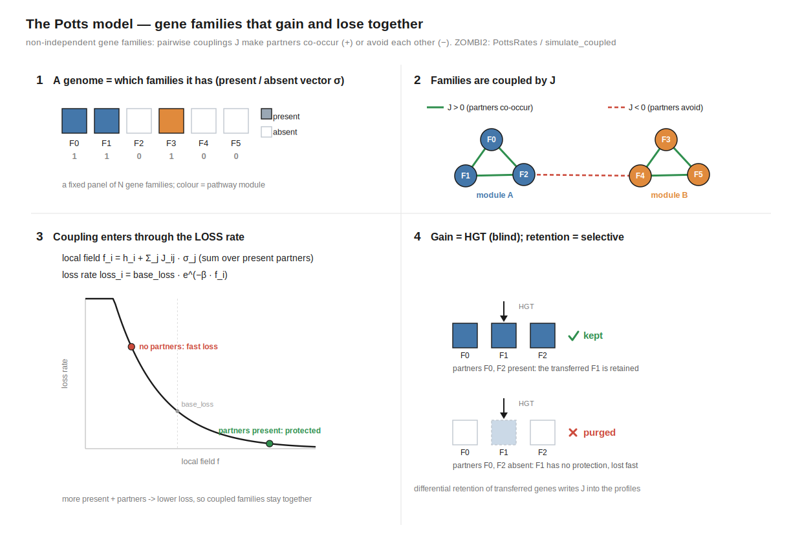

# Gene-family coupling (the Potts model)

By default every gene family evolves independently, so the phylogenetic profile
([`ProfileMatrix`](../reference/api.md#profiles)) correlates families **only
through the shared species tree**. Real genomes correlate through **function**: families in
the same pathway or complex tend to be present or absent *together* (Pellegrini 1999). ZOMBI2
can inject that structure directly — a prescribed pairwise coupling `J` (and fields `h`) that
makes families gain and lose **non-independently** — so the simulated profiles carry a *known
ground-truth* coupling. It is the forward, generative counterpart of the inverse-Potts / DCA
methods that infer functional linkage from profiles (Croce 2019; Fukunaga & Iwasaki 2022), and
the benchmark those methods can be tested against.

<figure markdown="span">

<figcaption>The coupling model: a genome is a present/absent vector σ over a fixed family
panel; couplings <em>J</em> tie families into modules; the coupling enters through the loss
rate; and blind horizontal gain plus selective retention is what writes <em>J</em> into the
profiles.</figcaption>
</figure>

## The model

Presence/absence of a fixed panel of `N` families inside one genome is an Ising vector
`σ ∈ {0,1}ᴺ`. Fields `h_i` and couplings `J_ij` (symmetric, zero diagonal) define the **local
field** family `i` feels — its intrinsic bias plus a contribution from every *present* partner:

```
f_i = h_i + Σ_j J_ij · σ_j          (sum over present partners)
```

**Coupling enters through loss.** A present family is lost at rate

```
loss_i = base_loss · exp(−β · f_i)
```

so a present partner with `J_ij > 0` raises `f_i` and **lowers** `i`'s loss (they protect each
other → co-occurrence); `J_ij < 0` **raises** loss (they purge each other → avoidance);
`J_ij = 0` is independence. `h_i` is the solo retention bias (a large positive `h` is a
near-universal "hub" gene), and `β` is a global coupling strength.

**Gain is horizontal transfer.** A lost family returns only via the stock, **field-blind**
`TRANSFER` event — a donor that still carries the family passes a copy to a recipient. The
coupled loss then **selectively retains** it: kept where its partners are present (high `f_i`),
quickly purged where they are absent. That *differential retention of horizontally acquired
genes* is the mechanism that writes `J` into the profiles.

Two deliberate modelling choices: gain is HGT rather than an explicit detailed-balance rate
(mechanistically honest to how genes re-enter genomes), and the state is presence/absence
(copy number is ignored beyond `> 0`; transfers default to *replacement* so re-acquisition
doesn't stack copies).

## Building a coupling

A `CouplingSpec` holds the panel size, the couplings `J`, the fields `h`, and the base rates.
Build it from pathway blocks, a dense matrix, or a sparse edge list:

```python
import zombi2 as z

# (a) pathway blocks: families 0–2 co-occur, 3–5 co-occur, the two blocks mutually exclusive
spec = z.pathway_blocks([3, 3], within=3.0, between=-1.0,
                        h=2.0, base_loss=1.0, transfer=0.2, beta=1.0)

# (b) a dense N×N coupling matrix (diagonal ignored)
J = [[0, 3, 0], [3, 0, 0], [0, 0, 0]]
spec = z.CouplingSpec.from_dense(J, h=2.0, base_loss=1.0, transfer=0.2)

# (c) a sparse edge list {(i, j): J_ij} (symmetrised)
spec = z.CouplingSpec.from_edges(6, {(0, 1): 3.0, (0, 2): 3.0, (0, 3): -2.0}, h=2.0)
```

- **`within` / `between`** (`pathway_blocks`) set the coupling *inside* a block (positive →
  co-occurring pathway members) and *across* blocks (negative → mutually-exclusive "rival"
  pathways; `0` leaves blocks independent).
- **`h`** is a scalar applied to every family, or a length-`N` vector.
- **`base_loss`** is the loss at `f_i = 0`, **`transfer`** the per-copy HGT (gain) rate,
  **`beta`** the global coupling strength, and **`origination`** an optional background rate of
  brand-new *uncoupled* families (`0` keeps the panel closed).
- Panel families are named `F0 … F{N-1}`; `spec.dense_J()` materialises `J` for inspection.

## Running a coupled simulation

```python
tree = z.simulate_species_tree(z.BirthDeath(1.0, 0.2), n_tips=100, age=6.0, seed=1)
res = z.simulate_coupled(tree, spec, seed=1)

res.profiles          # ProfileMatrix — N panel rows × extant species (all rows kept)
res.profiles.presence()
```

`simulate_coupled` seeds the root with the whole panel present (override with
`initial_presence`, a length-`N` 0/1 mask) and returns a `CoupledResult` — `.profiles`,
`.leaf_genomes`, `.event_log`, `.spec`. Transfers default to `TransferModel(replacement=1.0)`;
pass `transfers=` to customise (e.g. distance-weighted recipients). Because `PottsRates` is a
custom rate model it runs on the pure-Python engine (coupling breaks the per-family
independence the Rust fast path assumes); cost is `O(N + nnz(J))` per event, fine at benchmark
scale.

## Two caveats worth knowing

!!! note "Recovered Ĵ tracks injected J in sign and rank, not as a clean multiple"
    Because the gain channel is field-blind, detailed balance does **not** hold and the process
    has no exact Boltzmann stationary distribution. Couplings recovered from the profiles follow
    the injected `J` **monotonically** (positive → co-occurrence, negative → avoidance), but not
    as an affine constant — the price of keeping regain mechanistic (a lost family returns only
    from a donor that still has it). An exact-Boltzmann mode (an explicit Glauber gain) is a
    documented extension, not the default.

!!! warning "Control for the phylogeny"
    On an ordinary birth–death tree even *uncoupled* families co-occur, because loss is
    clade-restricted (shared ancestry). The coupling model's own tests isolate the injected `J`
    on a **near-star** tree (all lineages split just below the root, then evolve independently) —
    and this is exactly why real inference (Fukunaga & Iwasaki 2022) corrects for the tree. Any
    downstream benchmark should respect the same caveat.

## Coupling a trait instead of another family

The same retention mechanism drives [trait-linked gene families](trait-linked-genomes.md): there
a family's loss is modulated by a **trait** value (`loss_i = base_loss · exp(−effect·w_i·s)`)
rather than by its partners' presence — the Potts field with the trait standing in for the
coupled state. Use this page's model when you want family↔family structure, and that one when
you want gene content to track a phenotype.

The design decisions and the theory behind this model are recorded in the implementation note
[`docs/coupling_model.md`](https://github.com/AADavin/zombi2/blob/main/docs/coupling_model.md)
and its companion `non_independence.tex`.
