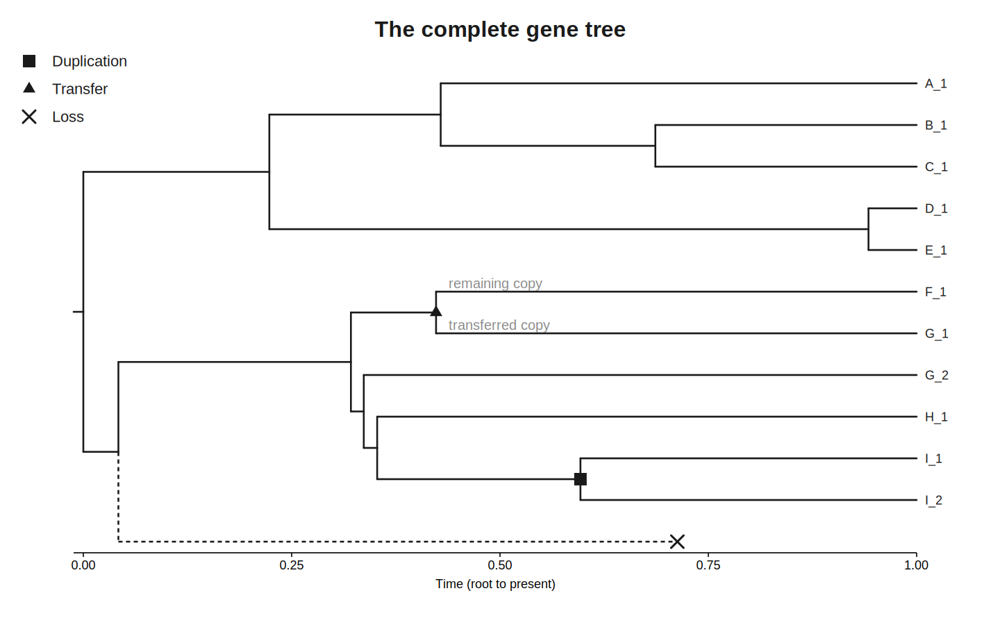

# Gene trees & output

## The event log is a full genealogy

Every event re-mints the gene-lineage ids it touches, and speciations are logged, so each
family's event log records a complete parent→children genealogy. Reconstruction is then
pure post-processing (as in ZOMBI1).

```python
trees = genomes.gene_trees()          # {family_id: (complete_newick, extant_newick)}
complete, extant = trees["7"]
```

- **complete** — every lineage, including losses (leaves labelled `LOSS_<id>`).
- **extant** — pruned to lineages with a surviving copy, unifurcations suppressed. Extant
  leaves are labelled `<species>_<geneid>`. `None` if the family has no survivors.

The number of extant-tree leaves equals the family's total copy count across species.

<figure markdown="span">

<figcaption>A reconstructed gene family: the gene tree (reconciled against the species tree)
that the duplication, transfer and loss events imply.</figcaption>
</figure>

## The profile matrix

The key object for phylogenetic-profiling analyses — gene families × extant species:

```python
P = genomes.profiles
P.matrix        # integer copy numbers
P.presence()    # binary presence/absence
P.families      # row labels
P.species       # column labels
P.to_tsv()      # tab-separated text
```

## Writing everything

```python
genomes.write("out/")
```

| Path | Contents |
|---|---|
| `species_tree.nwk` | timed species tree |
| `species_nodes.tsv` | node name, time, is_leaf, is_extant |
| `gene_family_events/<fid>_events.tsv` | per-family events: time, event, branch, donor, recipient, `role=id` nodes |
| `gene_trees/<fid>_complete.nwk`, `_extant.nwk` | reconstructed gene trees |
| `Transfers.tsv` | one row per transfer: time, family, donor, recipient, ids |
| `Gene_family_summary.tsv` | per family: origin, event counts, extant copies, species present |
| `Profiles.tsv`, `Presence.tsv` | copy-number and presence matrices |

## The event log directly

```python
from zombi2.events import EventType
for r in genomes.event_log:
    if r.event is EventType.TRANSFER:
        print(r.time, r.donor, "->", r.recipient, [op.gid for op in r.genes])
```

Each `EventRecord` has `time`, `event` (an `EventType`), `branch`, optional `donor`/
`recipient`, and `genes` (per-gene rows; the first is the source lineage, the rest its
descendants).
