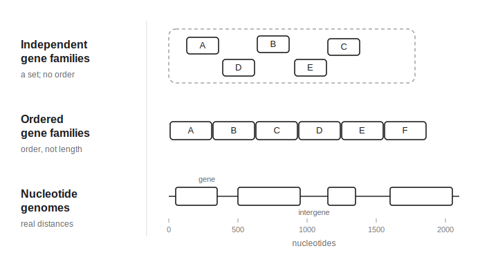
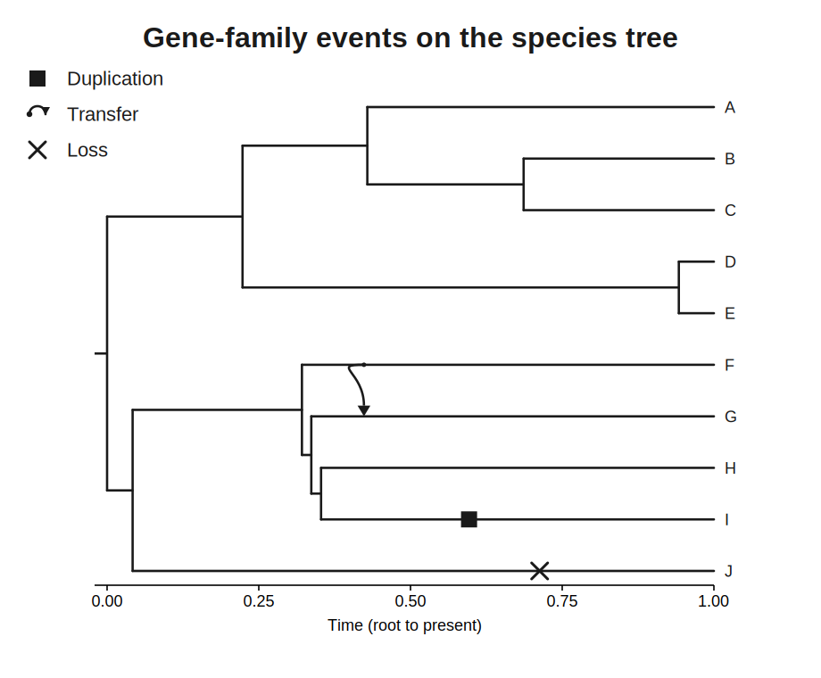
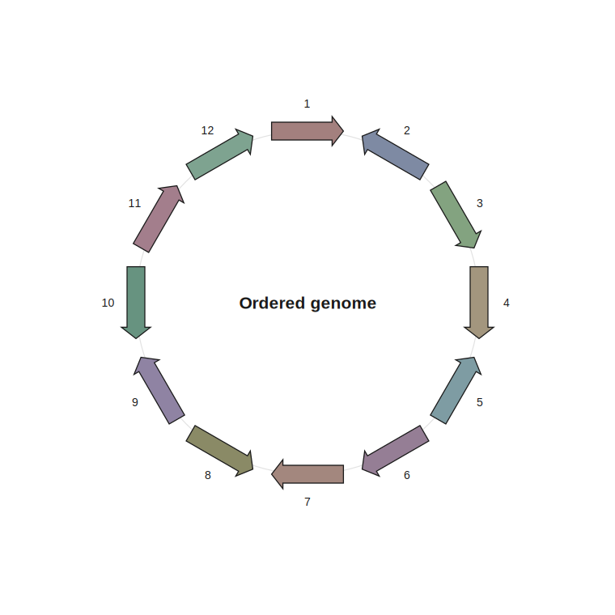
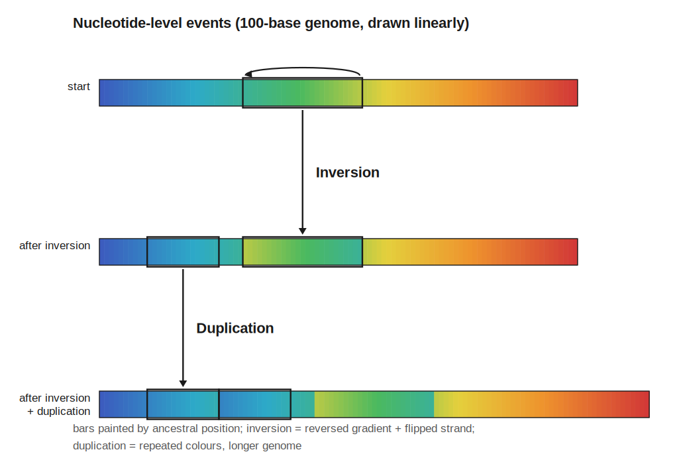
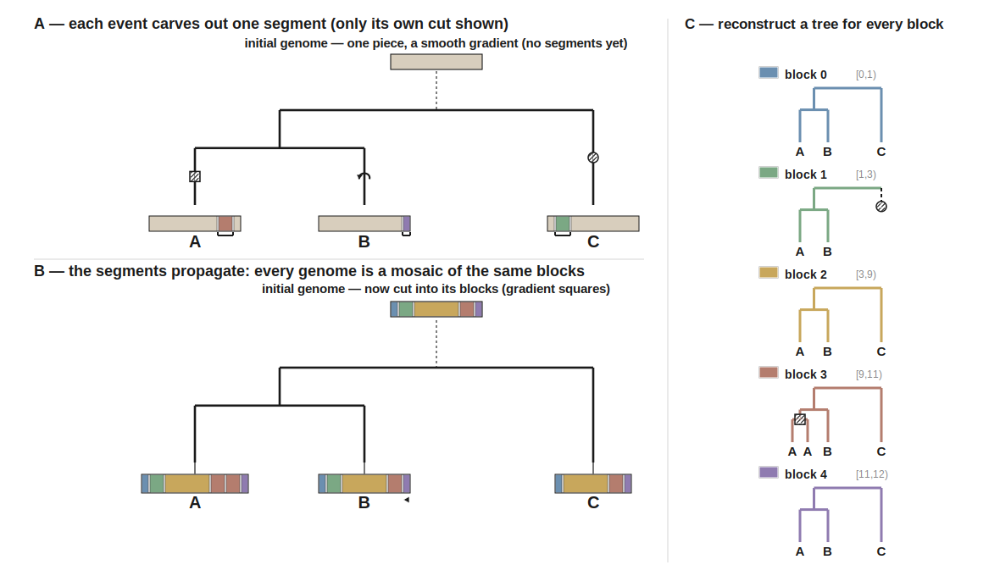
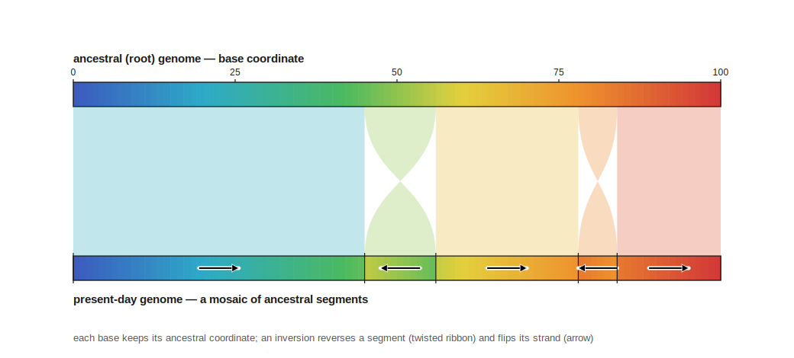

# Genomes

A genome in ZOMBI2 evolves **along a species tree**, and you can model it at three levels of
resolution — pick the coarsest one that answers your question.

<figure markdown="span">
  { width="560" }
</figure>

**Gene families (unordered).** The default: a genome is a **bag of gene families** with copy
numbers, evolving by **duplication, transfer, loss and origination** (DTL) — no positional
structure. Fast, and enough for phylogenetic profiles, reconciliation and transfer studies. Rates
can be shared, per-family-sampled (ZOMBI1 style), genome-wise, or per-branch.

**Ordered chromosomes.** Genes sit on an **ordered, circular chromosome** with a strand, and the
genome also undergoes **inversions and transpositions** — so gene *order* and orientation carry
signal, not just presence and absence.

**Nucleotide genomes.** The finest level: a **nucleotide-resolution** genome of root-anchored
segments, with variable-length structural events (inversions, transpositions, indels), an explicit
gene/intergene structure, homologous replacement, and GFF import to start from a real genome. Every
block carries its own gene tree, and ancestral sequences can be reconstructed at every node.

All three run the same way — `simulate_genomes(tree, ...)` in Python, or `zombi2 genomes` on the
command line (`--genome-model {unordered, ordered, nucleotide}`, default `unordered`; in Python,
ordered chromosomes can also be selected with the `genome_factory` argument). Growth can be bounded
with a hard `max_family_size` cap or a soft `carrying_capacity` — see [Bounding growth](#bounding-growth)
below. For what the simulation produces, see [Gene trees & output](gene-trees-and-output.md).

## Gene families & rate models

Along the fixed species tree, ZOMBI2 runs one forward continuous-time (Gillespie) process
over all co-existing branches, with four core events:

| Event | Effect |
|---|---|
| **Origination (O)** | a brand-new family appears (one copy) on a branch |
| **Duplication (D)** | a gene copy splits into two |
| **Transfer (T)** | a copy is gained by another lineage alive at that time |
| **Loss (L)** | a copy is removed |

Speciation is implicit: at each species-tree node a branch's genome is inherited by both
children. The result is a **gene tree per family** (reconciled against the species tree) and a
**presence/absence profile** — the copy number of every family in every extant species.

<figure markdown="span">

<figcaption>One gene family evolving along a species tree: a duplication (□), a loss (○) and a
transfer (curved arrow) placed on the branches where the Gillespie process fires them.</figcaption>
</figure>

D/T/L are **per gene copy** unless a model says otherwise, so a family's copy number follows an
exponential birth–death and the genome-wide rate scales with the number of copies; **origination** is
always **per branch** (independent of genome size). All rates are per unit of tree time — see
[Conventions § Rates and time](../contributing/conventions.md#rates-and-time). See
[Transfers](#transfers) for how a transfer recipient is chosen.

### The rate models

Rates are supplied by a **rate model**, all subclasses of `RateModel`. Several ship: `SharedRates`
(every family the same), `FamilySampledRates` (per-family sampled, ZOMBI1 style), `PerGenomeRates`
(constant per-genome rates), and `BranchRates` (rates vary per species-tree branch).

| Model | Rates | Reach for it when |
| --- | --- | --- |
| **SharedRates** | one per-copy D/T/L for every family (Rust engine) | the default DTL backbone, fast and shared |
| **PerGenomeRates** | constant per-genome totals; families grow linearly | you want size-independent rates and no runaway growth |
| **FamilySampledRates** | each family draws its own D/T/L (ZOMBI1 style) | families should differ in their evolutionary rates |
| **BranchRates** | a per-branch factor scaling any base model | rates vary across the species tree (relaxed clock) |

#### SharedRates — every family the same

Every gene family shares the same per-copy `duplication`, `transfer`, and `loss` rates, plus a
per-branch `origination` rate. The default DTL model and the one run by the compiled **Rust engine**
on the counts-only path. This is the model built for you when you pass bare `--dup/--trans/--loss/--orig`
(or the `simulate_genomes` rate shorthand). Optional `carrying_capacity` (K) adds logistic density
dependence, damping duplication as a family grows; the simulator's `max_family_size` (CLI
`--max-family-size`) is a hard ceiling.

```python
from zombi2.genomes import SharedRates, simulate_genomes

rates = SharedRates(duplication=0.2, transfer=0.1, loss=0.25, origination=0.5)
genomes = simulate_genomes(tree, rates, initial_families=40, seed=42)
```

D/T/L are **per gene copy** (the family-level rate scales with copy number); origination is
**per branch**. There is a shorthand that builds `SharedRates` for you:

```python
from zombi2.genomes import simulate_genomes

genomes = simulate_genomes(tree, duplication=0.2, transfer=0.1, loss=0.25,
                           origination=0.5, initial_families=40, seed=42)
```

#### FamilySampledRates — ZOMBI1 style

Give each family its **own** D/T/L, drawn from distributions the first time the family
appears and kept for its lifetime:

```python
from zombi2.genomes import FamilySampledRates, simulate_genomes
from zombi2 import Gamma, Exponential

rates = FamilySampledRates(
    duplication=Gamma(2, 0.06),        # built-in distribution
    transfer=Exponential(0.08),
    loss=Gamma(2, 0.07),
    origination=0.5,                   # per-branch (a single rate)
)
genomes = simulate_genomes(tree, rates, initial_families=40, seed=42)
```

Distribution arguments accept:

- a **built-in**: `Gamma(shape, scale)`, `Exponential(mean)`, `LogNormal(mu, sigma)`,
  `Uniform(low, high)`, `Fixed(value)`;
- any **scipy.stats frozen distribution** (e.g. `scipy.stats.gamma(2, scale=0.1)`);
- a **callable** `rng -> float`.

Negative draws are clipped to 0. Origination stays a single per-branch rate. Python API only. Also
honours an optional `carrying_capacity`.

#### PerGenomeRates — genome-wise rates

`SharedRates` is *gene-wise*: the total duplication/transfer/loss rate scales with the
number of gene copies, so a family's size follows an exponential birth–death. `PerGenomeRates`
instead fires each event at a **constant per-genome rate**, independent of genome size (a
target copy is then chosen uniformly):

```python
from zombi2.genomes import PerGenomeRates, simulate_genomes

genomes = simulate_genomes(tree, PerGenomeRates(duplication=1.0, transfer=0.3,
                                                loss=0.5, origination=0.4),
                           initial_families=20, seed=1)
```

A useful consequence: family sizes grow *linearly* rather than exponentially, so
genome-wise models are far less prone to runaway growth. Selected on the CLI with
`--rate-model per-genome` (Python engine).

#### BranchRates — branch-wise rates

`BranchRates` makes rates vary **per species-tree branch** by scaling any base rate model
with a per-branch factor (one scalar per branch, scaling duplication/transfer/loss
together; origination is left unscaled). It composes with the base model, so branch and
family heterogeneity combine. Choose one factor source:

```python
from zombi2.genomes import SharedRates, BranchRates, simulate_genomes
from zombi2 import LogNormal

base = SharedRates(duplication=0.2, transfer=0.1, loss=0.2, origination=0.4)

# 1. autocorrelated (relaxed clock): related lineages have similar rates
simulate_genomes(tree, BranchRates(base, autocorr_sigma=0.5), seed=1)

# 2. i.i.d. per branch, drawn from a distribution
simulate_genomes(tree, BranchRates(base, per_branch=LogNormal(0.0, 0.5)), seed=1)

# 3. an explicit {branch_name: factor} map (branches not listed keep root_rate)
simulate_genomes(tree, BranchRates(base, factors={"i3": 10.0}), seed=1)
```

For the relaxed clock, `factor(child) = factor(parent) · exp(N(0, σ·√branch_length))`, so
the drift accumulates with time and `σ = 0` recovers the base model. Python API only.

### Seeding the root genome

`initial_families` sets how many gene families the root genome starts with (each originated at
time 0). Additional families appear over time at the origination rate.

### Command line

Bare `--dup/--trans/--loss/--orig` selects `SharedRates` (the default `--rate-model shared`, Rust engine);
`--rate-model per-genome` selects `PerGenomeRates` (Python). `FamilySampledRates` and `BranchRates` are
Python-API only. `--write` selects the output parts (default `profiles trees`); `species_tree.nwk` is
always copied through, and the run writes a `genomes.log` manifest.

```bash
# a species tree to evolve genomes along
zombi2 species --birth 1 --death 0.3 --tips 20 --age 5 --seed 1 -o run/

# SharedRates DTL (default), full output
zombi2 genomes -t run/species_tree.nwk --dup 0.2 --trans 0.1 --loss 0.25 --orig 0.5 \
  --initial-families 40 --write all --seed 42 -o run/

# PerGenomeRates: constant per-genome totals, linear growth
zombi2 genomes -t run/species_tree.nwk --rate-model per-genome \
  --dup 0.5 --trans 0.2 --loss 0.5 --orig 0.4 --write profiles --seed 42 -o run/
```

### Python

Models live in `zombi2.genomes` (and re-export at the top level, so `zombi2.SharedRates` also works):

```python
from zombi2.species import BirthDeath, simulate_species_tree
from zombi2.genomes import (SharedRates, PerGenomeRates, FamilySampledRates,
                            BranchRates, simulate_genomes)
from zombi2.distributions import Exponential

tree = simulate_species_tree(BirthDeath(1.0, 0.3), n_tips=20, age=5.0, seed=1)

# SharedRates (default): one per-copy D/T/L for every family
rates = SharedRates(duplication=0.2, transfer=0.1, loss=0.25, origination=0.5)
genomes = simulate_genomes(tree, rates, initial_families=40, seed=42)

# PerGenomeRates: constant per-genome totals, linear growth
genomes = simulate_genomes(
    tree, PerGenomeRates(duplication=0.5, transfer=0.2, loss=0.5, origination=0.4),
    initial_families=40, seed=42)

# FamilySampledRates: each family draws its own D/T/L
fs = FamilySampledRates(duplication=Exponential(0.2), transfer=Exponential(0.1),
                        loss=Exponential(0.25), origination=0.5)
genomes = simulate_genomes(tree, fs, initial_families=40, seed=42)

# BranchRates: a per-branch factor (relaxed clock) scaling any base model
br = BranchRates(SharedRates(0.2, 0.1, 0.25, 0.5), autocorr_sigma=0.5)
genomes = simulate_genomes(tree, br, initial_families=40, seed=42)
```

There is a shorthand that builds `SharedRates` for you (pass the rate model **or** the shorthand, not
both):

```python
genomes = simulate_genomes(tree, duplication=0.2, transfer=0.1, loss=0.25,
                           origination=0.5, initial_families=40, seed=42)
```

### The result

`simulate_genomes` returns a `Genomes` object:

```python
genomes.species_tree      # the input tree
genomes.profiles          # ProfileMatrix (families × extant species)
genomes.event_log         # full chronological event log
genomes.gene_families     # {family_id: [EventRecord, ...]}
genomes.gene_trees()      # {family_id: (complete_newick, extant_newick)}
genomes.write("out/")
```

The returned `Genomes` object (and `--write`) exposes:

- **Profile matrix** — `genomes.profiles`; `Profiles.tsv` (copy counts, families × extant species) and
  `Presence.tsv` (its 0/1 binarization). `--sparse` writes `Profiles_sparse.tsv` instead.
- **Gene trees** — `genomes.gene_trees()`; `gene_trees/<family>_complete.nwk` (all lineages) and
  `_extant.nwk` (survivors only), each **reconciled** with the species tree.
- **Reconciliations & per-family events** — `gene_family_events/<family>_events.tsv` records where each
  family's D/T/L/S events map onto the species tree.
- **Events trace** — `Events_trace.tsv`, one compact chronological log of every event, from which gene
  trees can be reconstructed on demand. Also `Transfers.tsv` and `Gene_family_summary.tsv`.

Node and family names follow the [standard naming](../contributing/conventions.md#naming) (`g*` gene
lineages, plain integers for families); event codes are **O**rigination, **D**uplication, **T**ransfer,
**L**oss, **S**peciation — see [Conventions § Outputs](../contributing/conventions.md#outputs). For a
full walkthrough of the outputs see [Gene trees & output](gene-trees-and-output.md).

### Validation

- **SharedRates.** With duplication and loss only, the mean copy number at a leaf matches
  `exp((duplication − loss) · age)` over many replicates
  (`test_genome_dtl.py::test_dl_mean_copy_number`); the compiled Rust engine and the pure-Python
  reference engine agree on the mean family count within Monte-Carlo error over a shared model
  (`test_rust.py::test_rust_matches_python_engine`).
- **PerGenomeRates.** Under a size-independent per-genome model the realized duplication/loss event
  count equals `rate × total_branch_length` — a Poisson oracle checked to Monte-Carlo error for
  duplication-only and loss-only runs, with tripling the rate scaling the mean count by the same
  factor (`test_extensibility.py::test_per_genome_rates_event_counts_match_poisson_oracle`).
- **FamilySampledRates.** On an ultrametric tree each family's realized presence across the extant
  leaves matches its own closed-form survival probability `exp(−loss × T)`: binning families by their
  sampled loss rate, the observed per-leaf presence fraction tracks the per-bin oracle
  `mean(exp(−loss × T))`, confirming the simulator honours each family's cached rate
  (`test_extensibility.py::test_family_sampled_loss_calibrates_to_per_family_rate`).
- **BranchRates.** A branch scaled by a factor `f` yields about `f` times the events of the unscaled
  branch — in the low-rate (linear) regime each factor's mean loss count matches its own closed-form
  pure-death expectation `M·(1 − exp(−loss·f·age))`, and the event-count ratio calibrates to `f`
  rather than merely being "more" (`test_branch_rates.py::test_branch_factor_scales_event_count_proportionally`).

## Transfers

Rates decide *how often* a transfer fires (the [rate model](#gene-families-rate-models)); a
**`TransferModel`** decides *what a transfer does*.

```python
from zombi2.genomes import simulate_genomes, TransferModel

genomes = simulate_genomes(
    tree, transfer=0.3, ...,
    transfers=TransferModel(
        replacement=0.2,      # additive vs replacement
        distance_decay=2.0,   # recipient choice by phylogenetic distance
        allow_self=False,     # self-transfer = duplication
    ),
)
```

The default `TransferModel()` is additive, uniform-recipient, no self-transfer.

### Additive vs replacement

- **Additive** (`replacement=0`): the recipient gains a copy (net +1).
- **Replacement** (`replacement=p`): with probability `p`, the transfer also removes one
  pre-existing copy of that family in the recipient — a net-zero swap. It is only possible
  when the recipient already has the family (otherwise the transfer is additive).

`replacement=1` makes every possible transfer a replacement. Replacement transfers appear
in the log as a transfer **plus** a compensating loss.

### Distance-dependent recipient choice

By default the recipient is drawn **uniformly** among lineages alive at the transfer time.
Set `distance_decay=λ` to favour phylogenetically close recipients: candidate `r` is
weighted by `exp(-λ · d)`, where `d = 2·(t − t_MRCA)` is the patristic distance between
donor and candidate at the transfer time `t`. Larger `λ` = more local transfers; distant
transfers are damped but never forbidden.

!!! note "Performance"
    Distance weighting computes, per transfer, the MRCA time of the donor with every
    co-existing lineage (`O(alive · depth)`). It is the one hot spot; for very large trees
    it can be swapped for a sparse-table LCA later.

### Self-transfer

With `allow_self=True` the donor lineage is an eligible recipient. A self-transfer creates
a second copy in the same genome — mechanically a **duplication**. This lets you drop
explicit duplications and run a transfer/loss-only model:

```python
from zombi2.genomes import simulate_genomes, TransferModel

simulate_genomes(tree, transfer=1.0, duplication=0.0,
                 transfers=TransferModel(allow_self=True),
                 max_family_size=0.5, seed=1)   # cap it — self-transfers grow like D
```

!!! warning
    Self-transfers grow families exactly as duplications do, so pair them with a growth
    cap (see [Bounding growth](#bounding-growth)).

## Bounding growth

A family's copy number is a birth–death process in disguise: with duplication rate `d`
above loss rate `l` its expected size grows like `e^{(d−l)t}` without bound. **Both**
duplication and transfer create copies, so both must be reined in.

### Hard cap: `max_family_size` (recommended)

A single ceiling on family size, enforced across **all** copy-creating events:

```python
from zombi2.genomes import simulate_genomes

simulate_genomes(tree, duplication=0.5, transfer=0.2, loss=0.1, origination=0.3,
                 max_family_size=0.5)     # cap = round(0.5 · N_species)
```

- an **integer** is an absolute cap (`max_family_size=20`);
- a **float** is a fraction/multiple of the number of species
  (`max_family_size=0.5` → half the tips; `2.0` → twice the tips).

Duplication is rate-suppressed once a family reaches the cap; an additive transfer that
would overflow is turned into a **replacement** (net zero). The result is a family size that
never exceeds the cap.

### Soft cap: `carrying_capacity`

A logistic, duplication-only alternative living on the rate model: the per-copy duplication
rate is scaled by `max(0, 1 − n/K)`, so family size settles *around* `K` with a proper
stationary distribution.

```python
from zombi2.genomes import SharedRates

SharedRates(duplication=0.5, loss=0.1, origination=0.3, carrying_capacity=20)
```

!!! note "Which to use?"
    `carrying_capacity` shapes duplication smoothly but does **not** bound transfers; use
    `max_family_size` when you need a firm ceiling that also accounts for transfer-driven
    growth. They compose — you can set both.

### The safety guard

If a run still diverges (e.g. `allow_self=True` with no cap), the simulator raises a clear
error rather than hanging, pointing you to `max_family_size`.

## Ordered chromosomes

By default a genome is **order-free** (`UnorderedGenome`): a multiset of gene families with
copy numbers — all you need for phylogenetic profiles. When gene *order* matters (synteny,
operons, rearrangements) use **`OrderedGenome`**, the basic ZOMBI1 model: a circular
chromosome of genes, each carrying a strand orientation, with no intergenic regions. Genes sit on
an ordered, circular chromosome, and the chromosome evolves not just by gaining and losing genes but
by *shuffling* them — inversions and transpositions rearrange contiguous segments so that gene
**order** itself carries phylogenetic signal. Selecting the level is `--genome-model ordered`.

| Model | Substrate | Rearrangements | Reach for it when |
| --- | --- | --- | --- |
| **Ordered** | circular chromosome of oriented genes (no intergenes) | inversion, transposition on gene segments (distance in genes) | synteny, operons, gene-order evolution matter |

<figure markdown="span">

<figcaption>An ordered genome: a circular chromosome of genes, each with a strand
orientation — the substrate for segment duplications, inversions and transpositions.</figcaption>
</figure>

### Segment events

Events act on a **contiguous segment** of the circular chromosome. Its length is drawn from
`extension` (a per-step continuation probability): `extension=None` → single genes;
higher values → longer segments.

| Event | Effect on the segment |
|---|---|
| Duplication | tandem copy inserted after the segment |
| Loss | segment removed |
| Transfer | segment copied into a recipient at a chosen position |
| **Inversion** | segment reversed and every strand flipped |
| **Transposition** | segment cut and pasted elsewhere |

Inversions and transpositions change gene order/orientation but **not** gene content, so
they leave the profile matrix and the gene trees unchanged — they show up in the event log
and in the final chromosome order. Rearrangement rates are per gene copy; segment length is set by
`--mean-length` (in genes). Rearrangements require the `shared` rate model.

### How events reach the genome

Inversion and transposition rates are emitted by `SharedRates` as candidate events. A
genome only undergoes the events it declares in `supported_events()`:

- `UnorderedGenome` supports `{O, D, T, L}` — it silently ignores inversion/transposition
  rates.
- `OrderedGenome` supports `{O, D, T, L, I, P}` — it acts on them.

So the same rate model works for both representations; the genome decides what applies. Adding gene
order needed **no** change to the simulator, sampler, rate interface or output code — the same
extensibility design that underpins the [contributing guide](../contributing/adding-a-model.md).

### Command line

`--genome-model ordered` selects the level; `--inversion`/`--transposition` are the rearrangement
rates (per gene copy), and `--mean-length` sets the segment length (in genes).

```bash
# ordered: gene-order rearrangements on a circular chromosome
zombi2 genomes -t species_tree.nwk --genome-model ordered \
    --dup 0.2 --trans 0.1 --loss 0.2 --orig 0.4 \
    --inversion 0.3 --transposition 0.3 --mean-length 2 \
    --initial-families 30 --write profiles trees --seed 1 -o out/
```

### Python

Models live in `zombi2.genomes` (and re-export at the top level, so `zombi2.OrderedGenome` also
works). `OrderedGenome` takes an `extension` parameter (the segment-length knob), so the ordered
level runs through `simulate_genomes` with an `OrderedGenome` factory:

```python
from zombi2.species import BirthDeath, simulate_species_tree
from zombi2.genomes import simulate_genomes, SharedRates, OrderedGenome

tree = simulate_species_tree(BirthDeath(1.0, 0.3), n_tips=20, age=5.0, seed=1)

# rearrangements need OrderedGenome, which takes the extension knob
rates = SharedRates(duplication=0.2, transfer=0.1, loss=0.2, origination=0.4,
                    inversion=0.3, transposition=0.3)
genomes = simulate_genomes(tree, rates, initial_families=30, seed=1,
                           genome_factory=lambda ids: OrderedGenome(ids, extension=0.5))
leaf = next(iter(genomes.leaf_genomes.values()))
leaf.chromosome     # ordered list of OrderedGene(gid, family, orientation=±1)
```

### Output

The ordered level writes the usual gene-family output — `Profiles.tsv` / `Presence.tsv` (copy-number
and presence matrices over extant leaves), `species_nodes.tsv`, and per-family reconstructed gene
trees under `gene_trees/` when `trees` is requested; inversions and transpositions appear in the event
log and the final chromosome order, not in the profiles. `species_tree.nwk` is always written and
`genomes.log` is the run manifest.

### Validation

- **Ordered.** The mean inversion-event count equals `inversion_rate × initial_families ×
  total_branch_length` — a Poisson oracle: because rearrangements conserve genome content the size
  stays constant, so the integrated per-branch hazard is exact and the observed mean over many
  fixed-tree replicates lands within Monte-Carlo error of it
  (`test_ordered_genome.py::test_inversion_count_matches_poisson_mean`).

## Nucleotide genomes

The standard gene-family model treats each gene as an indivisible token. The **nucleotide genome**
model works one level down: a genome is a sequence of individual nucleotides, and structural events
act on **variable-length segments** of them. This resolves paralogy, xenology, and gene
order/orientation at nucleotide resolution, and reconstructs a gene tree for every stretch of shared
ancestry. Reach for it when you need nucleotide-resolution structure, want to start from a real
genome, or need per-block gene trees. Selecting the level is `--genome-model nucleotide`.

| Model | Substrate | Rearrangements | Reach for it when |
| --- | --- | --- | --- |
| **Nucleotide** | sequence of nucleotides; genes emerge as *blocks* | inversion, transposition, intergenic insertion/deletion (distance in nucleotides) | you need nucleotide-resolution structure, real genomes, or per-block gene trees |

### The model

`simulate_nucleotide_genomes` evolves a genome forward along a fixed species tree. It starts
from `initial_chromosomes` chromosome(s) of `root_length` nucleotides at the root, and these events fire:

| Event | Effect |
|---|---|
| `duplication` | copy a segment elsewhere (tandem / paralog) |
| `transfer` | copy a segment into another lineage (xenolog) |
| `loss` | delete a segment |
| `inversion` | reverse a segment's orientation |
| `transposition` | move a segment |
| `origination` | insert a brand-new gene under a fresh source |

Duplication/transfer/loss/inversion/transposition are **per-nucleotide** rates — the total
genome rate is `rate × current_length`, so longer genomes evolve faster — while `origination`
is **per branch**. Event lengths follow a geometric model with mean `1/(1 − extension)`
nucleotides (`extension=0.99` → ~100 nt). Two extra knobs edit only intergene positions:
`insertion` lays down a run of novel nucleotides (a fresh block) and `deletion` removes a run from
within a single intergene, each with mean `indel_mean_length`.

```python
from zombi2.species import simulate_species_tree, BirthDeath
from zombi2.genomes import simulate_nucleotide_genomes

tree = simulate_species_tree(BirthDeath(1.0, 0.3), n_tips=20, age=5.0, seed=1)

result = simulate_nucleotide_genomes(
    tree, root_length=1000,
    duplication=1e-4, transfer=5e-5, loss=1.5e-4,
    inversion=1e-3, transposition=5e-5, origination=0.2, seed=1)
```

!!! warning "Keep gain ≤ loss"
    Duplication and additive transfer grow the genome without a cap. Over long ages keep them
    at or below `loss` to avoid runaway growth.

<figure markdown="span">

<figcaption>Structural events on a nucleotide genome: an inversion reverses a segment's
orientation (the reversed colour gradient), a tandem duplication lengthens it — each acting on
a variable-length stretch of nucleotides.</figcaption>
</figure>

### Blocks: units of shared ancestry

The simulator partitions the surviving material into **blocks** — maximal segments that share
one unbroken ancestry. Every event boundary splits blocks, so a block is the finest unit for
which a single gene tree is meaningful. Results are expressed over blocks:

```python
block_ids, species, matrix = result.profile_matrix()   # copy number of each block per extant leaf
```

<figure markdown="span">

<figcaption>From events to blocks to gene trees: each structural event carves out a segment
(left); the same breakpoints partition every genome into shared <strong>blocks</strong>
(middle); and each block has its own reconstructed gene tree (right) — a duplication adds a tip,
a loss prunes one, an inversion leaves the genealogy unchanged.</figcaption>
</figure>

### Reading a leaf genome

```python
leaf = tree.leaves()[0]
result.leaf_mosaic(leaf)   # the genome as ordered, signed blocks: [(block_id, strand), ...]
result.trace_back(leaf)    # every nucleotide's ancestral origin: [(source, src_pos, strand), ...]
```

`leaf_mosaic` gives the leaf as a sequence of blocks with orientation; `trace_back` resolves
each nucleotide to where it came from.

<figure markdown="span">

<figcaption>Tracing a leaf back to the ancestor: the top bar is the ancestral genome painted by
position; the bottom bar is a leaf, each nucleotide coloured by where it came from — collinear
stretches keep the gradient, an inversion shows it reversed.</figcaption>
</figure>

### Per-block gene trees & reconciliation

With the default `output="genomes"` (pure-Python engine), the result also carries the full
event log and a reconstructed gene tree per block:

```python
trees = result.block_gene_trees()        # {block_id: (complete_newick, extant_newick)}
result.write_reconciliations("out/")    # reconciled trees + the events table on disk
```

### Genes & intergenes

By default a genome is an unstructured sequence and "genes" are only recovered *post hoc* as
blocks. Pass `gene_intervals` — non-overlapping `(start, end)` (or `(start, end, name)`)
intervals on the root chromosome — to declare **genes** up front. Everything else is
**intergene**. In this *genic mode*:

- **Genes are never split.** Event breakpoints fall only in intergene positions, so every
  event moves, copies, inverts, or deletes a gene *as a whole*. Each gene is therefore exactly
  one block (one genealogy) wherever it survives; intergene stretches still fragment into many
  intergene blocks. (A short event drawn entirely inside a gene is promoted to the whole gene.)
- **Pseudogenization.** With probability `pseudogenization`, a loss that hits a gene *demotes*
  it to intergene — the sequence is retained, but the gene loses function. It is a state change
  on the continuing lineage (a `G` node in that gene's tree), not a deletion, and it is
  lineage-specific: the gene stays functional in sister lineages.
- **Homologous replacement transfer.** With probability `replacement`, a transfer replaces the
  recipient's syntenic copy instead of adding a new one. The homologous locus is found by the
  genes flanking the transferred segment; the recipient material between those flank genes is
  replaced (and logged as recipient losses). When the recipient has no such homolog, the
  transfer falls back to additive insertion.
- **Origination** mints a brand-new gene (its own gene tree), as in the base model.

```python
from zombi2.genomes import simulate_nucleotide_genomes

genes = [(100, 180, "dnaA"), (300, 360, "gyrB"), (500, 620, "rpoB")]
result = simulate_nucleotide_genomes(
    tree, inversion=1e-3, loss=8e-4, duplication=5e-4, transfer=5e-4,
    root_length=1000, extension=0.97, gene_intervals=genes,
    pseudogenization=0.3, replacement=0.4, seed=1)

result.gene_trees()          # {block_id: (complete, extant)} for the gene blocks
result.intergene_trees()     # …and for the intergene blocks
result.pseudogenizations()   # [(block_id, gene_id, species_branch, time, gene_lineage), …]
```

Blocks carry their classification (`block.kind` is `"gene"`/`"intergene"`, `block.gene_id`), so
`gene_blocks()` / `intergene_blocks()` partition the block set. Genic mode runs on the Python
engine only (the Rust `profiles` path does not model genes). On the CLI:

```bash
zombi2 genomes -t species_tree.nwk --genome-model nucleotide \
  --genes genes.tsv --pseudogenization 0.3 --replacement 0.4 \
  --inversion 0.001 --loss 0.0008 --write profiles trees -o out/
```

where `genes.tsv` is a BED/TSV of `start end [name]` lines. The run writes `genes.tsv` (the
annotation, including originated genes), gene/intergene trees under `Gene_trees/` and
`Intergene_trees/`, a `kind`/`gene_id` column in `blocks.tsv`, and `Pseudogenizations.tsv`.

#### Starting from a real genome (GFF)

Instead of writing intervals by hand, point the model at a real annotation — e.g. a RefSeq
bacterial chromosome — and it copies the genome's **length** and **gene coordinates** (the
intergenes are the gaps). `read_gff` returns both; because bacterial genes sometimes overlap
(shared start/stop codons, nested ORFs) and the genic model forbids breakpoints inside a gene,
overlaps are removed by trimming — each gene's start is clipped to the previous gene's end, and a
gene swallowed whole is dropped:

```python
from zombi2.genomes import read_gff, simulate_nucleotide_genomes

g = read_gff("GCF_000005845.2_ASM584v2_genomic.gff")     # E. coli K-12 MG1655
g.length, len(g.genes), g.n_trimmed, g.n_dropped         # 4641652, 4480, 768, 26

result = simulate_nucleotide_genomes(
    tree, root_length=g.length, gene_intervals=g.genes,
    inversion=2e-6, loss=1.5e-6, extension=0.999, pseudogenization=0.3, seed=1)
```

On the CLI, `--gff` sets the length and genes in one step (superseding `--genes`/`--root-length`):

```bash
zombi2 genomes -t species_tree.nwk --genome-model nucleotide \
  --gff ecoli.gff --inversion 2e-6 --loss 1.5e-6 --pseudogenization 0.3 \
  --write profiles trees -o out/
```

The GFF may be gzipped. For a multi-sequence file (chromosome + plasmids), the most-annotated
sequence is used by default; `--gff-seqid ID` (or `read_gff(..., seqid=...)`) picks another. The
genes keep their annotation names (locus tag / `Name`), so `genes.tsv` and the trees are labelled
with real gene ids.

### Sequences and ancestral genomes

The model can also evolve the **DNA sequences** and reconstruct the **genome at every node** of the
tree — with the root being the input genome. Each block's gene tree is scaled to substitutions/site
and a sequence is evolved down it under a nucleotide substitution model (`jc69`, `k80`, `hky85`,
`gtr`, optionally with a discrete-Gamma). The genome at any node is then assembled by concatenating,
in genome order, the sequence of each segment's lineage (reverse-complemented on the − strand):

```python
from zombi2.genomes import simulate_nucleotide_genomes
from zombi2.sequences import hky85, read_fasta

res = simulate_nucleotide_genomes(tree, root_length=g.length, gene_intervals=g.genes,
                                  retain_internal=True, seed=1)            # keep every node's genome
res.simulate_sequences(hky85(2.0), subst_rate=0.05,
                       root_fasta=read_fasta("ecoli.fna")[g.seqid])        # real genome as the root

res.node_sequence(tree.root)     # == the input genome, exactly
res.node_sequence(leaf)          # the evolved genome at any node
res.node_mosaic(node)            # its architecture: ordered, oriented gene/intergene blocks
res.gene_alignments()            # {gene_id: {species_gid: sequence}} extant alignments
```

If no `root_fasta` is given, each root gene/intergene sequence is drawn at random from the model's
stationary frequencies (the ZOMBI1 way); with it, the root sequences are the real genome's
substrings, so the reconstructed root genome is byte-identical to the input.

On the CLI, `--write ancestral`:

```bash
zombi2 genomes -t species_tree.nwk --genome-model nucleotide \
  --gff ecoli.gff --genome-fasta ecoli.fna \
  --subst-model hky85 --kappa 2 --subst-rate 0.05 --write ancestral -o out/
```

writes `Architecture/<node>.tsv` (the oriented gene/intergene mosaic of every node), gzipped
`Genomes/<node>.fasta.gz` (the full assembled DNA of every node — `root.fasta.gz` reproduces the
input), and `Gene_alignments/<gene>.fasta` (the extant per-gene alignments). Substitution-model
options: `--subst-model`, `--kappa`, `--base-freqs`, `--gtr-rates`, `--gamma-shape`, `--subst-rate`.
Sequence simulation runs on the Python engine and scales to real genomes (E. coli's 4.6 Mbp in a
few seconds). See [Sequences](sequences.md) for the substitution models in detail.

### The Rust fast path

`output="profiles"` runs the compiled `zombi2_core` Rust engine over leaf segments only —
much faster, and enough for `profile_matrix()`, `leaf_mosaic()`, and `trace_back()`. It emits
**no event log**, so `block_gene_trees()` / `block_histories()` are unavailable, and it
**requires** the built extension (see [the Rust engine](rust-engine.md)):

```python
from zombi2.genomes import simulate_nucleotide_genomes

result = simulate_nucleotide_genomes(tree, duplication=1e-4, loss=1.5e-4,
                                     inversion=1e-3, seed=1, output="profiles")
```

### Command line & output summary

`--genome-model nucleotide` selects the level; `--inversion`/`--transposition` are the rearrangement
rates (per nucleotide), and `--mean-length` sets the segment length (in nucleotides). `--root-length`
sets the root chromosome length; `--insertion`/`--deletion` with `--indel-mean-length` edit intergene
positions; and declaring genes with `--genes` or `--gff` switches on genic mode
(`--pseudogenization`, `--replacement`).

```bash
# nucleotide: structural events at nucleotide resolution, blocks + per-block trees
zombi2 genomes -t species_tree.nwk --genome-model nucleotide \
    --inversion 0.001 --transposition 5e-5 --loss 1.5e-4 --dup 1e-4 --trans 5e-5 --orig 0.2 \
    --root-length 1000 --write profiles trees --seed 1 -o out/
```

The nucleotide level emits the block-based architecture: `Profiles.tsv`/`Presence.tsv` are over
**blocks**, `blocks.tsv` describes each block (and its `kind`/`gene_id` in genic mode), `Mosaics.tsv`
gives every leaf as an ordered signed block sequence, `gene_trees/` holds one reconstructed tree per
block, and `Reconciled_complete.nwk` / `Reconciled_extant.nwk` / `Reconciliation_events.tsv` record
the block reconciliations. `--write ancestral` additionally simulates DNA and reconstructs the genome
at every node. `species_tree.nwk` is always written and `genomes.log` is the run manifest.

### Validation

- **Inversion oracle.** Applying random inversions to a nucleotide genome reproduces an independent
  array oracle cell-for-cell, and every inversion preserves length
  (`test_nucleotide_genome.py::test_inversion_matches_oracle_random`).
- **All events oracle.** A full mixed stream of structural events (duplication, transfer, loss,
  inversion, transposition) matches the array oracle exactly
  (`test_nucleotide_genome.py::test_all_events_match_oracle`).
- **Indel lengths.** Intergenic insertion/deletion run lengths are geometric with mean equal to
  `indel_mean_length` (`test_nucleotide_indels.py::test_draw_indel_length_matches_mean`).

## References

- Davín, A. A., Tricou, T., Tannier, E., de Vienne, D. M. & Szöllősi, G. J. (2020). Zombi: a phylogenetic
  simulator of trees, genomes and sequences that accounts for dead lineages. *Bioinformatics* 36(4):
  1286–1288.