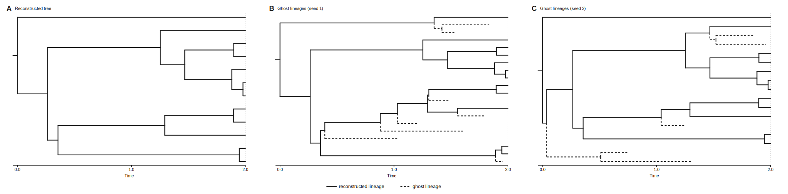

# Ghost lineages

A reconstructed species tree contains only the **sampled, extant** lineages — that is the
whole point of the backward, conditioned birth–death process behind
[`simulate_species_tree`](species-trees.md). But the real diversification process also
produced lineages that **went extinct before the present** (or were simply not sampled).
Those lineages are invisible in the reconstructed tree, yet they were part of the history —
for example, an extinct lineage could have been the donor of a horizontal transfer.

`add_ghost_lineages` **un-prunes** the tree: it grafts those dead ("ghost") lineages back
on, so the tree again reflects the full process rather than just the survivors.

<figure markdown="span">

<figcaption>Un-pruning: the reconstructed tree of survivors (solid) with the extinct/unsampled
ghost lineages grafted back on (dashed) to recover the full diversification history.</figcaption>
</figure>

!!! note "Un-pruning vs. simulating forward"
    Un-pruning is for when you *already have* (or want) a reconstructed tree conditioned on
    `N` extant tips and need the dead lineages added back. If you instead want the complete
    tree from the start, `simulate_species_tree(..., direction="forward")` grows it forward
    with extinct lineages included natively — no un-pruning needed. See
    [species trees](species-trees.md). The two are distributionally equivalent for the
    reconstructed part; pick by which you have in hand.

## Basic use

Pass the **same model** you used to build the tree:

```python
from zombi2.species import BirthDeath, simulate_species_tree, add_ghost_lineages

model = BirthDeath(birth=1.0, death=0.5)
tree = simulate_species_tree(model, n_tips=50, age=5.0, seed=1)

add_ghost_lineages(tree, model, seed=7)   # grafts ghosts in place, and returns the tree
```

The function mutates `tree` **in place** (and also returns it, so you can chain).

## What you get

Ghost lineages attach along each edge and each roots a birth–death subtree conditioned on
leaving no sampled descendant. Every new node is marked `is_extant=False`; the grafted dead
leaves are named `e*` (extinct) and the new internal nodes `i*` — ZOMBI2's standard
convention (extant leaves stay `n*`). The **sampled leaves are left untouched**, so pruning
back to the extant tips recovers the original reconstructed tree exactly.

```python
extant = [n for n in tree.leaves() if n.is_extant]        # the original sampled tips (n*)
ghosts = [n for n in tree.leaves() if not n.is_extant]    # the grafted dead tips (e*)
print(len(extant), "extant +", len(ghosts), "ghost leaves")

print(tree.to_newick())   # the Newick now includes the e* / i* ghost nodes
```

## When do ghosts appear?

Only where lineages could actually have been lost — i.e. the process must allow extinction
or incomplete sampling:

| Model | Ghosts? |
| --- | --- |
| `Yule` / `BirthDeath(death=0)` with full sampling | **none** — nothing goes extinct |
| `BirthDeath(death>0)` | yes — extinct lineages are grafted back |
| `EpisodicBirthDeath(..., sampling_fraction<1)` | yes — extinct **and** unsampled lineages |

On a tree with no possible extinction, `add_ghost_lineages` returns it unchanged.

## Supported models

`BirthDeath`/`Yule` and `EpisodicBirthDeath` (time-varying rates **and** incomplete
sampling with `sampling_fraction < 1`). Pass the model instance you built the tree with, so
the ghost process uses the matching rates.

## Choosing a sampler (`method=`)

Each ghost subtree is grown conditioned on leaving no sampled descendant. Two equivalent
samplers are available:

- **`"rejection"`** (default) — simple and exact: grow a birth–death subtree and reject any
  that leaves a survivor. When extinction or incomplete sampling is heavy, it may retry
  often. Two guards apply only to this method: `max_subtree_size` (reject a runaway subtree)
  and `max_attempts` (cap on retries per attachment).
- **`"htransform"`** — rejection-free, via Doob's h-transform. Faster in the heavy-retry
  regime, and statistically equivalent.

```python
add_ghost_lineages(tree, model, method="htransform", seed=7)
```

## Why un-prune?

Ghost lineages let you study what the reconstructed tree hides: extinct or unsampled
lineages as sources/sinks of horizontal transfer, the effect of sampling on downstream
inference, and the difference between the complete and reconstructed histories. The result
is an ordinary `Tree` — the extra tips are just leaves with `is_extant=False`.

## How it works

The reconstructed tree is the complete birth–death tree with its dead branches pruned off.
Un-pruning inverts that using the exact conditional law of the complete tree given the
reconstructed one (Nee, May & Harvey 1994; Stadler 2009; Lambert & Stadler 2013):

> Along each edge of the reconstructed tree, dead lineages attach as an inhomogeneous Poisson
> process with intensity `λ(t)·E(t)`, where `E(t)` is the probability that a lineage present at
> time `t` leaves **no sampled descendant** at the present.

Intuition: a surviving lineage still speciates at rate `λ`; each side-branch independently
leaves a sampled descendant (prob `1−E`) or nothing (prob `E`). The reconstructed tree kept
only the branchings where *both* sides survived — its nodes — so *between* its nodes every
branching had a dying sibling, occurring at rate `λ·E(t)`.

`E(t)` is the survival quantity ZOMBI2 already solves: the ODE `dE/dτ = μ − (λ+μ)E + λE²` with
`E(0) = 1−ρ` (τ = time before present). Constant-rate `BirthDeath` has the closed form;
`EpisodicBirthDeath` integrates it on a grid. This one quantity unifies the two kinds of dead
lineage — **extinct** (arose and died before the present; needs `μ>0`) and **unsampled extant**
(alive today but not sampled; needs `ρ<1`) — both being "leaves no *sampled* descendant".

**Growing each ghost.** An attachment at time `t` roots a birth–death subtree grown to the
present, conditioned on leaving no sampled descendant (the event of probability `E(t)`). The
two `method=` samplers realise this identically:

- **`rejection`** — grow a normal BD subtree, sample each present-day tip with prob `ρ`, and
  reject if any tip is sampled. Ghosts are small (conditioned to die out), so the expected work
  is `O(λ · tree length)`.
- **`htransform`** — the conditioned process is itself a birth–death with per-lineage birth
  `λ·E(τ)` and death `μ/E(τ)`, drawn in one pass (no rejection). The death rate diverges as
  `E→0`, which is exactly what forces extinction before the present.

**Why it is exact.** Pruning the ghosts back off returns the original reconstructed tree
unchanged (ghosts have no sampled descendants), so the sampled-tree statistics are untouched —
an exact augmentation, not an approximation. Yule with complete sampling (`μ=0, ρ=1`) gives
`E≡0` → zero ghosts → reconstructed = complete.

**Transfers from the dead.** Once grafted, ghosts are ordinary branches: the forward gene
simulator sees them in `branches_alive_at(t)`, so horizontal transfers can draw ghost
donors/recipients — a gene from a ghost donor surfaces in reconciliation as a transfer from a
lineage absent from the sampled species tree (Szöllősi, Tannier, Lartillot & Daubin 2013).

See also the [cookbook](../cookbook.md#add-ghost-extinct-lineages) for the short recipe and
[species trees](species-trees.md) for the underlying model.
