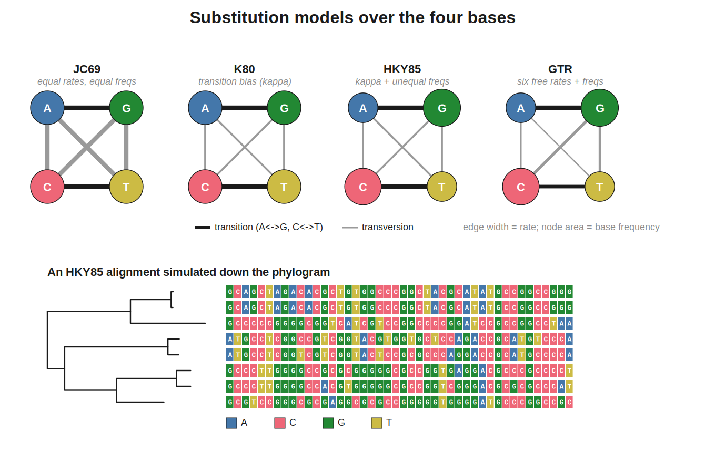

# Sequences

Once the gene trees exist (in **time** units), ZOMBI2 turns them into evolving **molecular
sequences** in two stages — a relaxed clock, then a substitution process — run by the
[`zombi2 sequence`](../cli.md) command (or `SequenceEvolution` / `evolve_on_tree` in Python).

<figure markdown="span">
  { width="560" }
</figure>

## Molecular clocks — time into substitutions

A **clock** rescales each gene tree from time into **expected substitutions per site**
(a chronogram into a phylogram) by assigning every branch a rate. The clock family covers a
strict clock, uncorrelated (lognormal, gamma) and autocorrelated (lognormal, Cox–Ingersoll–Ross)
relaxed clocks, white noise, and a discrete-bin GTDB model — plus a per-family speed multiplier.
See [rate variation](rate-variation.md) and the [relaxed clocks](../models/relaxed-clocks.md)
catalog page.

## Sequence evolution — substitutions along the tree

Given the rescaled trees, ZOMBI2 evolves an actual **alignment** down each one under a
continuous-time substitution model: DNA (JC / K80 / HKY / GTR, with +Γ among-site rate variation)
or empirical amino-acid models (LG / WAG / JTT / Dayhoff / Poisson). It writes one FASTA alignment
per gene family, and can seed each family's root from a real sequence. See the
[DNA substitution](../models/dna-substitution.md) and
[protein substitution](../models/protein-substitution.md) catalog pages.

```bash
# rescale the gene trees into substitutions AND simulate HKY85 DNA alignments
zombi2 genomes -t species_tree.nwk --dup 0.2 --trans 0.1 --loss 0.2 --orig 0.5 --write trace -o run/
zombi2 sequence --genomes run/ --subst-model hky85 --kappa 4 --branch-speed 0.4 --seed 7 -o run/seq/
```
