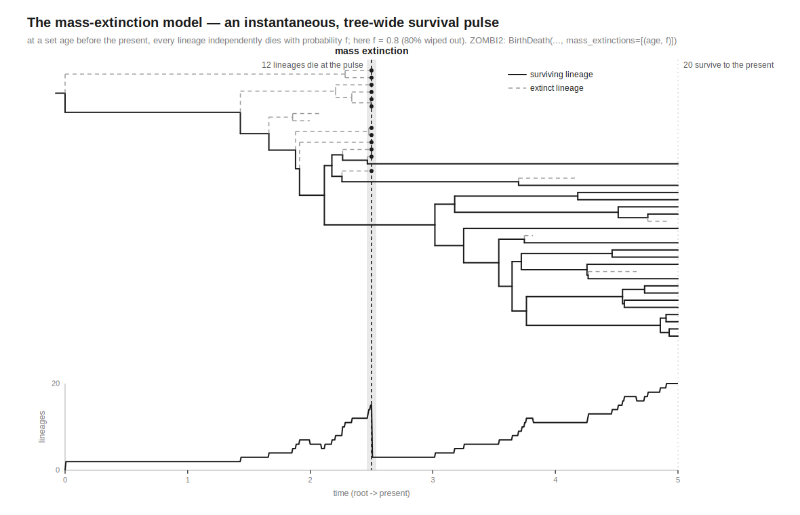
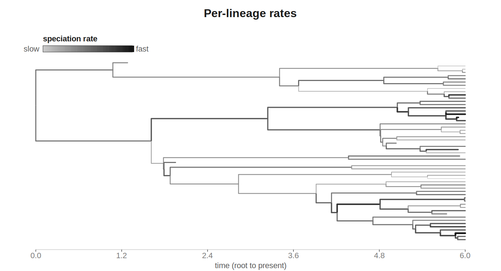
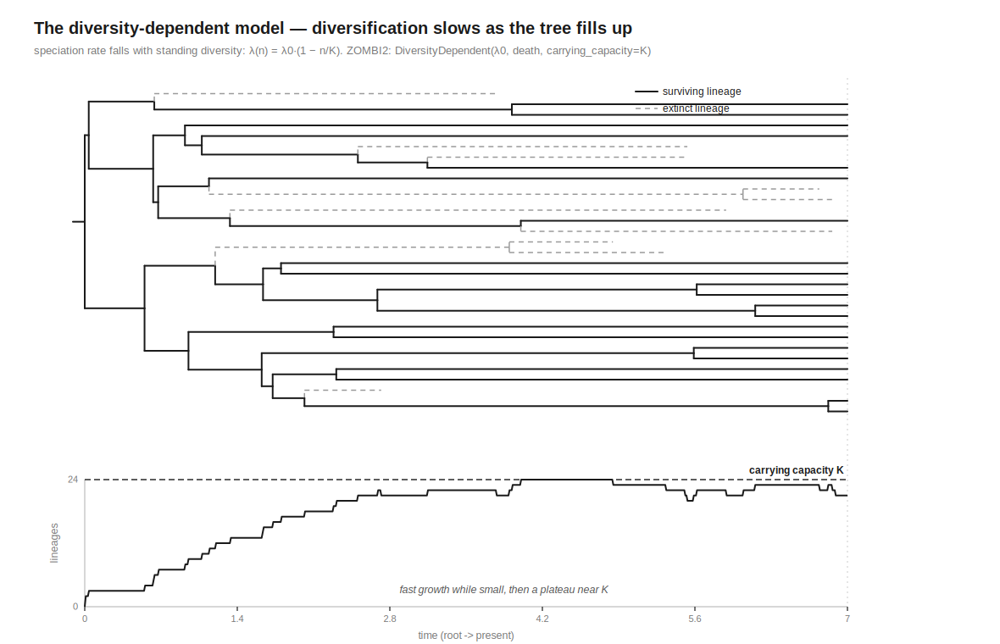
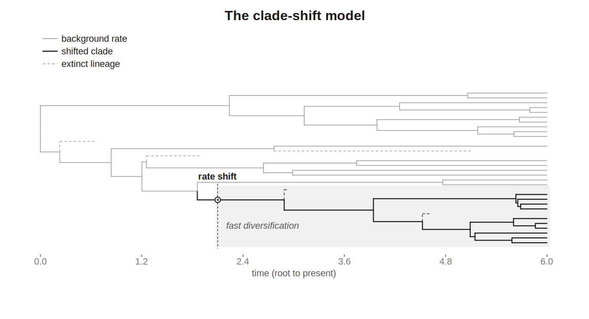

# Species trees

> **Reference:** see the [Birth–death models](../models/birth-death.md) catalog page.

ZOMBI2 simulates the species tree **backward in time** as a *reconstructed birth–death
process* conditioned on the number of extant tips. Concretely, it draws the internal-node
ages i.i.d. from the reconstructed-process CDF and assembles a ranked tree by uniform
coalescence (Hartmann, Wong & Stadler 2010).

## Models

```python
from zombi2.species import BirthDeath, Yule

BirthDeath(birth=1.0, death=0.3)   # speciation λ, extinction μ
Yule(birth=1.0)                    # pure birth == BirthDeath(birth, death=0)
```

## Simulating

```python
from zombi2.species import BirthDeath, simulate_species_tree

tree = simulate_species_tree(
    BirthDeath(1.0, 0.3),
    n_tips=20,          # condition on the number of extant species (>= 2)
    age=5.0,            # tree age
    age_type="crown",   # "crown": age of the root; "stem": time of origin
    seed=1,             # or rng=<numpy Generator>
)
```

- **`n_tips`** — the tree has exactly this many extant leaves.
- **`age` / `age_type`** — with `"crown"` the root sits at time 0 and every extant leaf at
  `age`; with `"stem"` the age is the origin time and a stem precedes the crown. (v1
  requires an explicit `age`; conditioning on `n_tips` alone is not currently supported.)

## The `Tree` object

```python
tree.to_newick()          # timed Newick (branch lengths from node times)
tree.leaves()             # extant leaves
tree.internal_nodes()
tree.branches_alive_at(t) # lineages crossing time t (used by the gene-family loop)
tree.total_age
```

Node times increase forward from the root (time 0) to the extant leaves (`total_age`); a
branch is identified by its child node and spans `(parent.time, node.time]`.

## Episodic (skyline) birth–death

`EpisodicBirthDeath` lets speciation and extinction rates be **piecewise-constant through
time** — the model behind shifting diversification regimes and *gradual* extinction pulses
(for an *instantaneous* mass extinction, see [below](#mass-extinctions-instantaneous-pulses)).
Rates are given one value per epoch (ordered from the present backward), with the epoch
boundaries as strictly increasing **ages** before the present:

```python
from zombi2.species import EpisodicBirthDeath, simulate_species_tree

# a mass extinction: normal extinction recently, a spike older than age 1
epi = EpisodicBirthDeath(birth=[1.0, 1.0], death=[0.2, 3.0], shifts=[1.0])
tree = simulate_species_tree(epi, n_tips=30, age=4.0, seed=1)
```

- `birth[i]`, `death[i]` apply to epoch `i`; `shifts` has one fewer entry than `birth`
  (the boundaries). One epoch (`shifts=[]`) reproduces the constant-rate `BirthDeath`.
- The reconstructed tree is still a coalescent point process, so ZOMBI2 samples i.i.d.
  node ages from the (numerically inverted) CDF and assembles exactly as before — the
  tree stays ultrametric.

### Incomplete extant sampling

Pass `sampling_fraction=ρ` (probability an extant species is sampled):

```python
from zombi2.species import EpisodicBirthDeath

EpisodicBirthDeath(birth=[1.0], death=[0.3], shifts=[], sampling_fraction=0.25)
```

!!! note "Scope"
    This covers episodic *diversification* and incomplete *extant* sampling — both keep
    the tree ultrametric. Serial sampling *through time* (dated tips / fossils, as in the
    fossilized birth–death process) needs forward simulation with retained extinct
    lineages — it ships in forward mode; see the
    [birth–death](../models/birth-death.md) catalog page.

## Mass extinctions (instantaneous pulses)

Raising `death` over an epoch spreads extra extinction *smoothly* across a time window. A **mass
extinction** proper is an *instantaneous, tree-wide pulse* — at one instant a large fraction of
the standing diversity is wiped out at once. Give any forward model a `mass_extinctions` list of
`(age, fraction)` pulses:

```python
from zombi2.species import BirthDeath, EpisodicBirthDeath, simulate_species_tree

# a radiation punctuated by two cataclysms (75% then 50% die), grown forward:
m = BirthDeath(1.0, 0.3, mass_extinctions=[(1.0, 0.75), (2.5, 0.5)])
tree = simulate_species_tree(m, age=5.0, direction="forward", seed=1)

# pulses layer on the episodic background too:
m = EpisodicBirthDeath(birth=[1.0, 1.4], death=[0.2, 0.3], shifts=[2.0],
                       mass_extinctions=[(1.0, 0.8)])
```

- At each `age` before the present, every lineage then alive **independently** dies with
  probability `fraction` (survives with `1 − fraction`) — the standard survival-pulse formulation
  of TreeSim / TESS. Killing is Bernoulli, so the realized fraction fluctuates around `fraction`.
- Mass extinctions are a **forward** feature and need `age` mode (their times are ages before a
  fixed present). The backward reconstructed sampler and `n_tips` mode reject them.
- The victims become ordinary extinct (`e*`) leaves at the pulse instant, so `simulate_genomes`
  treats them as ghost transfer partners — the mass extinction leaves a *genomic* signature
  (families lost with the dead clades, transfers from the dead) with no extra wiring.
- A pulse of `fraction=1.0` wipes the whole tree out; the ≥2-survivor conditioning then rejects
  the run.

CLI: `zombi2 species --mode forward --age 5 --mass-extinction 1.0 0.75 --mass-extinction 2.5 0.5 -o out/`.

<figure markdown="span">

<figcaption>A mass extinction: at one instant a fraction of the standing diversity is wiped
out (the pulse), pruning many lineages at once.</figcaption>
</figure>

## Per-lineage rates: ClaDS

In the models so far, every lineage shares the same rates at any instant. **ClaDS** (Maliet,
Hartig & Morlon 2019) instead gives each lineage its *own* speciation rate: at each speciation the
two daughters inherit the parent's rate times an independent lognormal jump, so rates drift
lineage-by-lineage down the tree. It's the diversification counterpart of a relaxed molecular
clock, and captures the heavy among-clade rate variation real phylogenies show.

```python
from zombi2.species import ClaDS, simulate_species_tree

# α<1 = speciation slows toward the present; σ = jump spread; ε = μ/λ turnover
m = ClaDS(lambda_0=1.0, alpha=0.9, sigma=0.2, turnover=0.1)
tree = simulate_species_tree(m, age=5.0, direction="forward", seed=1)   # or n_tips=…
```

- Forward-only (per-lineage rates have no closed-form reconstructed CDF); `age` or `n_tips` mode.
- `turnover=0` is ClaDS0 (pure birth with shifts); `turnover>0` adds proportional extinction.
- Accepts `sampling_fraction` and `mass_extinctions` overlays, like `BirthDeath`.

<figure markdown="span">

<figcaption>ClaDS: each lineage inherits its parent's speciation rate times a lognormal jump,
so rates drift lineage-by-lineage — some clades radiate, others stall.</figcaption>
</figure>

## Diversity-dependent diversification

**`DiversityDependent`** (Rabosky & Lovette 2008; Etienne et al. 2012) makes speciation slow as
the tree fills an ecological carrying capacity `K`: `λ(n) = max(0, λ₀·(1 − n/K))`, with constant
`μ`. The tree radiates fast when small and saturates near `K` — a diversity-brake, and the
macroevolutionary analogue of the per-family `carrying_capacity` ZOMBI2 already offers for genes.

```python
from zombi2.species import DiversityDependent, simulate_species_tree

m = DiversityDependent(lambda_0=2.0, death=0.2, carrying_capacity=50)
tree = simulate_species_tree(m, age=15.0, direction="forward", seed=1)   # or n_tips ≤ K
```

- Forward-only; `age` or `n_tips` mode (`n_tips` must be `≤ K`).
- With `μ=0` the tree saturates at exactly `K`; with `μ>0` it settles near `n* = K·(1 − μ/λ₀)`.

Both are grown by an exact-Gillespie loop (their rates are constant between events), and both feed
`simulate_genomes` unchanged.

<figure markdown="span">

<figcaption>Diversity-dependent diversification: speciation slows as the tree fills its
carrying capacity <em>K</em> — fast radiation early, a plateau near <em>K</em>.</figcaption>
</figure>

## Clade-specific rate shifts

Where ClaDS shifts *every* lineage a little at *every* speciation, **`CladeShiftBirthDeath`**
shifts *one* clade a lot at a *scheduled* time — the discrete, hand-specified version. The tree
runs at the background `(birth, death)` until, at each scheduled age before the present, a random
lineage then alive (and all its descendants) adopts a new `(birth, death)` — a key innovation
sparking a radiation, or a clade entering a slow-down.

```python
from zombi2.species import CladeShiftBirthDeath, simulate_species_tree

# a slow background; at age 3 one clade starts diversifying fast
m = CladeShiftBirthDeath(0.6, 0.4, clade_shifts=[(3.0, 2.0, 0.1)])
tree = simulate_species_tree(m, age=5.0, direction="forward", seed=1)
```

- Forward-only and **age mode** (the shifts are scheduled as ages before a fixed present).
- The shifted lineage is drawn at random — you can't name an unborn clade in a forward run, and
  contemporaneous lineages are exchangeable. Give several shifts for several clades.
- Accepts `sampling_fraction` and `mass_extinctions` overlays, and feeds `simulate_genomes` as is.

<figure markdown="span">

<figcaption>A clade-specific shift: at a scheduled age one lineage and all its descendants
adopt a new speciation/extinction regime — here sparking a fast-diversifying clade.</figcaption>
</figure>

## Related models

Trait-dependent diversification — the SSE family, tying rates to the traits ZOMBI2 simulates —
ships under the `coevolve` command (`--couple traits:species`); see the
[coevolution](../models/coevolution.md) catalog page. The heterogeneous-rate forward models
(ClaDS, diversity-dependent, clade-shift, episodic, mass extinctions) are catalogued on the
[advanced diversification](../models/advanced-diversification.md) page.
