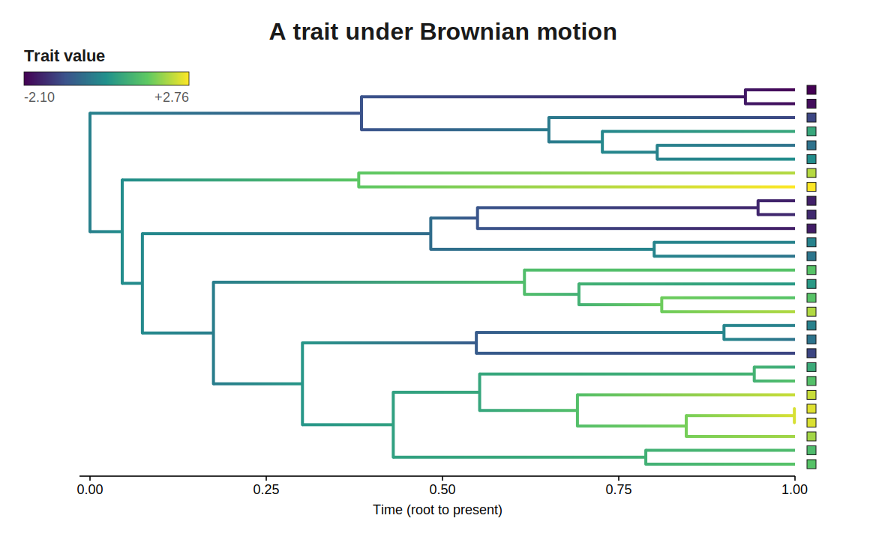
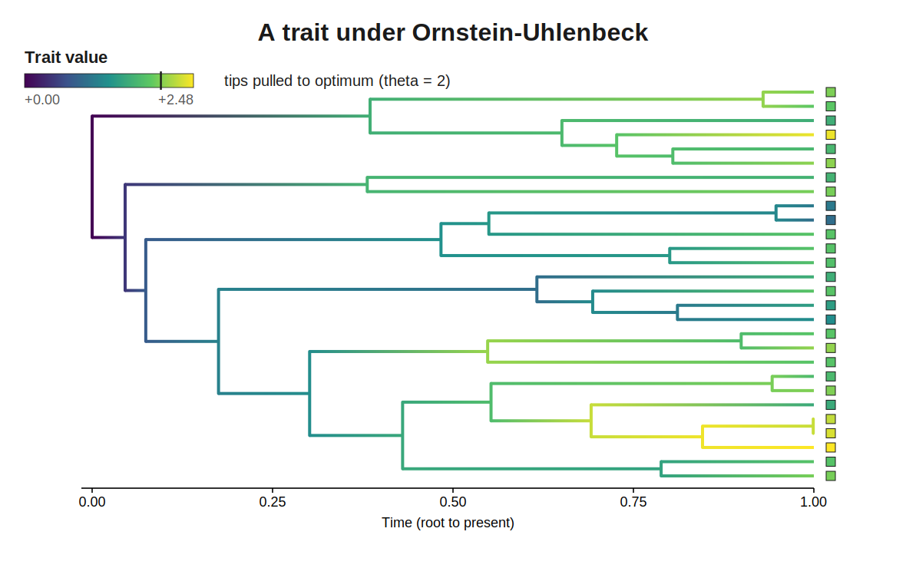
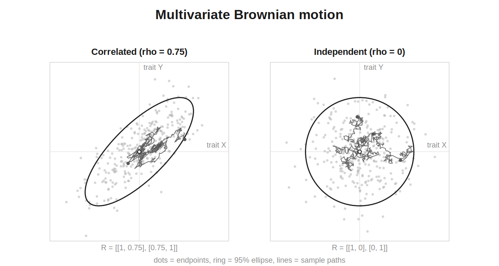
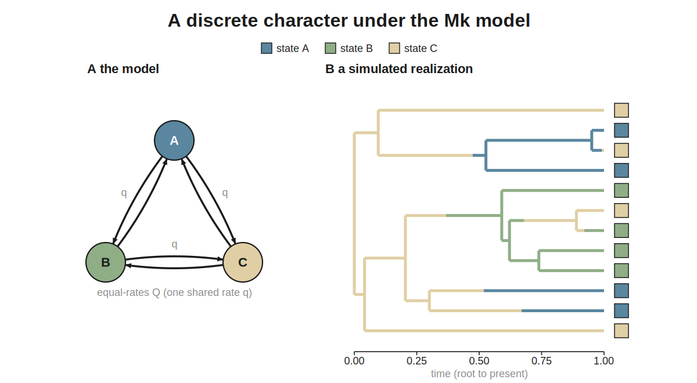
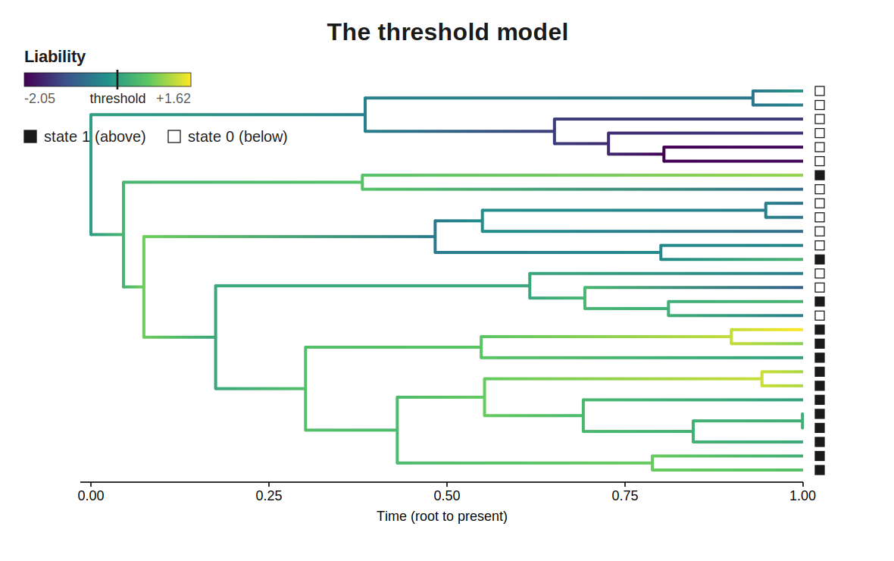
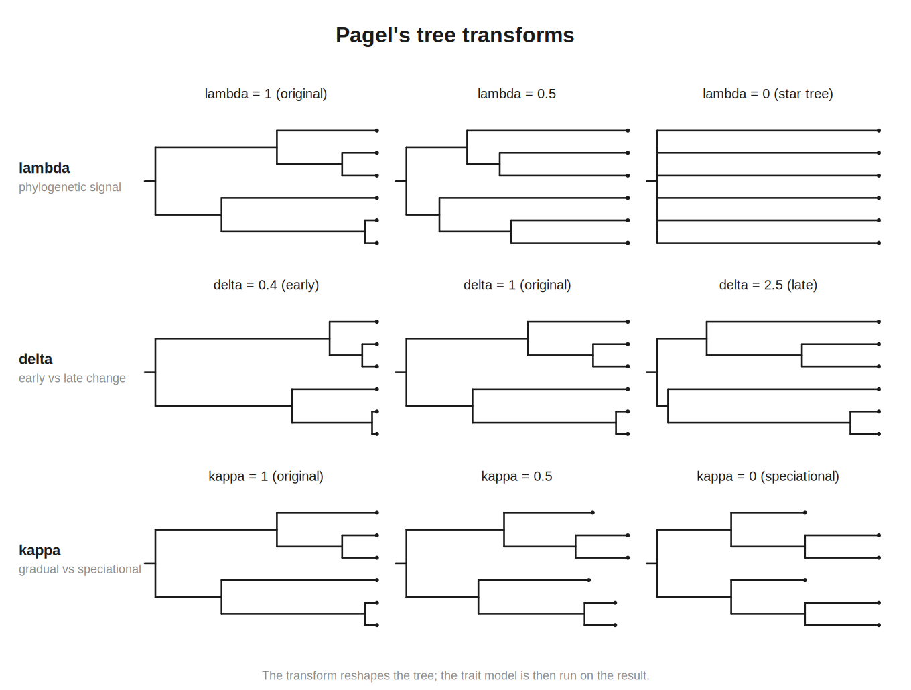
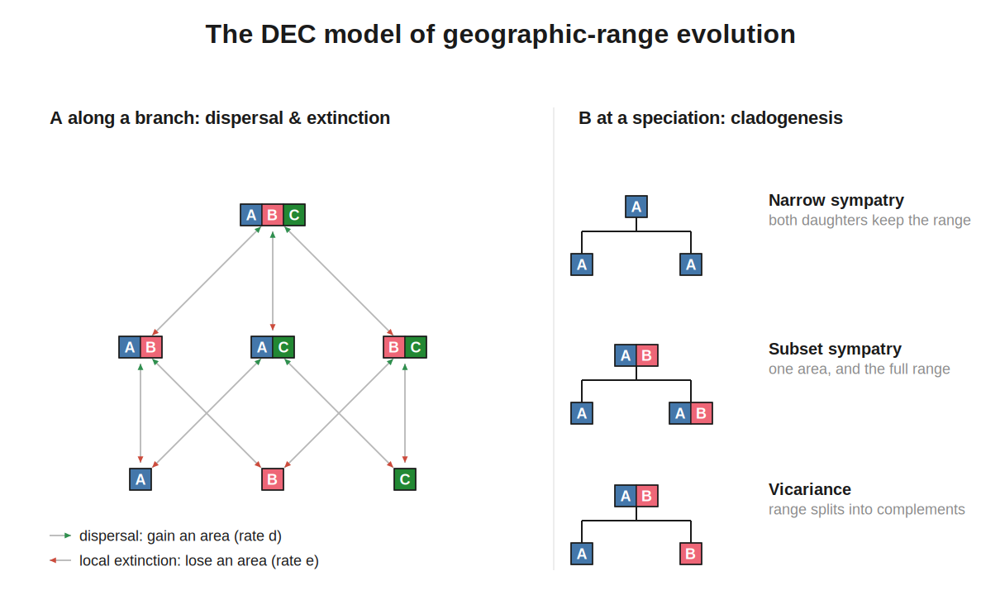

# Traits

Once you have a tree, you can evolve **traits** on it — a body size, an expression level, a discrete character such as habitat or the presence of a structure, or even a geographic range. ZOMBI2 simulates the classic phylogenetic-comparative models (Felsenstein 1985 and successors) with one function, `simulate_traits`, and a family of model objects.

```python
from zombi2.species import simulate_species_tree, BirthDeath
from zombi2.traits import simulate_traits, BrownianMotion

tree = simulate_species_tree(BirthDeath(1.0, 0.3), n_tips=30, age=5.0, seed=1)
result = simulate_traits(tree, BrownianMotion(sigma2=0.5), seed=1)

result.values                 # {extant leaf: value} — the observable tip data
result.ancestral_states()     # {internal node: value} — exact, not inferred
```

All models share one engine: the trait starts at the root and is evolved branch by branch in pre-order, each node inheriting its parent's end state. **Continuous** models draw the exact branch endpoint; **discrete** models simulate the Markov jumps exactly, so the realized history along each branch — a *stochastic character map* — comes for free. It works on any `Tree`: a simulated species tree, or a gene tree loaded with [`read_newick`](../reference/api.md#tree).

## The result

`simulate_traits` returns a `TraitResult`:

| Access | Meaning |
| --- | --- |
| `result.values` | Values at the **extant** tips (the observable comparative data) |
| `result.labeled_values()` | Same, with discrete state indices decoded to their labels |
| `result.ancestral_states()` | Values at every internal node (exact ancestral states) |
| `result.node_values` | Every node (root, internal, tips) |
| `result.history` | Per-branch `(state, duration)` segments — the stochastic map (discrete only) |
| `result.changes()` | Realized transitions `(node, time, from, to)` (discrete only) |
| `result.to_tsv()` / `result.to_newick()` | Tip table / annotated Newick (`[&trait=…]`) |

## Continuous-trait models

A quantitative trait — a body size, an expression level, a latent liability — evolves down the tree as a **diffusion**: along each branch it performs a random walk, and ZOMBI2 integrates that walk **exactly**, node by node in preorder from a root value, so the internal nodes are true ancestral states rather than an inference. The models below are variants of that diffusion: a free random walk (BM), a pull toward an optimum (OU), a rate that changes through time (EarlyBurst), a per-clade optimum (MultiOptimumOU), and vector-valued versions that let several traits evolve in a correlated way (MultivariateBrownian, MultivariateOU). All are exact — every one reproduces the closed-form tip law, so tips come out multivariate-normal.

| Model | Diffusion | Reach for it when |
| --- | --- | --- |
| **BM** | free random walk (optional trend) | the default null model for a neutral quantitative trait |
| **OU** | pulled toward one optimum `theta` | stabilizing selection / adaptation to a fixed optimum |
| **EarlyBurst** | rate changes exponentially through time | an adaptive radiation (early burst) or an accelerating rate |
| **MultiOptimumOU** | a different optimum on each painted regime | different clades adapt toward different optima |
| **MultivariateBrownian** | vector trait, rate matrix `R` | several traits evolve together, correlated |
| **MultivariateOU** | vector trait pulled toward `theta` | correlated traits under multivariate stabilizing selection |

### Brownian motion (BM)

The classic model (Felsenstein 1985): along a branch `dX = trend·dt + σ·dW`, so the endpoint from `x` is normal with mean `x + trend·t` and variance `sigma2·t`. Simulated in preorder this reproduces the exact tip law — tips are multivariate-normal with mean `x0 + trend·depth` and covariance `sigma2 · C`, where `C` is the tree's shared-path-length matrix. Parameters: `sigma2` (diffusion rate, ≥ 0), `x0` (root value, default `0.0`), `trend` (directional drift, default `0.0`). With `trend = 0` it is the driftless random walk; a non-zero `trend` biases it. The default null for a trait wandering neutrally down a tree.

```python
from zombi2.traits import simulate_traits, BrownianMotion

simulate_traits(tree, BrownianMotion(sigma2=0.5, x0=0.0, trend=0.0), seed=1)
```

<figure markdown="span">

<figcaption>A continuous trait wandering down the branches by Brownian motion — the value at
each tip is the endpoint of its root-to-tip random walk.</figcaption>
</figure>

### Ornstein–Uhlenbeck (OU)

A trait under stabilizing selection: it diffuses but is pulled toward an optimum `theta` (θ) with strength `alpha` (α), `dX = alpha·(theta − X)·dt + σ·dW` (Hansen 1997; Butler & King 2004). Over a branch of duration `t` the endpoint from `x` is normal with mean `theta + (x − theta)·e^{−alpha·t}` and variance `sigma2/(2·alpha)·(1 − e^{−2·alpha·t})`, so tips settle into the stationary law `N(theta, sigma2/(2·alpha))`. Parameters: `sigma2` (default `1.0`), `alpha` (> 0), `theta`, and `x0` (defaults to `theta` — start at the optimum). `alpha` must be strictly positive — use BM for `alpha = 0`. Reach for it when a trait is constrained rather than free to wander.

```python
from zombi2.traits import simulate_traits, OrnsteinUhlenbeck

simulate_traits(tree, OrnsteinUhlenbeck(sigma2=0.4, alpha=2.0, theta=10.0), seed=1)
```

<figure markdown="span">

<figcaption>Ornstein–Uhlenbeck: the trait diffuses but is pulled back toward an optimum, so
lineages cluster around it instead of wandering freely as under Brownian motion.</figcaption>
</figure>

### Early burst / ACDC (EarlyBurst)

Brownian motion whose rate changes exponentially through time (Blomberg et al. 2003; Harmon et al. 2010): the diffusion rate at absolute time `t` (root at 0) is `σ²(t) = sigma2 · e^{rate·t}`. With `rate < 0` the rate **decays** — most divergence happens early, the signature of an adaptive radiation (an *early burst*); with `rate > 0` it **accelerates** (the AC of ACDC); `rate = 0` is plain BM. The variance over a branch spanning `[t1, t2]` is the exact integral `sigma2·(e^{rate·t2} − e^{rate·t1})/rate`, so tips stay multivariate-normal. Parameters: `sigma2` (rate **at the root**, ≥ 0), `rate`, `x0` (default `0.0`), `trend` (default `0.0`).

```python
from zombi2.traits import simulate_traits, EarlyBurst

simulate_traits(tree, EarlyBurst(sigma2=1.0, rate=-0.8), seed=1)
```

### Multi-optimum OU (MultiOptimumOU)

OU with a different optimum on each painted regime of the tree (`OUwie`, `ouch`): each branch belongs to a regime, and the trait follows an OU pulled toward that regime's optimum. The **regimes** come from a discrete stochastic map — typically an `Mk` trait simulated on the *same* tree — so a regime may switch partway along a branch, and the OU is integrated exactly piece by piece. Parameters: `regimes` (a discrete `TraitResult` carrying the map), `theta` (one optimum per regime), `alpha` (> 0, scalar or one per regime), `sigma2` (≥ 0, scalar or one per regime), `x0` (defaults to the optimum of the root's regime). Optionally `alpha`/`sigma2` also vary by regime (the `OUMV` / `OUMA` / `OUMVA` variants); by default only `theta` differs (`OUM`).

```python
from zombi2.traits import simulate_traits, Mk, MultiOptimumOU

regimes = simulate_traits(tree, Mk.equal_rates(2, 0.4), seed=1)            # paint 2 regimes
mou = MultiOptimumOU(regimes, theta=[-5.0, 5.0], alpha=4.0, sigma2=0.4)
simulate_traits(tree, mou, seed=2)                                         # tips track their optimum
```

### Correlated continuous traits (MultivariateBrownian, MultivariateOU)

A vector-valued trait with a rate (covariance) matrix `R` couples its dimensions — the model of correlated evolution (`mvMORPH`). Each node's value is a length-`k` array.

```python
from zombi2.traits import simulate_traits, MultivariateBrownian, MultivariateOU

R = [[1.0, 0.9],
     [0.9, 1.0]]                       # strong positive correlation between the two dimensions
simulate_traits(tree, MultivariateBrownian(R), seed=1)

# multivariate OU: pull each dimension toward an optimum (alpha may be a scalar, vector, or matrix)
simulate_traits(tree, MultivariateOU(R, alpha=1.5, theta=[0.0, 5.0]), seed=1)
```

<figure markdown="span">

<figcaption>A multivariate trait: the rate matrix <em>R</em> correlates the dimensions, so the
two traits tend to move together down the tree.</figcaption>
</figure>

**Multivariate Brownian motion (MultivariateBrownian).** Brownian motion of a **vector-valued** trait with a rate (covariance) matrix `R`: a length-`k` trait diffuses so the increment over a branch is `MVN(trend·t, R·t)`. The off-diagonal `R[a, b]` couples dimensions `a` and `b`, so this is the model of **correlated** continuous-trait evolution (`mvMORPH`, `Rphylopars`): tips are jointly multivariate-normal with covariance `R ⊗ C`. Each node's value is a length-`k` array. Parameters: `R` (k×k symmetric positive-semidefinite rate matrix), `x0` (root vector, default zeros), `trend` (per-dimension drift, default zeros).

**Multivariate OU (MultivariateOU).** Multivariate stabilizing selection (`mvMORPH`): `dX = A·(theta − X)·dt + Σ^{1/2}·dW`, with mean-reversion matrix `A` (`alpha`), optimum vector `theta`, and diffusion covariance `R` (`Σ`). The exact branch transition has mean `theta + e^{−A·t}·(x − theta)` and covariance `V − e^{−A·t}·V·e^{−Aᵀ·t}`, where the stationary covariance `V` solves the Lyapunov equation `A·V + V·Aᵀ = R`. Parameters: `R` (k×k PSD diffusion covariance), `alpha` (mean reversion as a scalar `alpha·I`, a length-`k` diagonal, or a k×k matrix with eigenvalues of positive real part), `theta` (optimum vector), `x0` (default `theta`). For a scalar `alpha` this reduces to per-dimension OU with correlated diffusion.

### Command line

`zombi2 trait` needs a tree — make one first with `zombi2 species` (writing `species_tree.nwk`). The CLI covers the scalar continuous models `--model bm | ou | eb`; the vector-valued models (MultivariateBrownian, MultivariateOU) and MultiOptimumOU are Python-only. Shared flags: `--sigma2` (default `1.0`), `--x0` (root value; OU defaults it to `--theta`), `--trend` (bm/eb). OU adds `--alpha` (default `1.0`) and `--theta` (default `0.0`); EB adds `--rate` (negative = early burst, default `1.0`).

```bash
# Brownian motion
zombi2 trait -t run/species_tree.nwk --model bm --sigma2 0.5 --seed 1 -o run/

# Ornstein–Uhlenbeck toward an optimum
zombi2 trait -t run/species_tree.nwk --model ou --alpha 2 --theta 5 --seed 1 -o run/

# early burst (rate decays through time)
zombi2 trait -t run/species_tree.nwk --model eb --sigma2 1 --rate -1.5 --seed 1 -o run/
```

Add `--replicates N` to write `traits.tsv` with one column per replicate.

### Python

Models live in `zombi2.traits` (and re-export at the top level, so `zombi2.BrownianMotion` also works):

```python
import numpy as np
from zombi2.traits import (
    BrownianMotion, OrnsteinUhlenbeck, EarlyBurst,
    MultivariateBrownian, MultivariateOU, MultiOptimumOU, Mk,
    simulate_traits, replicate_traits,
)
from zombi2.species import BirthDeath, simulate_species_tree

tree = simulate_species_tree(BirthDeath(1.0, 0.3), n_tips=20, age=5.0, seed=1)

# scalar continuous models
res = simulate_traits(tree, BrownianMotion(sigma2=0.5, x0=0.0, trend=0.0), seed=1)
res.values                 # {extant leaf: value} — the observable tip data
res.ancestral_states()     # {internal node: value} — exact, not inferred

simulate_traits(tree, OrnsteinUhlenbeck(sigma2=0.4, alpha=2.0, theta=10.0), seed=1)
simulate_traits(tree, EarlyBurst(sigma2=1.0, rate=-1.5), seed=1)
replicate_traits(tree, BrownianMotion(0.5), 100, seed=7)   # 100 independent draws

# correlated vector-valued traits (each node value is a length-k array)
R = [[1.0, 0.6], [0.6, 0.8]]
simulate_traits(tree, MultivariateBrownian(R), seed=1)
simulate_traits(tree, MultivariateOU(R, alpha=2.0, theta=[0.0, 0.0]), seed=1)

# per-regime optima: paint regimes with an Mk map on the SAME tree, then run OU on it
regimes = simulate_traits(tree, Mk.equal_rates(2, 0.4), seed=1)
simulate_traits(tree, MultiOptimumOU(regimes, theta=[-5.0, 5.0], alpha=4.0, sigma2=0.4), seed=2)
```

### Output

A `TraitResult`: `values` at the extant tips (the observable comparative data), `ancestral_states()` at every internal node (exact, not inferred), and `node_values` for all nodes. Being continuous, it carries no per-branch history (`history is None`). `to_tsv()` gives a `node`/`trait` table (pass `nodes="all"` for ancestral rows too) and `to_newick()` a Newick with `[&trait=…]` on every node. The CLI writes `traits.tsv` (tip **and** ancestral values), `trait_tree.nwk` (values annotated on every node), and the `trait.log` manifest; `--replicates N` writes one `traits.tsv` column per replicate instead.

### Validation

- **BM.** Over many replicates the empirical tip mean matches `x0 + trend·depth` and the tip covariance matches `sigma2·C` (`C` = the shared-path-length / MRCA-time matrix) — `test_traits.py::test_bm_tip_moments_match_theory`.
- **OU.** Over many single-branch replicates the endpoint mean reverts as `theta + (x0 − theta)·e^{−alpha·t}` and the variance matches `sigma2/(2·alpha)·(1 − e^{−2·alpha·t})` — `test_traits.py::test_ou_transition_moments_match_theory`.
- **EarlyBurst.** The single-branch tip variance matches the exact integral `sigma2·(e^{rate·t} − 1)/rate` for both a decaying and an accelerating rate — `test_traits.py::test_early_burst_variance_matches_integral`.
- **MultiOptimumOU.** With strong `alpha`, tips in each painted regime concentrate near that regime's own optimum — `test_traits.py::test_multi_optimum_ou_tracks_local_optima`.
- **MultivariateBrownian.** The per-tip covariance matches `R·depth` and the cross-tip same-dimension covariance matches `R[a,a]·MRCA-time` — `test_traits.py::test_mvbm_tip_covariance_matches_R_times_C`.
- **MultivariateOU.** Over many single-branch replicates the endpoint mean matches `theta + e^{−A·t}·(x0 − theta)` and the covariance matches `V − e^{−A·t}·V·e^{−Aᵀ·t}` — `test_traits.py::test_mvou_single_branch_moments`.

## Discrete-trait models

A **discrete trait** is a character that takes one of finitely many states — a habitat, the presence or absence of a structure, a diet class. ZOMBI2 evolves it as a **continuous-time Markov chain** along the tree: given a rate matrix `Q` (off-diagonal `Q[i,j] ≥ 0` is the instantaneous rate `i → j`), every branch's jumps are simulated **exactly** by the Gillespie algorithm, so the realized `(state, duration)` history — a *stochastic character map* — comes for free (`result.history`, `result.changes()`). All the models below are one shared `Mk` engine wearing different `Q` matrices: they differ only in what transition structure they impose. One function, `simulate_traits`, runs them all.

| Model | Structure | Reach for it when |
| --- | --- | --- |
| **Mk** | one `k×k` rate matrix `Q` | any single discrete character (ER / SYM / ordered / ARD) |
| **CorrelatedBinary** | two binary traits, one flips at a time | testing whether two binary characters coevolve (Pagel) |
| **CorrelatedBinaryK** | `k` binary traits, one flips at a time | the `k`-trait generalization of the above |
| **HiddenStateMk** | observed states × hidden rate classes | rate heterogeneity a plain `Mk` cannot capture (corHMM) |
| **ThresholdModel** | discrete state cut from a latent BM liability | a discrete character with an underlying continuous cause |

### The Mk model

A `k`-state continuous-time Markov chain over `k` states with a rate matrix `Q` (Lewis 2001). Convenience constructors cover the standard sub-models; the raw constructor takes any `Q` (all-rates-different, or an ordered/meristic character).

```python
from zombi2.traits import simulate_traits, Mk

mk = simulate_traits(tree, Mk.equal_rates(3, 0.4,                  # ER: one shared rate
                                          states=["marine", "brackish", "fresh"]),
                     seed=2)

mk.labeled_values()                    # {extant leaf: "marine" | "brackish" | "fresh"}
mk.history[node]                       # [(state, duration), ...] — the stochastic map
mk.changes()                           # the transition events

Mk.symmetric([[0, 2, 1], [2, 0, 3], [1, 3, 0]])   # SYM: symmetric Q
Mk.ordered(4, 0.5)                                 # ordered: adjacent-only steps (i <-> i±1)
Mk([[0, 1, 2], [3, 0, 1], [1, 1, 0]])             # ARD: any user-supplied rate matrix
```

<figure markdown="span">

<figcaption>A discrete character under an Mk model: the state jumps along the branches (the
exact stochastic character map), and the tips inherit whatever state they end in.</figcaption>
</figure>

The transition structure is entirely in the `Q` you pass: `equal_rates` is all-to-all at one rate (**ER**), `symmetric` makes `i→j` and `j→i` equal (**SYM**), `ordered` is the tridiagonal nearest-neighbour chain (adjacent steps only, `i ↔ i±1` — a meristic character, the character-state analogue of [`RateVariation`](sequences.md)), and the raw constructor `Mk(Q)` takes an arbitrary Markov chain, including all-rates-different (**ARD**). From the CLI, `--model mk` is equal-rates by default, `--ordered` gives the adjacent-only chain, and `--q-matrix FILE` reads an arbitrary `Q`. This is the default discrete model and the base class of every other model in this section.

Every `Mk` also exposes its analytic quantities:

```python
from zombi2.traits import Mk

m = Mk.equal_rates(3, 0.4)
m.transition_matrix(1.0)               # P(t) = exp(Q·t)
m.stationary_distribution()            # π with πQ = 0
```

The root state is `"uniform"` by default; pass `root="stationary"`, an index, or a probability vector.

### Correlated binary characters (Pagel 1994)

Two binary characters **X** and **Y** evolving jointly over the four states `(X, Y)`, with **one trait changing at a time** (simultaneous double flips have rate 0). Each trait's gain/loss rate may depend on the *other* trait's current state — that dependence *is* correlated evolution (Pagel 1994). Pass the eight directional rates (`x_gain_y0`, `x_gain_y1`, … named by the changing trait, its direction, and the other trait's state); `CorrelatedBinary.independent(...)` builds the null model where the two evolve independently, against which the dependent fit is tested. Each node's value is the `(X, Y)` pair.

```python
from zombi2.traits import simulate_traits, CorrelatedBinary

# Y tracks X: Y is gained quickly when X = 1 and lost quickly when X = 0
m = CorrelatedBinary(x_gain_y0=0.5, x_gain_y1=0.5, x_loss_y0=0.5, x_loss_y1=0.5,
                     y_gain_x0=0.05, y_gain_x1=2.0, y_loss_x0=2.0, y_loss_x1=0.05)
res = simulate_traits(tree, m, seed=1)
res.labeled_values()                   # {extant leaf: (X, Y)}

null = CorrelatedBinary.independent(x_gain=0.5, x_loss=0.5, y_gain=0.5, y_loss=0.5)
```

### Correlated binary characters, k traits (CorrelatedBinaryK)

The `k`-trait sibling of `CorrelatedBinary` (Pagel 1994, generalized to `k ≥ 2`). `k` binary traits evolve over the `2^k` configurations, still flipping **exactly one bit at a time**, and each flip may depend on the other traits' states. The compact entry points are `CorrelatedBinaryK.independent(gains, losses)` (the null model — `Q` is the Kronecker sum of `k` independent 2-state chains), `.equal_rates(k, gain, loss)` (one shared gain/loss), and `.partner_coupling(gains, losses, partners, boost_gain, boost_loss)` (each trait multiplicatively boosted by one designated partner — `O(k)` parameters that still induce genuine pairwise correlation). `.from_table` / the raw `rate_fn` constructor give full generality. Each node's value is the `k`-tuple. Reach for it when you have more than two coevolving binary characters.

```python
from zombi2.traits import simulate_traits, CorrelatedBinaryK

# three binary traits (independent null, or partner-coupled)
CorrelatedBinaryK.independent(gains=[0.4, 0.4, 0.4], losses=[0.6, 0.6, 0.6])
cbk = CorrelatedBinaryK.partner_coupling(gains=0.3, losses=0.3,
                                         partners=[1, None, None], boost_gain=5.0)  # trait 0 tracks trait 1
simulate_traits(tree, cbk, seed=1).labeled_values()         # {leaf: (t0, t1, t2)}
```

### Hidden rate classes (corHMM)

`HiddenStateMk` gives the observed character **hidden rate classes**: its transition rates depend on an unobserved class that itself switches along the tree, capturing rate heterogeneity a plain `Mk` cannot (Beaulieu et al. 2013). Pass one `O×O` observed-rate matrix **per hidden class** (`observed_rates`, e.g. a slow class and a fast class) and the `hidden_rate` between classes (a scalar for a symmetric all-to-all rate, or an `H×H` matrix). The full state is the `(observed, hidden)` pair; tips report the observed state, while `result.full_label(v)` and `changes()` expose the hidden dimension.

```python
from zombi2.traits import simulate_traits, HiddenStateMk

slow = [[0, 0.1], [0.1, 0]]
fast = [[0, 3.0], [3.0, 0]]
hmm = HiddenStateMk(observed_rates=[slow, fast], hidden_rate=0.5,
                    observed_states=[0, 1], hidden_states=["slow", "fast"])
res = simulate_traits(tree, hmm, seed=1)
res.labeled_values()                   # observed 0/1 (hidden class collapsed)
res.full_label(res.node_values[tree.extant_leaves()[0]])   # (observed, hidden), e.g. (1, 'fast')
```

### The threshold model

A discrete state derived from a latent continuous **liability** that evolves by Brownian motion; the observed state is whichever interval the liability currently falls in, cut by an ordered set of `thresholds` (`k−1` cuts give `k` states; `[0.0]` is a binary trait) (Felsenstein 2012). Only the ratio of thresholds to the diffusion scale is identifiable, so `sigma2` is fixed to `1.0` by default; `x0` sets the root liability. The evolving value at each node is the liability (`result.values`, continuous); the observed discrete state comes from `result.labeled_values()`. Reach for it to model a discrete character with an underlying continuous cause (and the correlated / polymorphic behaviour that implies). Its `kind` is `"continuous"` because the liability, not the state, is what diffuses.

```python
from zombi2.traits import simulate_traits, ThresholdModel

th = simulate_traits(tree, ThresholdModel(thresholds=[0.0]), seed=1)   # binary
th.values                              # liabilities (continuous, latent)
th.labeled_values()                    # observed 0/1 states
```

<figure markdown="span">

<figcaption>The threshold model: a latent liability evolves by Brownian motion (top), and the
observed discrete state is whichever interval it falls in at each point (bottom).</figcaption>
</figure>

### Command line

The `trait` command covers the two discrete models that need no auxiliary structure — **Mk** and **ThresholdModel**. (`CorrelatedBinary`, `CorrelatedBinaryK`, and `HiddenStateMk` are Python-only, as their multi-trait / hidden-class parameterizations have no flat CLI form.) `--model mk` is equal-rates by default; `--ordered` gives the adjacent-only chain and `--q-matrix FILE` reads an arbitrary `Q` (overriding `--states`/`--rate`/`--ordered`).

```bash
# a tree to evolve the trait along
zombi2 species --birth 1 --death 0.3 --tips 30 --age 5 --seed 1 -o run/

# Mk: 3-state equal-rates character
zombi2 trait -t run/species_tree.nwk --model mk --states 3 --rate 0.4 --seed 1 -o mk/

# Mk: ordered (meristic) 4-state character, 20 replicates
zombi2 trait -t run/species_tree.nwk --model mk --states 4 --ordered --replicates 20 --seed 1 -o mko/

# threshold: binary (default) and a 3-state ordered character
zombi2 trait -t run/species_tree.nwk --model threshold --seed 1 -o th/
zombi2 trait -t run/species_tree.nwk --model threshold --thresholds=-1,1 --seed 1 -o th3/
```

(Invoke the CLI as `python -m zombi2 trait …`.) `--replicates N` writes `traits.tsv` with one column per replicate.

### Python

Models live in `zombi2.traits` (and re-export at the top level, so `zombi2.Mk` also works):

```python
from zombi2.species import BirthDeath, simulate_species_tree
from zombi2.traits import (Mk, CorrelatedBinary, CorrelatedBinaryK,
                           HiddenStateMk, ThresholdModel, simulate_traits)

tree = simulate_species_tree(BirthDeath(1.0, 0.3), n_tips=30, age=5.0, seed=1)

# Mk: equal-rates over labeled states; the stochastic map comes for free
mk = simulate_traits(tree, Mk.equal_rates(3, 0.4, states=["marine", "brackish", "fresh"]), seed=2)
mk.labeled_values()                    # {extant leaf: "marine" | "brackish" | "fresh"}
mk.history[node]                       # [(state, duration), ...] — the stochastic map
Mk.symmetric([[0, 2, 1], [2, 0, 3], [1, 3, 0]])     # SYM
Mk.ordered(4, 0.5)                                   # ordered / meristic
Mk([[0, 1, 2], [3, 0, 1], [1, 1, 0]])               # ARD (any Q)

# CorrelatedBinary: Y tracks X (gained fast when X=1, lost fast when X=0)
cb = CorrelatedBinary(x_gain_y0=0.5, x_gain_y1=0.5, x_loss_y0=0.5, x_loss_y1=0.5,
                      y_gain_x0=0.05, y_gain_x1=2.0, y_loss_x0=2.0, y_loss_x1=0.05)
simulate_traits(tree, cb, seed=1).labeled_values()          # {leaf: (X, Y)}
CorrelatedBinary.independent(x_gain=0.5, x_loss=0.5, y_gain=0.5, y_loss=0.5)   # null model

# CorrelatedBinaryK: three binary traits (independent null, or partner-coupled)
CorrelatedBinaryK.independent(gains=[0.4, 0.4, 0.4], losses=[0.6, 0.6, 0.6])
cbk = CorrelatedBinaryK.partner_coupling(gains=0.3, losses=0.3,
                                         partners=[1, None, None], boost_gain=5.0)  # trait 0 tracks trait 1
simulate_traits(tree, cbk, seed=1).labeled_values()         # {leaf: (t0, t1, t2)}

# HiddenStateMk: a slow and a fast hidden class over an observed binary character
hmm = HiddenStateMk(observed_rates=[[[0, 0.1], [0.1, 0]], [[0, 3.0], [3.0, 0]]],
                    hidden_rate=0.5, observed_states=[0, 1], hidden_states=["slow", "fast"])
res = simulate_traits(tree, hmm, seed=1)
res.labeled_values()                                        # observed 0/1 (hidden collapsed)
res.full_label(res.node_values[tree.extant_leaves()[0]])    # (observed, hidden), e.g. (1, 'fast')

# ThresholdModel: binary state from a latent BM liability
th = simulate_traits(tree, ThresholdModel(thresholds=[0.0]), seed=1)
th.values                              # liabilities (continuous, latent)
th.labeled_values()                    # observed 0/1 states
```

### Output

`simulate_traits` returns a `TraitResult`: `values` are the extant-tip states (the observable data), `labeled_values()` decodes state indices to their labels (and returns the `(X, Y)` / `k`-tuple pair for the correlated models), `ancestral_states()` gives the exact internal-node states, and `history` / `changes()` give the per-branch stochastic map and the realized transition events. `to_tsv()` and `to_newick()` write the tip table and a `[&trait=…]`-annotated Newick.

From the CLI, `trait` writes `traits.tsv` (`node <TAB> trait`, or one `rep_*` column per replicate), `trait_tree.nwk` (the Newick with `[&trait=…]` on every node), and `trait.log`. For `ThresholdModel`, the reported trait is the discrete **state**, not the latent liability.

### Validation

- **Mk.** `P(t)` for the equal-rates model matches the closed form `P_ii = 1/k + (1−1/k)e^{−kqt}`, `P_ij = (1/k)(1−e^{−kqt})` (`test_traits.py::test_mk_equal_rates_transition_closed_form`), and the empirical end-state distribution over a single branch matches `P(t)` from the start state across 20 000 replicates (`test_traits.py::test_mk_simulation_matches_transition_matrix`).
- **CorrelatedBinary.** The assembled `Q` zeroes both double-transitions (no simultaneous flips), sums to zero per row, and places each named rate in the right off-diagonal cell (`test_traits.py::test_correlated_binary_Q_structure`).
- **CorrelatedBinaryK.** The `independent` constructor produces exactly the Kronecker sum of the `k` per-trait 2-state chains, for `k = 2..5` (`test_correlated_binary_k.py::test_independent_is_kronecker_sum`).
- **HiddenStateMk.** With the same observed-rate matrix in every hidden class, the hidden dimension is irrelevant and the observed binary character stays symmetric (tip mean ≈ 0.5) (`test_traits.py::test_hidden_state_mk_same_rates_are_observed_symmetric`).
- **ThresholdModel.** A symmetric binary threshold (`thresholds=[0.0]`, `x0=0`) yields balanced tip states (mean ≈ 0.5) (`test_traits.py::test_threshold_binary_symmetric_is_balanced`).

## Adaptation to different regimes (multi-optimum OU)

Different parts of the tree can adapt toward different optima (`OUwie`). The **regimes** come from a discrete stochastic map — simulate them with `Mk` on the *same* tree, then run an OU with one `theta` per regime. `alpha` and `sigma2` may also vary by regime. (See [Multi-optimum OU](#multi-optimum-ou-multioptimumou) above for the full model definition and parameters.)

```python
from zombi2.traits import simulate_traits, Mk, MultiOptimumOU

regimes = simulate_traits(tree, Mk.equal_rates(2, 0.4), seed=1)            # paint 2 regimes
mou = MultiOptimumOU(regimes, theta=[-5.0, 5.0], alpha=4.0, sigma2=0.4)
simulate_traits(tree, mou, seed=2)                                         # tips track their optimum
```

## Pagel's tree transforms

Pagel's (1999) λ, κ and δ rescale a tree's branch/node lengths *before* you run a trait model on it — each warps the **tempo of trait evolution** so a Brownian or OU trait can depart from a constant, strictly time-proportional rate. (This is the 1999 tree-transform family, distinct from the 1994 [correlated-character model](#correlated-binary-characters-pagel-1994) above that also carries Pagel's name.) Each is a *deterministic*, one-parameter map `Tree → Tree`; the randomness comes from the trait model you then run on the result.

```python
from zombi2.traits import simulate_traits, BrownianMotion, pagel_lambda, pagel_delta, pagel_kappa

simulate_traits(pagel_lambda(tree, 0.5), BrownianMotion(0.5), seed=1)      # reshape tempo
pagel_delta(tree, 2.0)       # node depths ^delta (>1 late, <1 early change)
pagel_kappa(tree, 0.0)       # branch lengths ^kappa (0 = speciational: unit branches)
```

- **λ** scales internal (shared) depths while holding tip depths fixed: `1` is the original tree (full phylogenetic signal), `0` a star tree (independent tips) — it tunes a Brownian trait's shared-vs-tip-specific covariance, which no molecular clock does.
- **δ** raises node depths to a power (root and tips fixed): above `1` concentrates change late, below `1` early.
- **κ** raises each branch length to a power; `0` gives a speciational model (change per speciation event, not per unit time).



!!! note "Not the molecular clocks of the sequence chapter"
    Pagel's transforms reshape the timetree a **trait** model (BM/OU/Mk) evolves over — a deterministic warp of *trait tempo*. The [relaxed molecular clocks](sequences.md) instead turn a timetree into a *substitution* phylogram (subs/site) for **sequence** simulation, drawing random per-branch rates. Different object transformed, different model consuming it, different units — neither subsumes the other.

## Biogeography (DEC)

A species' "trait" can be its **geographic range** — a subset of discrete areas. Biogeography models evolve that range down a species tree, and ZOMBI2 ships the classic Dispersal–Extinction–Cladogenesis process (DEC; Ree & Smith 2008): along a branch the range changes anagenetically — a lineage *disperses* into new areas and goes *locally extinct* in old ones — and at every speciation the ancestral range is split between the two daughters by **cladogenesis** (narrow sympatry, subset sympatry, or vicariance). The anagenetic part is an [`Mk`](#the-mk-model) chain over the enumerated ranges, so DEC sits alongside the other discrete-trait models but adds the area-set state space and the cladogenetic split at nodes. Because of the node process it has its own driver, `simulate_biogeography`. Use it to simulate biogeographic histories on a dated tree, or to make ground truth for testing biogeographic inference (Lagrange, BioGeoBEARS).

| Model | Range dynamics | Reach for it when |
| --- | --- | --- |
| **DEC** | dispersal + local extinction along branches, cladogenetic split at nodes | you want ancestral ranges and range shifts on a dated tree |

### DEC (dispersal–extinction–cladogenesis)

The state space is every non-empty subset of `areas` with at most `max_range_size` areas. Along a branch a range in area set `R` gains an absent area `a` (dispersal) at rate `Σ_{b∈R} dispersal[b,a]` and, when `|R| ≥ 2`, drops an area `a` (local extinction) at rate `extinction[a]` — a range never becomes empty. `dispersal` is a scalar or an `n×n` matrix; `extinction` is a scalar or a length-`n` vector; both default to `0.1`. At each speciation `cladogenesis` splits the range: a single-area range is inherited whole by both daughters (narrow sympatry), while a widespread range yields one single-area daughter and another that is either the full range (subset sympatry) or its complement (vicariance), drawn uniformly over the `2·|R|` outcomes (Ree & Smith 2008). `max_range_size` caps how many areas a range may span.

```python
from zombi2.traits import DEC, simulate_biogeography

dec = DEC(areas=["A", "B", "C"], dispersal=0.1, extinction=0.1, max_range_size=3)
res = simulate_biogeography(tree, dec, root_state={"A"}, seed=1)

res.labeled_values()                   # {extant leaf: ('A', 'B') ...} — the observed ranges
res.ancestral_states()                 # ancestral ranges at every internal node
res.changes()                          # anagenetic dispersal / extinction events along branches
```

<figure markdown="span">

<figcaption>Historical biogeography (DEC): a lineage's range gains and loses discrete areas by
dispersal and local extinction, and the ancestral range is split between daughters at each
speciation.</figcaption>
</figure>

### Command line

`--model dec` on the `trait` command evolves a range down an existing tree; areas are given as a count or as comma-separated labels.

```bash
# a dated tree to evolve the range along
zombi2 species --birth 1 --death 0.3 --tips 30 --age 5 --seed 1 -o run/

# DEC over 3 areas, starting the root in area 0
zombi2 trait -t run/species_tree.nwk --model dec --areas 3 \
    --dispersal 0.2 --extinction 0.1 --root-range 0 --seed 1 -o run/bio/
```

`--areas` takes a count (`3`) or labels (`A,B,C`); `--max-range-size N` caps how many areas a range may span (default: all); `--root-range` gives the root range as comma-separated labels (default: random).

### Python

Models live in `zombi2.traits` (and re-export at the top level, so `zombi2.DEC` also works):

```python
from zombi2.species import BirthDeath, simulate_species_tree
from zombi2.traits import DEC, simulate_biogeography

tree = simulate_species_tree(BirthDeath(1.0, 0.3), n_tips=30, age=5.0, seed=1)
model = DEC(areas=["A", "B", "C"], dispersal=0.2, extinction=0.1)
result = simulate_biogeography(tree, model, root_state={"A"}, seed=1)

result.labeled_values()          # tip ranges, e.g. {leaf: ("A", "C")}
result.ancestral_states()        # internal-node ranges
```

`root_state` is an `Mk` state index or an iterable of area labels (e.g. `{"A"}`); omit it to follow the model's `root` policy.

### Output

A discrete `TraitResult`: `labeled_values()` gives each tip's range as a tuple of area labels, `ancestral_states()` the internal-node ranges, and `.history` the anagenetic (dispersal/extinction) map along each branch. The CLI writes `traits.tsv` (one `node`/`trait` row per node, ranges as area sets like `{0,2}`), `trait_tree.nwk`, and the `trait.log` manifest. Nodes use the [standard node names](../contributing/conventions.md#naming).

### Validation

- **DEC.** The rate matrix has the exact analytic entries — gaining an area at the summed dispersal rate, losing one at the extinction rate, and no empty range (`test_biogeography.py::test_dispersal_and_extinction_rates`); pure anagenetic evolution down a branch matches the transition matrix `expm(Q·t)` over 20 000 replicates, tying the simulator back to that rate matrix (`test_biogeography.py::test_dec_anagenesis_matches_transition_matrix`); a widespread range splits into its `2·|R|` subset-sympatry / vicariance outcomes with equal probability and nothing else (`test_biogeography.py::test_dec_cladogenesis_probabilities`); and a fixed `seed` reproduces every node's range (`test_biogeography.py::test_biogeography_reproducible`).

## Output

```python
from zombi2.traits import simulate_traits, BrownianMotion

res = simulate_traits(tree, BrownianMotion(0.5), seed=1)
print(res.to_tsv())                    # node<TAB>trait, one row per extant tip
print(res.to_newick())                 # Newick with [&trait=…] on every node
res.to_tsv(nodes="all")                # include internal (ancestral) nodes too
```

Continuous traits are written as their value, multivariate traits as `{a,b,c}`, and discrete traits as their state label.

## References

- Felsenstein, J. (1985). Phylogenies and the comparative method. *The American Naturalist* 125(1): 1–15.
- Hansen, T. F. (1997). Stabilizing selection and the comparative analysis of adaptation. *Evolution* 51(5): 1341–1351.
- Butler, M. A. & King, A. A. (2004). Phylogenetic comparative analysis: a modeling approach for adaptive evolution. *The American Naturalist* 164(6): 683–695.
- Blomberg, S. P., Garland, T. & Ives, A. R. (2003). Testing for phylogenetic signal in comparative data. *Evolution* 57(4): 717–745.
- Clavel, J., Escarguel, G. & Merceron, G. (2015). mvMORPH: an R package for fitting multivariate evolutionary models to morphometric data. *Methods in Ecology and Evolution* 6(11): 1311–1319.
- Lewis, P. O. (2001). A likelihood approach to estimating phylogeny from discrete morphological character data. *Systematic Biology* 50(6): 913–925.
- Pagel, M. (1994). Detecting correlated evolution on phylogenies: a general method for the comparative analysis of discrete characters. *Proceedings of the Royal Society B* 255: 37–45.
- Beaulieu, J. M., O'Meara, B. C. & Donoghue, M. J. (2013). Identifying hidden rate changes in the evolution of a binary morphological character. *Systematic Biology* 62(5): 725–737.
- Felsenstein, J. (2012). A comparative method for both discrete and continuous characters using the threshold model. *The American Naturalist* 179(2): 145–156.
- Ree, R. H. & Smith, S. A. (2008). Maximum likelihood inference of geographic range evolution by dispersal, local extinction, and cladogenesis. *Systematic Biology* 57(1): 4–14.