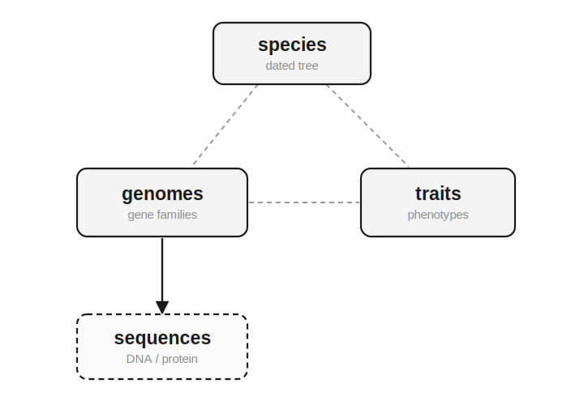

# ZOMBI2

**ZOMBI2** simulates phylogenetic evolution end to end — **species trees**, then
**gene families**, **phenotypic traits** and molecular **sequences** along them. It is a
ground-up redesign of [ZOMBI](https://github.com/AADavin/Zombi), with a fast Rust engine, a
composable Python library and a command-line interface.

<figure markdown="span">
  { width="440" }
</figure>

The four levels can be **simulated independently** — run whichever you need along a shared
species tree:

```python
from zombi2.species import BirthDeath, simulate_species_tree
from zombi2.genomes import simulate_genomes

tree = simulate_species_tree(BirthDeath(birth=1.0, death=0.3), n_tips=20, age=5.0, seed=1)
genomes = simulate_genomes(tree, duplication=0.2, transfer=0.1, loss=0.25,
                           origination=0.5, seed=42)

print(genomes.profiles.matrix)          # gene families × extant species (copy numbers)
complete, extant = genomes.gene_trees()["1"]
genomes.write("out/")                   # trees, event tables, transfers, profiles
```

Or **coupled**, so one level drives another — here a trait drives diversification:

```python
from zombi2.coevolve import BiSSE, simulate_sse

# state 1 speciates 3x faster than state 0 (trait-dependent diversification)
model = BiSSE(lambda0=1.0, lambda1=3.0, mu0=0.3, mu1=0.3, q01=0.4, q10=0.4)
result = simulate_sse(model, n_tips=40, seed=1)   # tips end up biased toward the fast state
```

## What's in the box

- **Species trees** — backward (reconstructed) and forward (complete) birth–death and
  Yule, episodic/skyline rate shifts, fossilized birth–death with incomplete sampling,
  heterogeneous-rate diversification (ClaDS, diversity-dependent, clade shifts), mass
  extinctions and ghost lineages. The Rust engine scales to millions of tips.
- **Gene families** — duplication / transfer / loss / origination along the tree, with
  shared (`SharedRates`), per-family-sampled (`FamilySampledRates`, ZOMBI1 style) and
  genome-wise rate models; transfers additive or **replacement** with distance-weighted
  recipients; ordered chromosomes with **inversions** and **transpositions**; and
  nucleotide-resolution genomes. Output as full event logs, compact event traces, or
  counts-only sparse **profile matrices**.
- **Traits** — Brownian motion, Ornstein–Uhlenbeck, early burst, Mk, threshold and
  related models, plus DEC biogeography, evolved along a phylogeny.
- **Sequences** — a gene × lineage **relaxed-clock** family that rescales gene trees from
  time into substitutions/site, plus nucleotide substitution models (JC / K80 / HKY / GTR
  + Γ).
- **Coevolution** — couple species, traits and genes along six directed edges with
  `coevolve --couple driver:target`.

## Design philosophy

ZOMBI2 is **interface-first**: one Gillespie simulator programs only against `Genome`,
`RateModel` and `EventSampler` protocols, so new genome representations, rate models and
event types drop in as subclasses without touching the engine. See
[Extending ZOMBI2](contributing/adding-a-model.md).

## Where next

- New to ZOMBI2? Start with [Installation](installation.md) and the
  [Quickstart](quickstart.md).
- Then work through the **User guide** in the navigation, or browse the
  [**model catalog**](guide/species-trees.md).
- Prefer a narrative? The
  [**Concepts & Tutorial manual (PDF)**](https://github.com/AADavin/zombi2/releases/latest/download/zombi2-manual.pdf)
  walks through every model with worked examples and figures.
