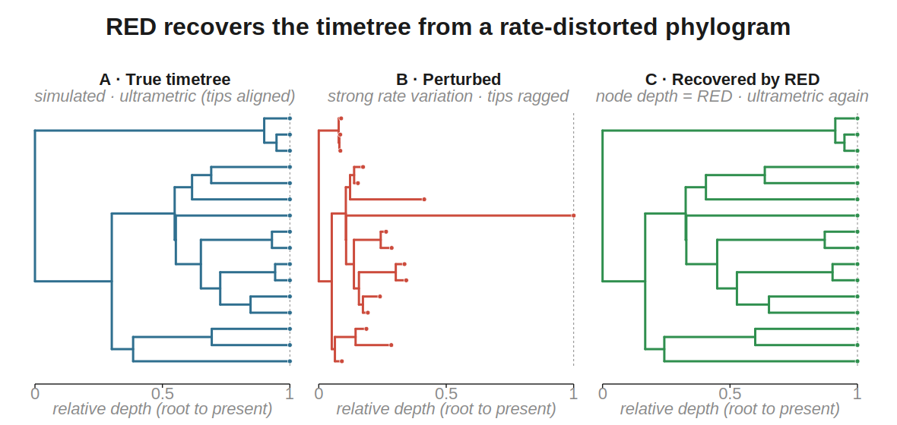

# Relative Evolutionary Divergence (RED)

`zombi2.tools.red` computes the **Relative Evolutionary Divergence** of every node of a rooted
tree — the quantity the [Genome Taxonomy Database](https://gtdb.ecogenomic.org) uses to
normalise taxonomic ranks across lineages that evolve at very different rates (Parks et al.,
*Nat. Biotechnol.* 2018; Rinke et al., *Nat. Microbiol.* 2021).

RED places the root at **0**, every leaf at **1**, and each internal node at the fraction of its
root-to-tip path (measured in branch length) that has elapsed by the time evolution reaches it.
Because it depends only on branch-length *proportions*, **RED is invariant to a global rescaling
of the tree**: multiplying every branch by a constant leaves it unchanged. That is what makes it
useful — on a *phylogram* (branch lengths in substitutions, distorted by rate variation) RED
recovers an approximate, normalised timeline of relative node ages **without a molecular clock**.



*One tree, three ways. **A** the true timetree (ultrametric, tips aligned at the present); **B** the same
tree perturbed into a phylogram by a strong relaxed clock, so rate variation leaves the tips ragged
(here root-to-tip depths span ~12×); **C** the tree RED recovers, placing each node at its RED value —
ultrametric again, and back on panel A. Reproduce with `figures/scripts/fig_red_recovery.py`.*

## What it computes

Assign `RED(root) = 0`. Visiting nodes from the root outward, for a non-root node *n* with parent *p*:

$$\mathrm{RED}(n) = \mathrm{RED}(p) + \frac{a}{a + b}\,\bigl(1 - \mathrm{RED}(p)\bigr)$$

where `a` is the length of the branch above *n* and `b` is the mean branch-length distance from
*n* to the leaves of its subtree. A leaf has `b = 0`, so `a/(a+b) = 1` and every leaf lands
exactly at `1`.

On an **ultrametric** tree (a dated tree, all tips at the present) RED returns each node's true
relative age, `node.time / total_age`, exactly — the identity the tool is validated against.

## Command line

```bash
# a phylogram recovers relative ages; a dated tree gives them exactly
zombi2 tools red -t species_tree.nwk -o out/     # writes out/red.tsv
zombi2 tools red -t gene_tree.nwk                 # or print the table to stdout
```

`red.tsv` has one row per node:

| column | meaning |
| --- | --- |
| `node` | node name |
| `is_leaf` | `True` for a tip, `False` for an internal node |
| `red` | Relative Evolutionary Divergence, in `[0, 1]` |

The tree is any single Newick — a dated species tree from `zombi2 species`, a phylogram from
`zombi2 sequences`, or an external tree. Branch lengths are read as-is.

## Python

```python
from zombi2.tree import read_newick
from zombi2.tools import relative_evolutionary_divergence

tree = read_newick(open("species_tree.nwk").read())
red = relative_evolutionary_divergence(tree)      # {TreeNode: float}, root 0.0, leaves 1.0
```

It also accepts a [`RateScaledTree`](../guide/sequences.md) — the phylogram a clock produces — using
its substitution branch lengths directly, or an explicit `branch_length` accessor:

```python
from zombi2 import RateVariation
phylogram = RateVariation(bins=[0.25, 0.5, 1, 2, 4], switch_rate=0.5).scale(tree, seed=1)
red = relative_evolutionary_divergence(phylogram)
```

## Measuring robustness to rate variation

Because RED is meant to survive rate variation, a natural check is to perturb a dated tree with a
[relaxed clock](../guide/sequences.md) and see how well RED recovers the true ages. ZOMBI2's
[`RateVariation`](../guide/sequences.md) clock is exactly the discrete-bin autocorrelated model used
in the GTDB archaea study, so this reproduces that benchmark end-to-end within ZOMBI2: simulate a
dated tree → apply the clock at increasing `switch_rate` → compute RED on the resulting phylogram →
compare to `node.time / total_age`. RED stays accurate (correlation ≥ 0.99) even under ~20-fold
across-lineage rate variation.

## Validation

The tool is checked against: `RED(root) == 0` and `RED(leaf) == 1` on any tree; the exact
ultrametric identity `RED == node.time / total_age`; invariance under a global branch-length
rescaling; monotonic increase from the root to every tip; and a hand-computed reference tree. See
`tests/test_red.py`.
